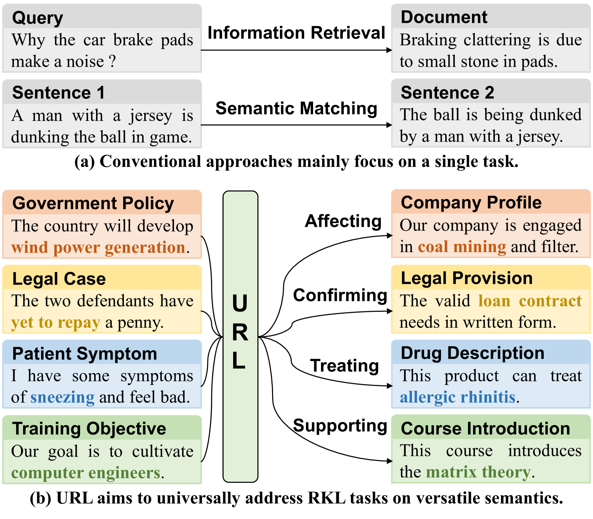
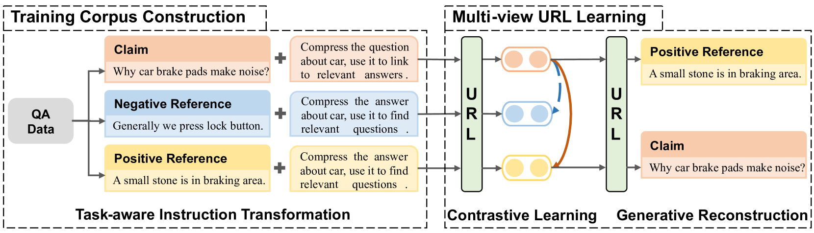

# URL：通过任务驱动的表示压缩技术，实现知识的普遍引用链接。

发布时间：2024年04月24日

`LLM应用` `信息检索` `语义匹配`

> URL: Universal Referential Knowledge Linking via Task-instructed Representation Compression

# 摘要

> 将索赔与确凿的参照物相联系是人类获取真实可靠信息的关键。现有研究多聚焦于特定任务，如信息检索或语义匹配，这些任务中的索赔与参照物关系明确且固定。然而，现实世界中的参照知识链接（RKL）远为复杂多变。本文提出了一种通用参照知识链接（URL）的概念，目的在于通过统一模型处理多样化的RKL任务。我们引入了一种由大型语言模型（LLM）驱动的任务指导表示压缩技术和多视角学习方法，以提升LLM在参照知识链接方面的指令执行和语义理解能力。此外，我们还建立了一个新的基准测试，用以评估模型在不同情境下的RKL任务表现。实验结果证明，现有的方法在处理通用RKL上存在挑战，而我们提出的框架能够在多种情境下有效解决问题，显著优于以往的方法。

> Linking a claim to grounded references is a critical ability to fulfill human demands for authentic and reliable information. Current studies are limited to specific tasks like information retrieval or semantic matching, where the claim-reference relationships are unique and fixed, while the referential knowledge linking (RKL) in real-world can be much more diverse and complex. In this paper, we propose universal referential knowledge linking (URL), which aims to resolve diversified referential knowledge linking tasks by one unified model. To this end, we propose a LLM-driven task-instructed representation compression, as well as a multi-view learning approach, in order to effectively adapt the instruction following and semantic understanding abilities of LLMs to referential knowledge linking. Furthermore, we also construct a new benchmark to evaluate ability of models on referential knowledge linking tasks across different scenarios. Experiments demonstrate that universal RKL is challenging for existing approaches, while the proposed framework can effectively resolve the task across various scenarios, and therefore outperforms previous approaches by a large margin.

[Arxiv](https://arxiv.org/abs/2404.16248)