# 为大型语言模型（LLMs）进行不确定性的评估与量化：一种简洁的监督式途径。

发布时间：2024年04月24日

`LLM应用` `机器学习`

> Uncertainty Estimation and Quantification for LLMs: A Simple Supervised Approach

# 摘要

> 大型语言模型（LLMs）虽然在众多任务上能力出众，但也存在生成不可靠或错误输出的风险。为应对这一挑战，本研究聚焦于LLMs的不确定性评估与校准问题。文章首先明确了LLMs不确定性评估的问题框架，随后提出了一种监督学习方法，该方法利用标注数据集来估计LLMs回答的不确定性。在此基础上，我们对比了LLMs与标准机器学习模型在不确定性评估上的差异，并阐释了LLMs的隐藏激活为何蕴含着不确定性信息。我们提出的方案有效地利用隐藏激活信息，提升了不同任务的不确定性评估，并在跨领域应用中展现了良好的适应性。此外，我们区分了不确定性评估与校准两个任务，并指出更精准的评估模型能够带来更优的校准效果。在实际应用中，该方法不仅易于部署，还能适应从黑盒到白盒不同程度的模型透明度，均展现出优异的性能。

> Large language models (LLMs) are highly capable of many tasks but they can sometimes generate unreliable or inaccurate outputs. To tackle this issue, this paper studies the problem of uncertainty estimation and calibration for LLMs. We begin by formulating the uncertainty estimation problem for LLMs and then propose a supervised approach that takes advantage of the labeled datasets and estimates the uncertainty of the LLMs' responses. Based on the formulation, we illustrate the difference between the uncertainty estimation for LLMs and that for standard ML models and explain why the hidden activations of the LLMs contain uncertainty information. Our designed approach effectively demonstrates the benefits of utilizing hidden activations for enhanced uncertainty estimation across various tasks and shows robust transferability in out-of-distribution settings. Moreover, we distinguish the uncertainty estimation task from the uncertainty calibration task and show that a better uncertainty estimation mode leads to a better calibration performance. In practice, our method is easy to implement and is adaptable to different levels of model transparency including black box, grey box, and white box, each demonstrating strong performance based on the accessibility of the LLM's internal mechanisms.

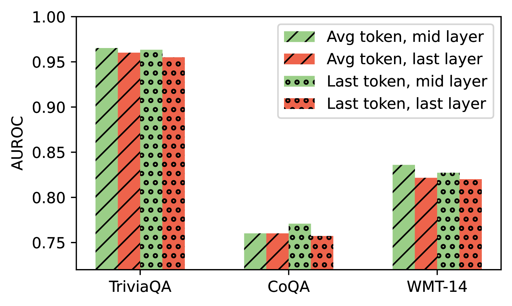

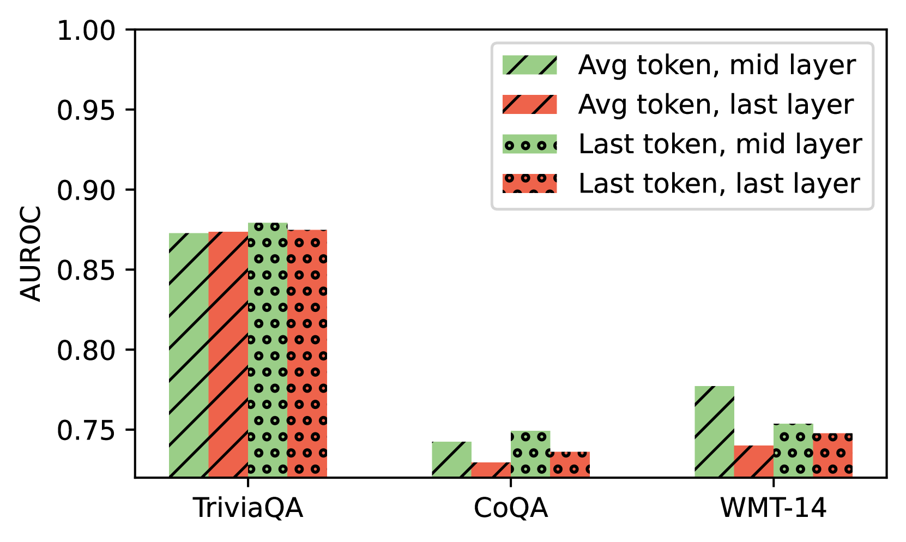

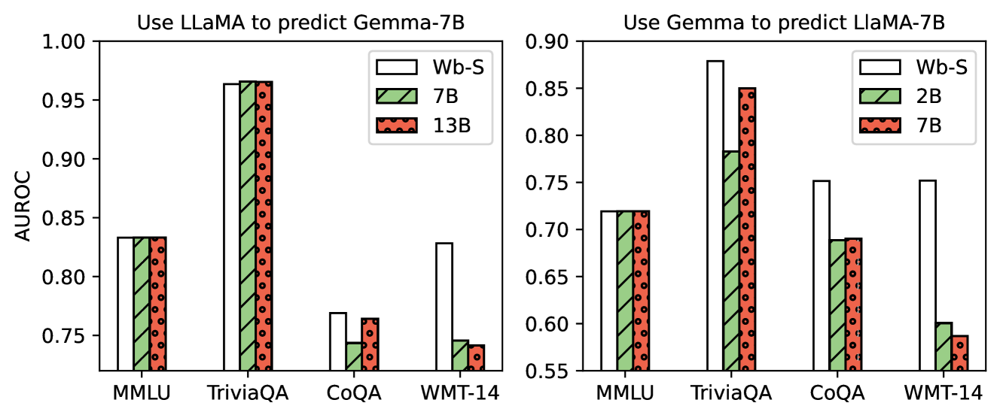

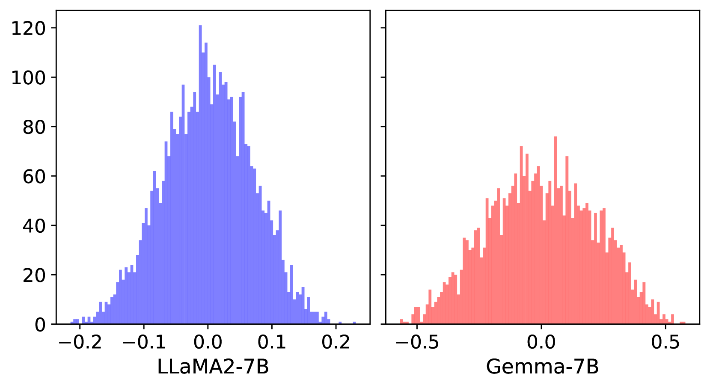

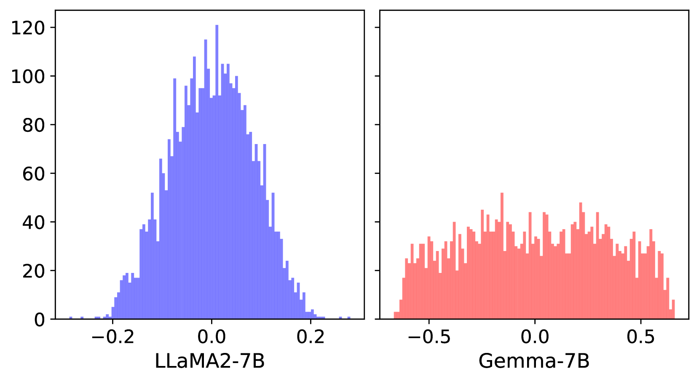

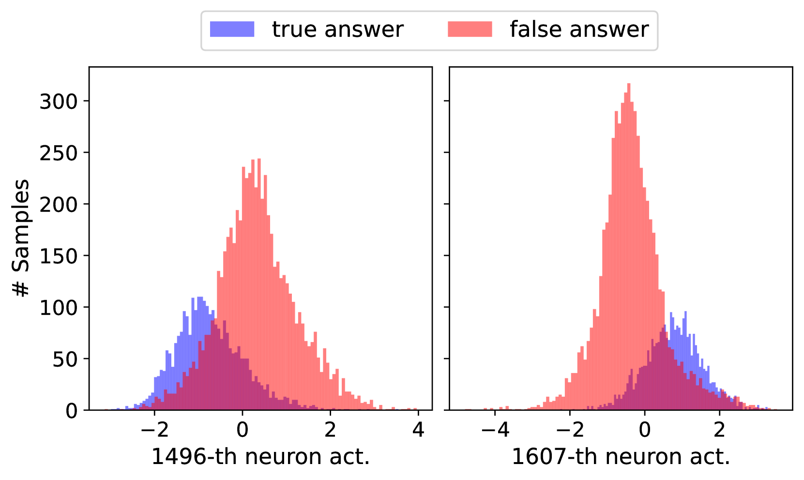

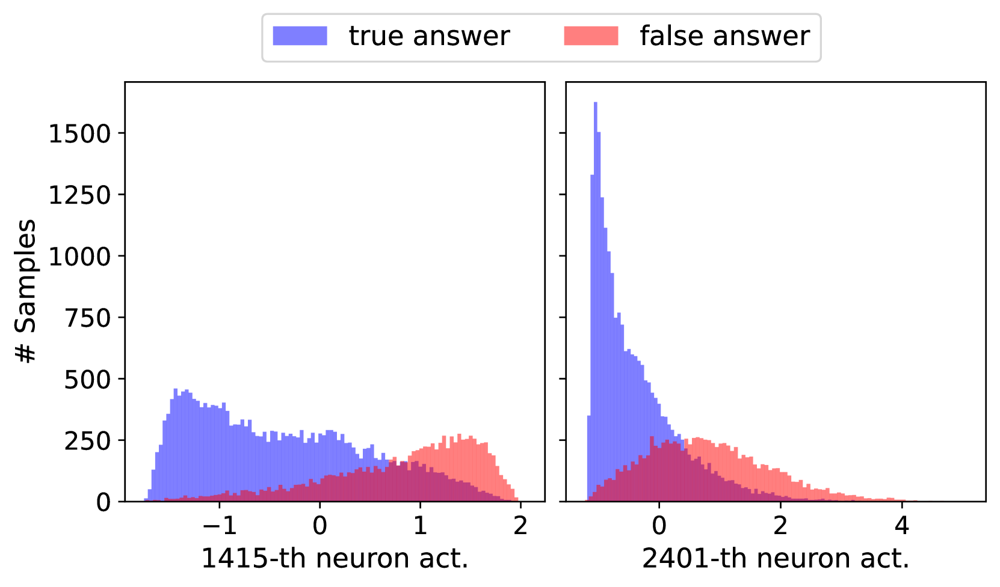

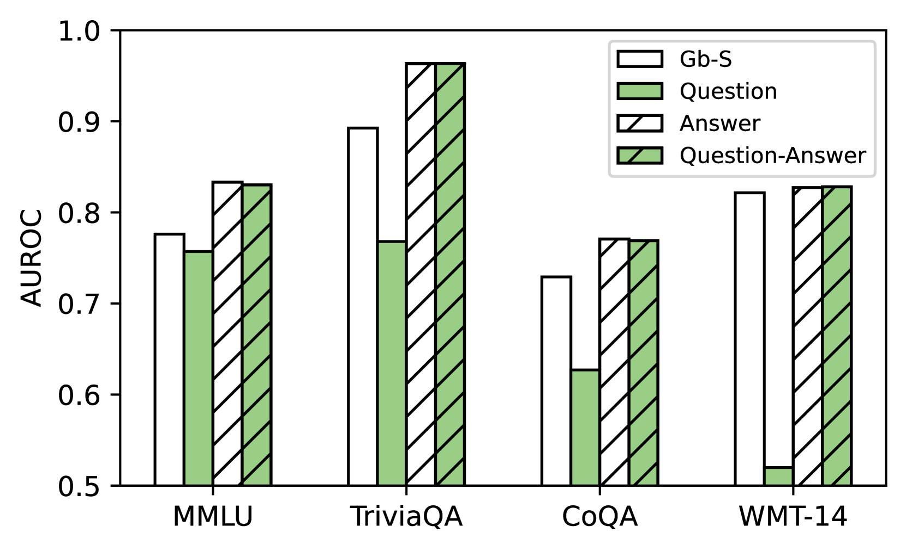

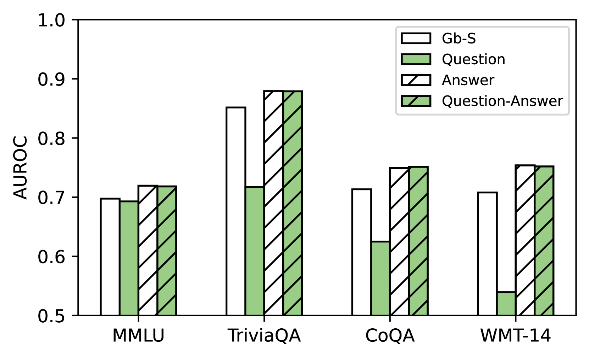

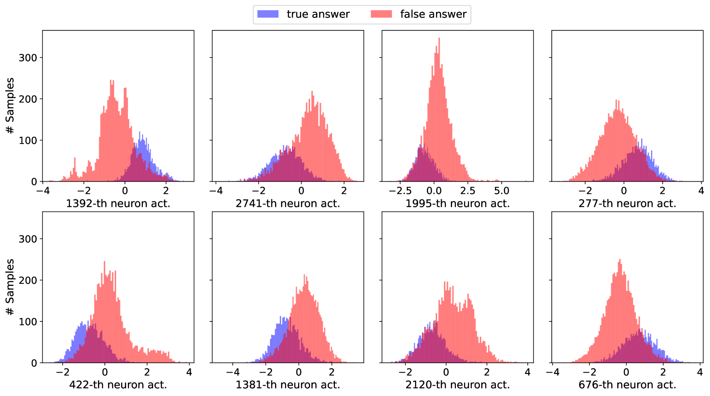

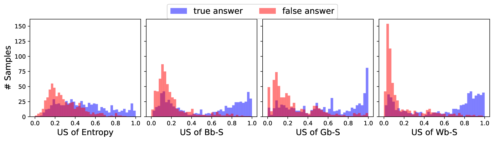

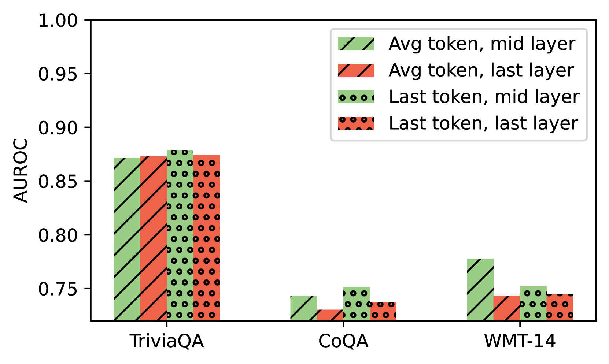

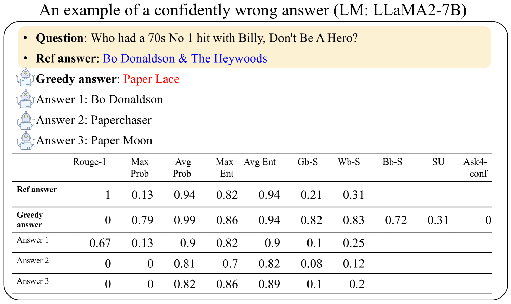

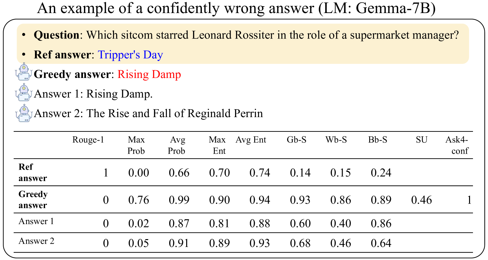

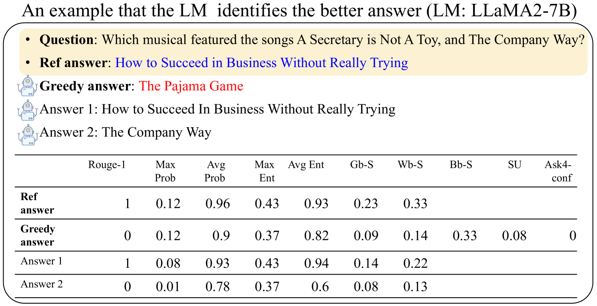

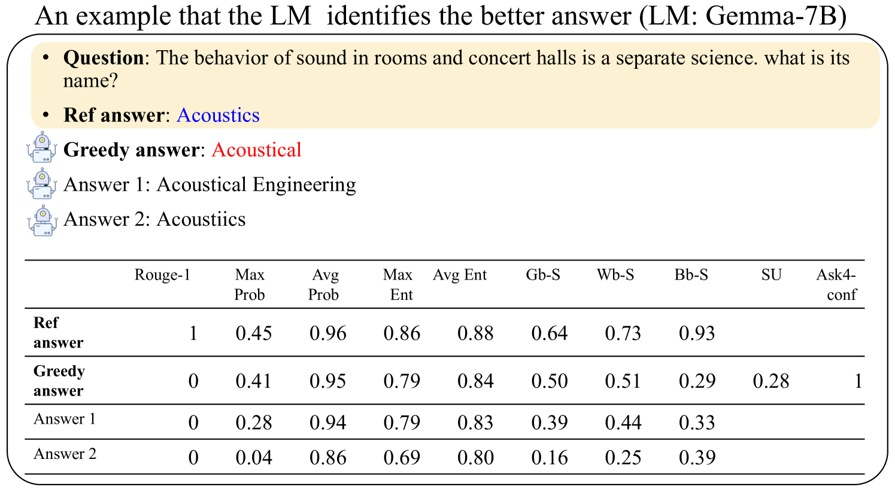

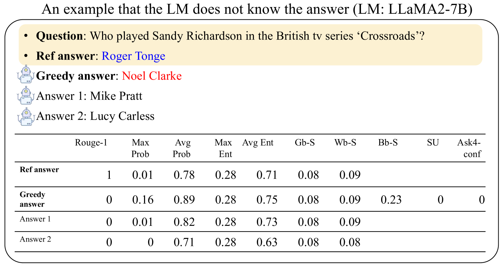

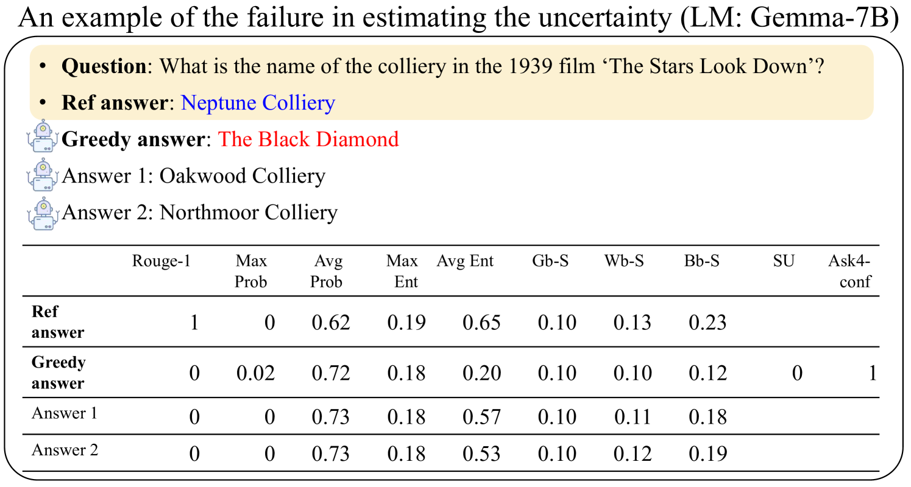

[Arxiv](https://arxiv.org/abs/2404.15993)