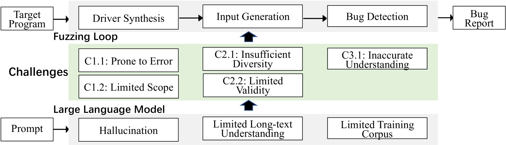

# 模糊测试与大型语言模型的邂逅：面临的挑战与潜在的机遇。

发布时间：2024年04月24日

`分类：LLM应用` `软件测试` `数据库管理`

> When Fuzzing Meets LLMs: Challenges and Opportunities

# 摘要

> 模糊测试，作为一种流行的漏洞识别技术，随着大型语言模型（LLM）的应用而取得了新的进展。尽管LLM在模糊测试中展现出巨大潜力，但也遭遇了一些特有的难题。本文中，我们梳理了LLM辅助模糊测试面临的五大挑战。为了验证这些挑战的普遍性，我们回顾了顶级会议上的最新研究成果。针对这些问题，我们不仅提出了一系列切实可行的改进建议，还在数据库管理系统（DBMS）模糊测试中进行了初步的评估。评估结果证明，我们的建议能够显著应对这些挑战。

> Fuzzing, a widely-used technique for bug detection, has seen advancements through Large Language Models (LLMs). Despite their potential, LLMs face specific challenges in fuzzing. In this paper, we identified five major challenges of LLM-assisted fuzzing. To support our findings, we revisited the most recent papers from top-tier conferences, confirming that these challenges are widespread. As a remedy, we propose some actionable recommendations to help improve applying LLM in Fuzzing and conduct preliminary evaluations on DBMS fuzzing. The results demonstrate that our recommendations effectively address the identified challenges.

[Arxiv](https://arxiv.org/abs/2404.16297)