# 漫画中角色的零样本识别与说话者预测：一种迭代多模态融合方法。

发布时间：2024年04月24日

`Agent` `漫画处理` `机器学习`

> Zero-Shot Character Identification and Speaker Prediction in Comics via Iterative Multimodal Fusion

# 摘要

> 漫画中的角色识别和对话者预测对于声音生成和翻译等处理任务至关重要。然而，由于角色随漫画标题而异，传统的监督学习方法因需要针对每个标题进行特定注释而变得不切实际。为此，我们提出了一种创新的零样本方法，使机器能够仅通过未标注的漫画图像来识别角色和推断说话者。尽管这些任务在现实世界中极为关键，但由于故事理解和多模态融合的挑战，它们尚未得到充分研究。尽管最新的大型语言模型（LLMs）在文本理解和推理上展现了卓越能力，但其在多模态内容分析上的应用仍面临挑战。为应对这一挑战，我们提出了首个迭代多模态框架，它利用多模态信息同时进行角色识别和说话者预测。实验结果表明，该框架不仅有效，而且为这些任务设定了坚实的基准。更重要的是，由于该方法无需训练数据或注释，因此可以无缝应用于任何漫画系列。

> Recognizing characters and predicting speakers of dialogue are critical for comic processing tasks, such as voice generation or translation. However, because characters vary by comic title, supervised learning approaches like training character classifiers which require specific annotations for each comic title are infeasible. This motivates us to propose a novel zero-shot approach, allowing machines to identify characters and predict speaker names based solely on unannotated comic images. In spite of their importance in real-world applications, these task have largely remained unexplored due to challenges in story comprehension and multimodal integration. Recent large language models (LLMs) have shown great capability for text understanding and reasoning, while their application to multimodal content analysis is still an open problem. To address this problem, we propose an iterative multimodal framework, the first to employ multimodal information for both character identification and speaker prediction tasks. Our experiments demonstrate the effectiveness of the proposed framework, establishing a robust baseline for these tasks. Furthermore, since our method requires no training data or annotations, it can be used as-is on any comic series.

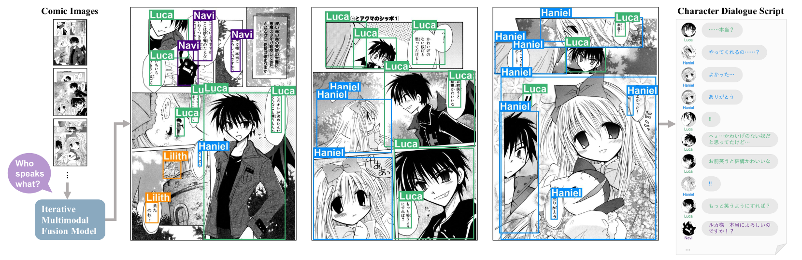

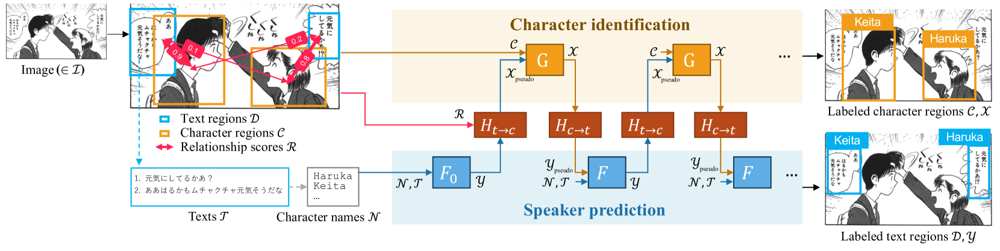

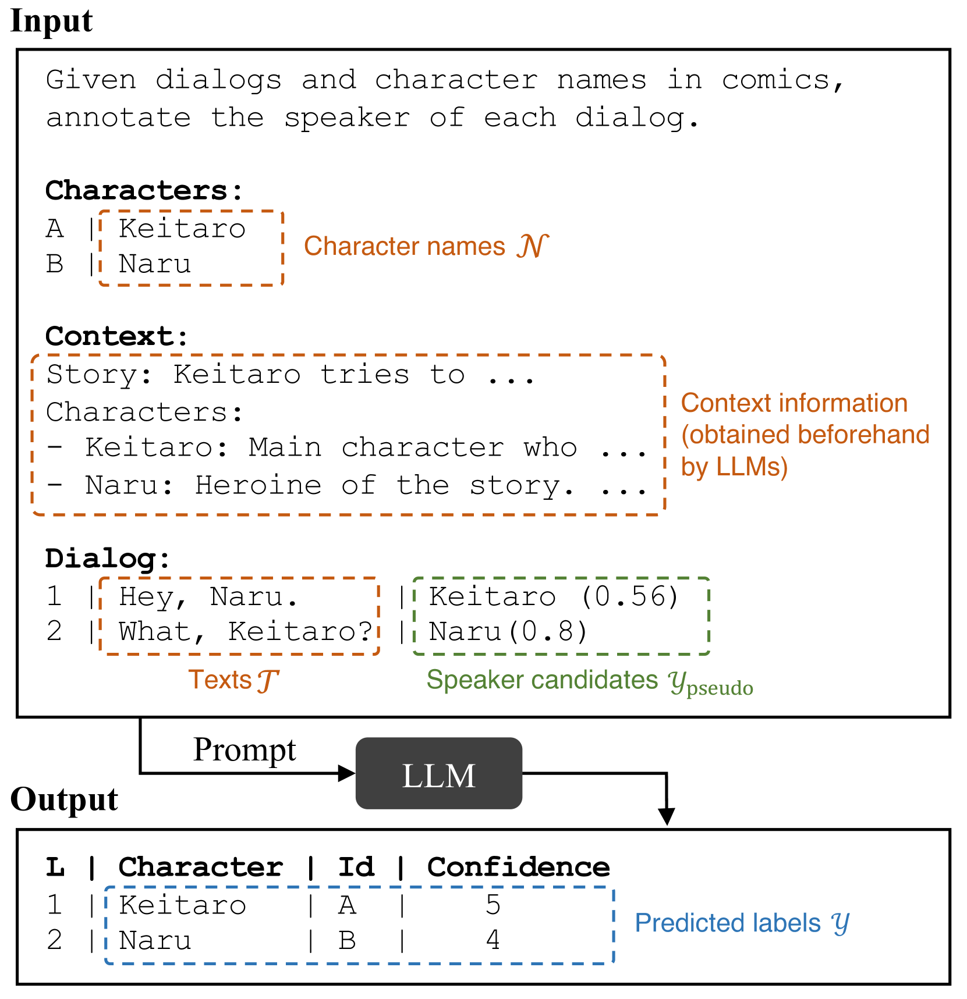

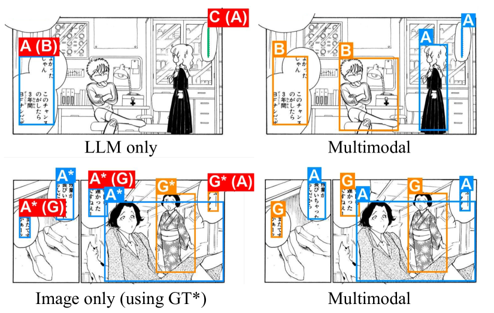

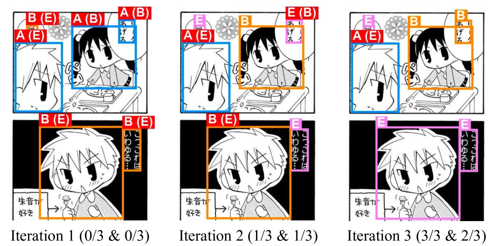

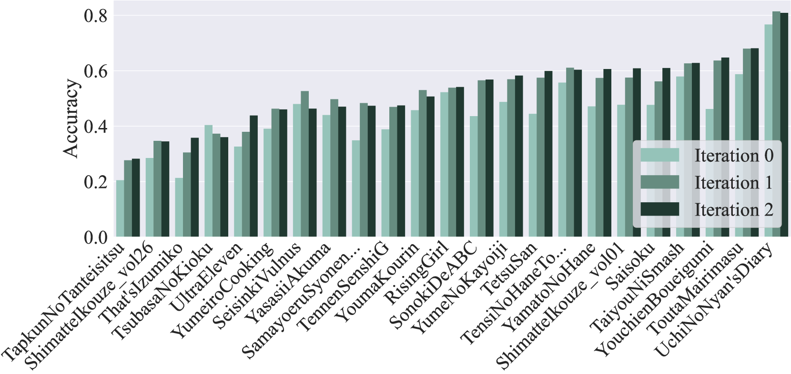

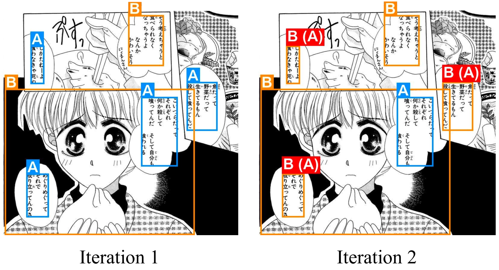

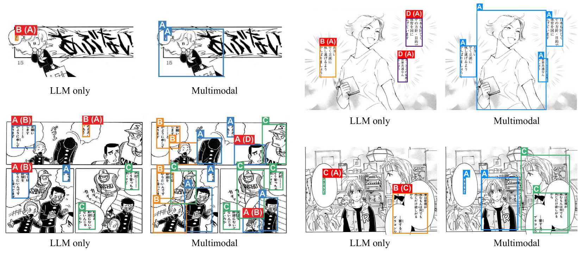

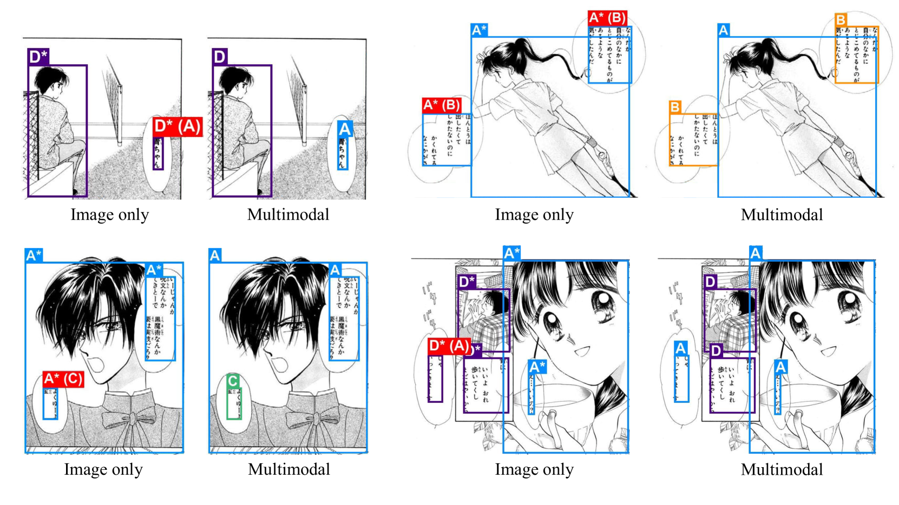

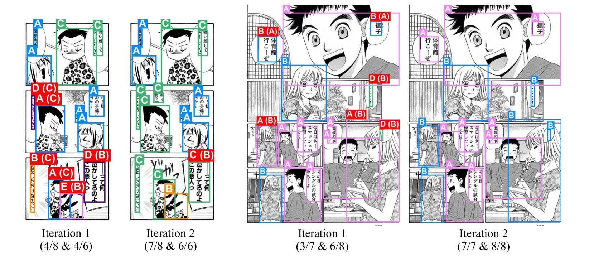

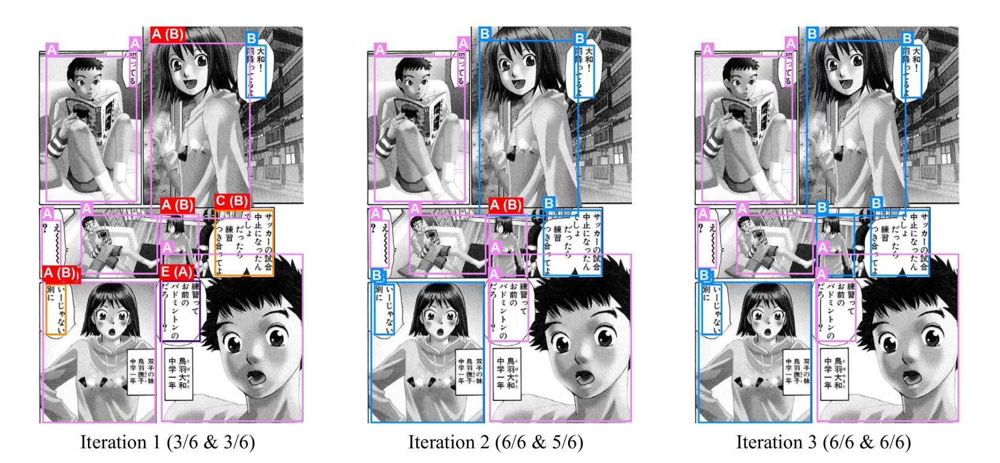

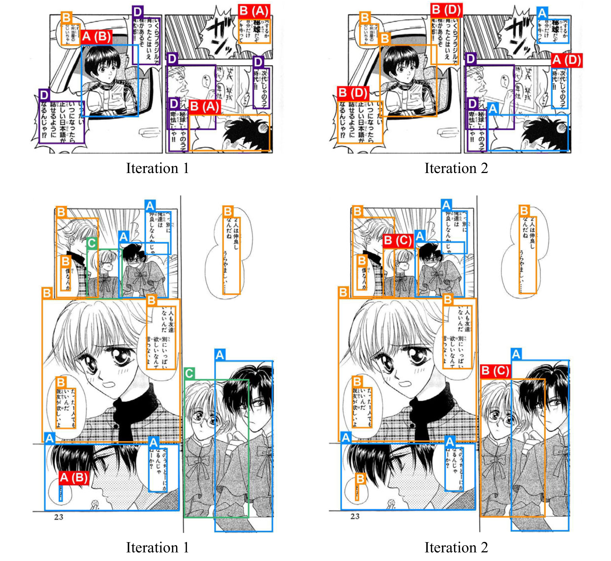

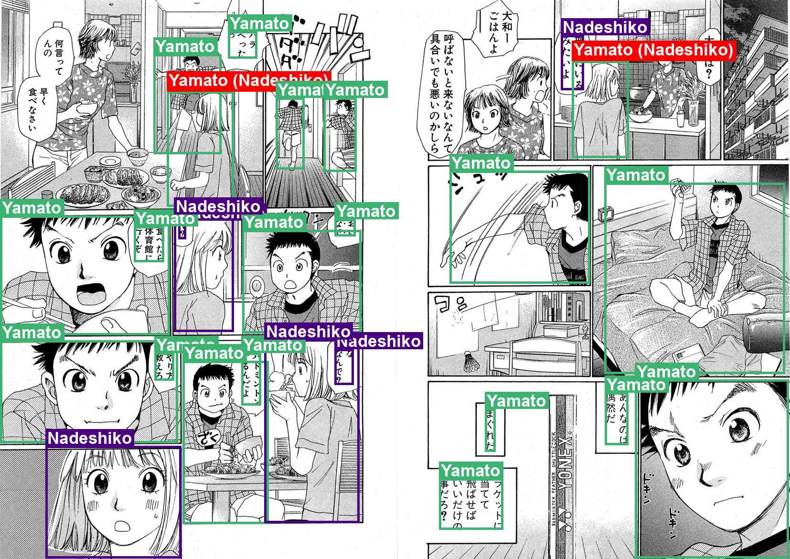

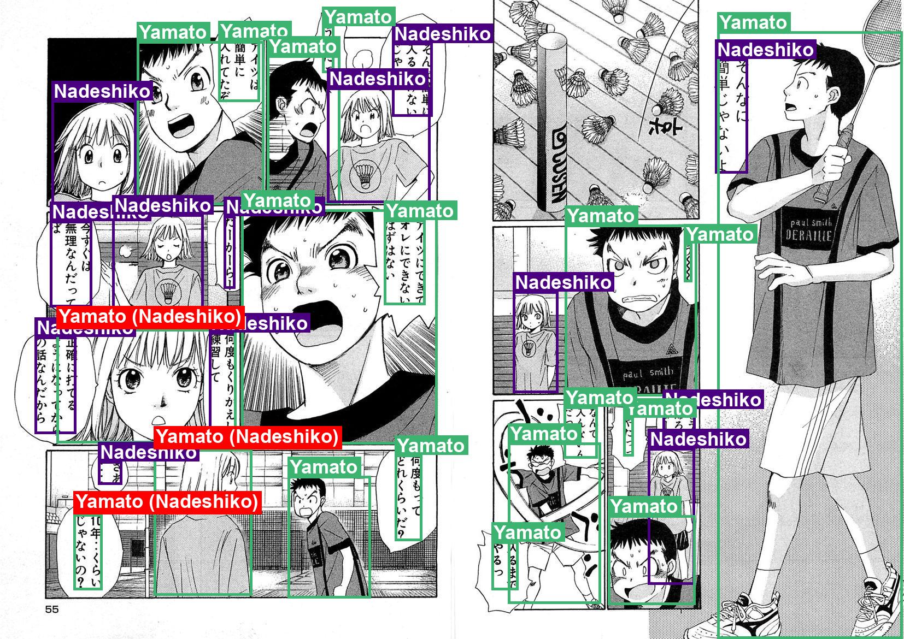

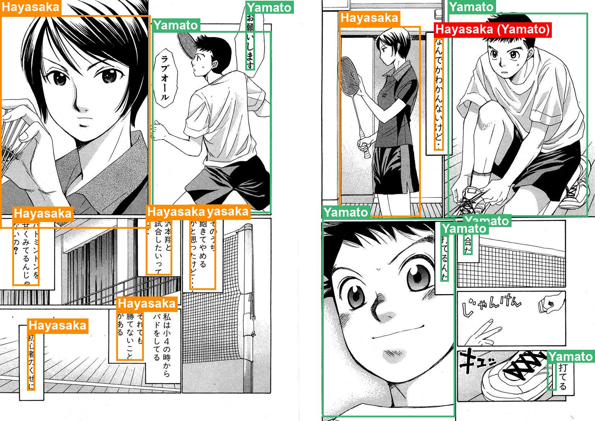

[Arxiv](https://arxiv.org/abs/2404.13993)