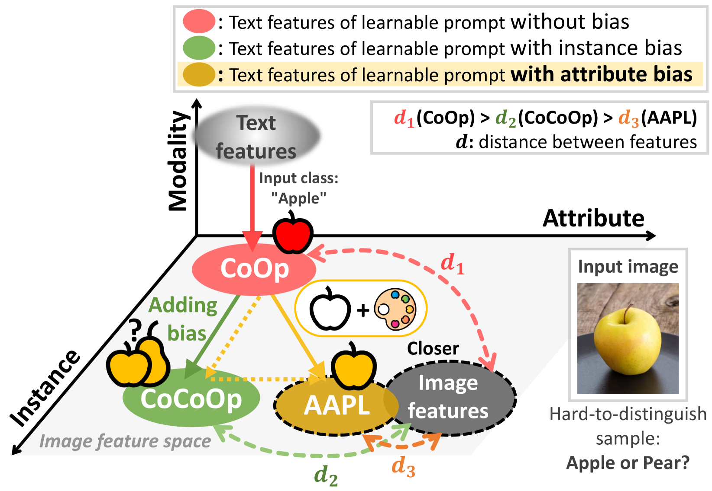
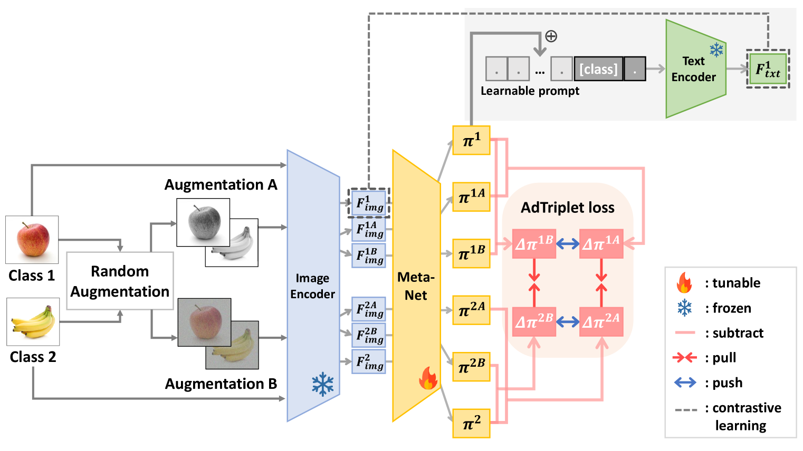
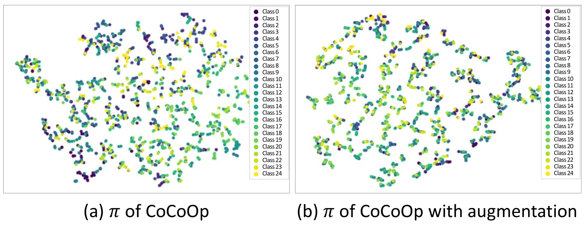
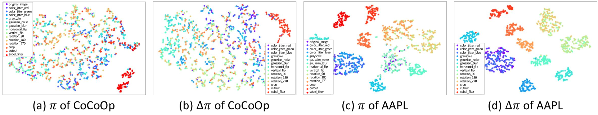
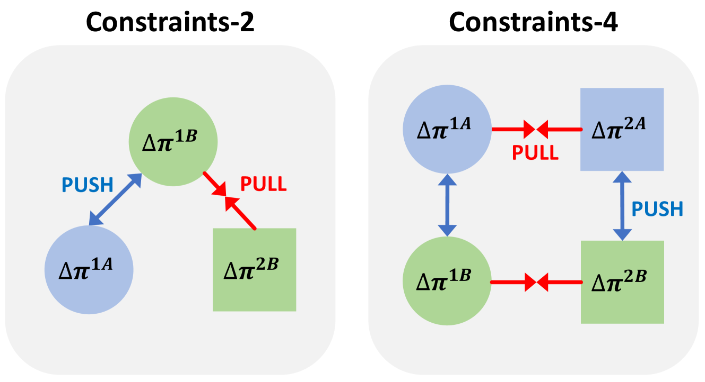
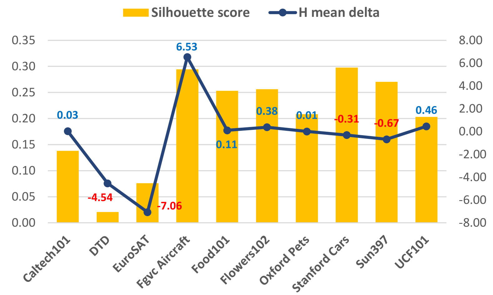
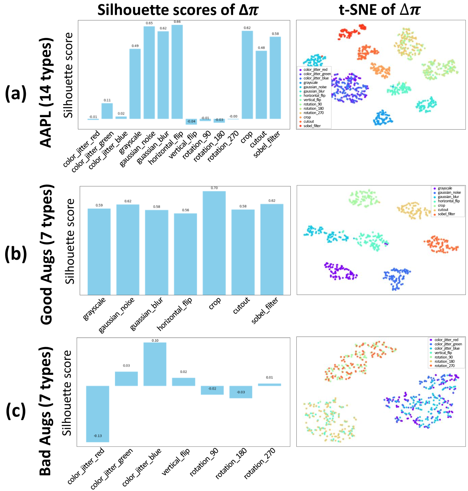

# AAPL：为视觉-语言模型引入属性，以增强提示学习的效果。

发布时间：2024年04月25日

`分类：LLM应用` `计算机视觉`

> AAPL: Adding Attributes to Prompt Learning for Vision-Language Models

# 摘要

> 最新进展的大型预训练视觉-语言模型在零样本任务上取得了卓越成效。继此之后，如 CoOp 和 CoCoOp 等最新研究提出了提示学习的概念，即将提示中的上下文替换为可训练的向量，显著提升了性能。尽管如此，对于未见过的类别，性能提升依旧有限。为了克服这一难题，传统零样本学习中常采用数据增强技术。我们的实验揭示了 CoOp 和 CoCoOp 的关键问题：通过传统图像增强获得的上下文偏向于已知类别，这不利于对未知类别的泛化。为此，我们引入了对抗性标记嵌入技术，以在可学习提示中引入偏差时，将低层次的视觉增强特征与高层次的类别信息解耦。我们提出的“为提示学习添加属性”的新机制 AAPL，通过专注于未知类别的高层次特征，引导可学习上下文有效提取文本特征。我们在 11 个数据集上进行了广泛实验，结果显示 AAPL 在少样本学习、零样本学习、跨数据集和领域泛化任务中相比现有方法具有更佳的表现。

> Recent advances in large pre-trained vision-language models have demonstrated remarkable performance on zero-shot downstream tasks. Building upon this, recent studies, such as CoOp and CoCoOp, have proposed the use of prompt learning, where context within a prompt is replaced with learnable vectors, leading to significant improvements over manually crafted prompts. However, the performance improvement for unseen classes is still marginal, and to tackle this problem, data augmentation has been frequently used in traditional zero-shot learning techniques. Through our experiments, we have identified important issues in CoOp and CoCoOp: the context learned through traditional image augmentation is biased toward seen classes, negatively impacting generalization to unseen classes. To address this problem, we propose adversarial token embedding to disentangle low-level visual augmentation features from high-level class information when inducing bias in learnable prompts. Through our novel mechanism called "Adding Attributes to Prompt Learning", AAPL, we guide the learnable context to effectively extract text features by focusing on high-level features for unseen classes. We have conducted experiments across 11 datasets, and overall, AAPL shows favorable performances compared to the existing methods in few-shot learning, zero-shot learning, cross-dataset, and domain generalization tasks.

[Arxiv](https://arxiv.org/abs/2404.16804)