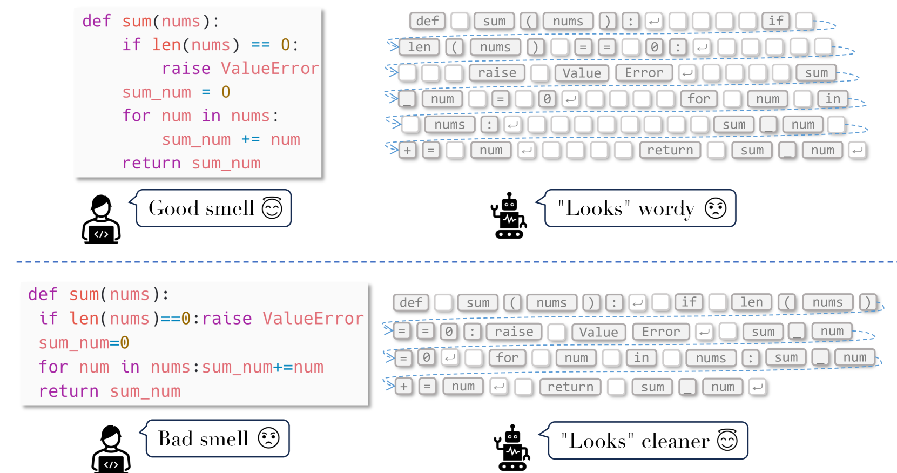
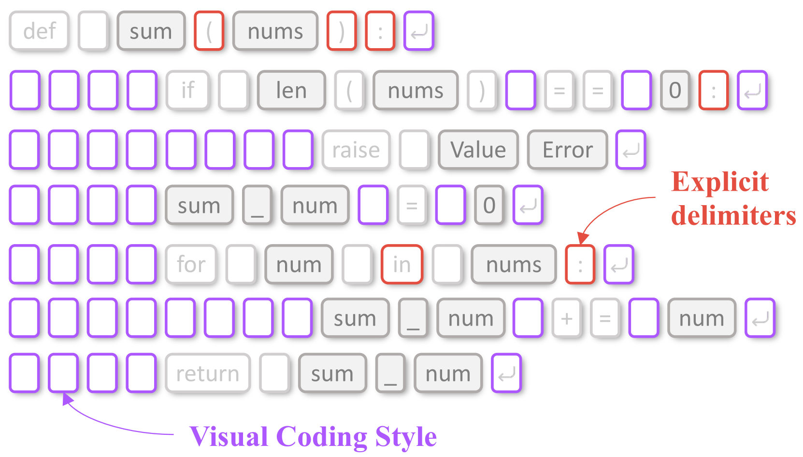
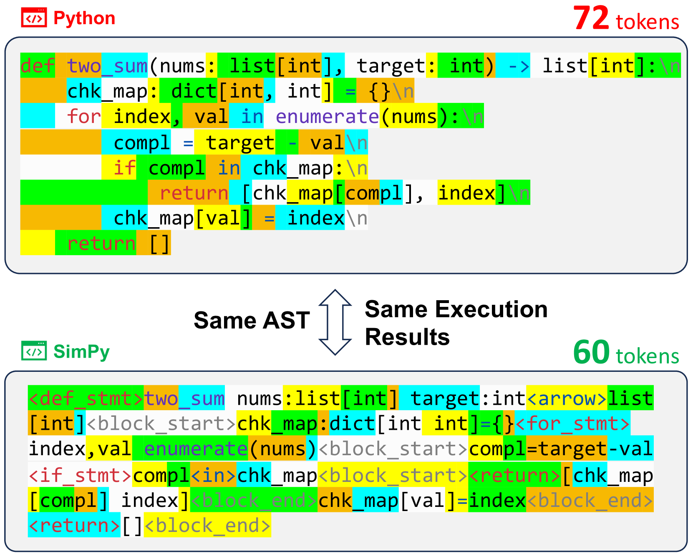
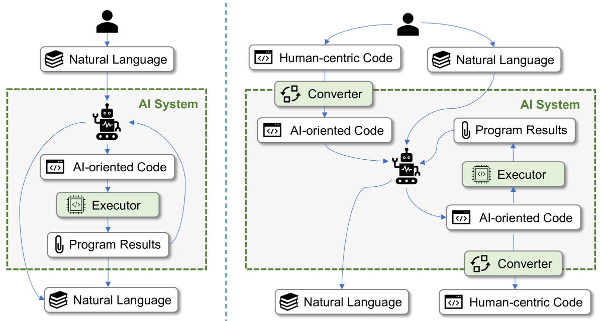

# AI程序员就在我们身边：我们正在重新构想编程语言的语法规则，以提高代码生成的效率。

发布时间：2024年04月25日

`LLM应用` `编程语言` `人工智能`

> AI Coders Are Among Us: Rethinking Programming Language Grammar Towards Efficient Code Generation

# 摘要

> 随着大型语言模型（LLMs）时代的到来，人工智能（AI）模型已成为编程语言的新的重要受众。这些模型不仅能在编程竞赛中大放异彩，还能像程序员一样编写代码，处理包括数学计算在内的多种任务。然而，现有的程序设计大多考虑了人类的阅读习惯，包含了大量语法和格式标记，这给 LLMs 带来了额外的计算负担。为了提升推理效率和降低成本，我们提出了一种新的面向 AI 的语法概念，它以更适应 AI 模型工作方式的形式来表达代码。这种语法下编写的代码简化了格式，用最少的标记高效传递代码含义。我们首次实现了面向 AI 的 Python 语法——Simple Python（SimPy），它通过一系列启发式规则对传统 Python 语法进行了优化。SimPy 编写的程序与标准 Python 保持一致的抽象语法树（AST）结构，可以通过修改后的 AST 解析器执行。我们还研究了如何让现有的 LLMs 熟练掌握并使用 SimPy，同时确保这些变化对人类开发者无感知。与标准 Python 相比，SimPy 在减少标记使用上取得了显著成效，分别在 CodeLlama 和 GPT-4 上减少了 13.5% 和 10.4%，并且在性能上与 Python 代码训练的模型不相上下，甚至有所超越。

> Besides humans and machines, Artificial Intelligence (AI) models have emerged to be another important audience of programming languages, as we come to the era of large language models (LLMs). LLMs can now excel at coding competitions and even program like developers to address various tasks, such as math calculation. Yet, the grammar and layout of existing programs are designed for humans. Particularly, abundant grammar tokens and formatting tokens are included to make the code more readable to humans. While beneficial, such a human-centric design imposes an unnecessary computational burden on LLMs where each token, either consumed or generated, consumes computational resources. To improve inference efficiency and reduce computational costs, we propose the concept of AI-oriented grammar, which aims to represent the code in a way that better suits the working mechanism of AI models. Code written with AI-oriented grammar discards formats and uses a minimum number of tokens to convey code semantics effectively. To demonstrate the feasibility of this concept, we explore and implement the first AI-oriented grammar for Python, named Simple Python (SimPy). SimPy is crafted by revising the original Python grammar through a series of heuristic rules. Programs written in SimPy maintain identical Abstract Syntax Tree (AST) structures to those in standard Python, allowing execution via a modified AST parser. In addition, we explore methods to enable existing LLMs to proficiently understand and use SimPy, and ensure the changes remain imperceptible for human developers. Compared with the original Python, SimPy not only reduces token usage by 13.5% and 10.4% for CodeLlama and GPT-4, but can also achieve equivalent, even improved, performance over the models trained on Python code.

[Arxiv](https://arxiv.org/abs/2404.16333)