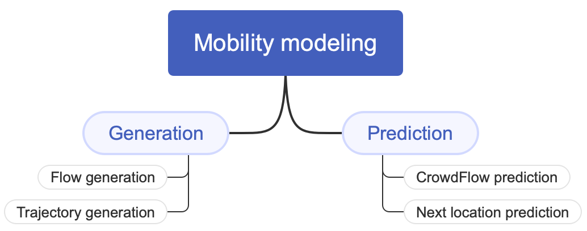

# 一篇关于从变换器到大型语言模型在流行病建模中预测人类移动性的简明调查。

发布时间：2024年04月25日

`LLM应用` `公共卫生` `机器学习`

> A Short Survey of Human Mobility Prediction in Epidemic Modeling from Transformers to LLMs

# 摘要

> 本文全面梳理了运用机器学习技术，尤其是 Transformer 模型，预测疫情中人类活动模式的最新进展。深入理解疫情下的人群流动对于疾病传播模型的构建和有效应对策略的制定极为关键。准确预测人群移动对于公共卫生紧急事件中的流行病学模型构建和响应计划的制定具有重要意义。通过预测活动模式，有关部门可以更准确地预测疾病的地理和时间分布，更高效地配置资源，并实施精准干预。本研究回顾了多种方法，包括使用预训练的语言模型如 BERT，以及专为预测移动性而设计的定制大型语言模型（LLMs）。这些模型在捕捉文本数据中的复杂时空关系和上下文模式方面显示出巨大潜力。

> This paper provides a comprehensive survey of recent advancements in leveraging machine learning techniques, particularly Transformer models, for predicting human mobility patterns during epidemics. Understanding how people move during epidemics is essential for modeling the spread of diseases and devising effective response strategies. Forecasting population movement is crucial for informing epidemiological models and facilitating effective response planning in public health emergencies. Predicting mobility patterns can enable authorities to better anticipate the geographical and temporal spread of diseases, allocate resources more efficiently, and implement targeted interventions. We review a range of approaches utilizing both pretrained language models like BERT and Large Language Models (LLMs) tailored specifically for mobility prediction tasks. These models have demonstrated significant potential in capturing complex spatio-temporal dependencies and contextual patterns in textual data.

[Arxiv](https://arxiv.org/abs/2404.16921)