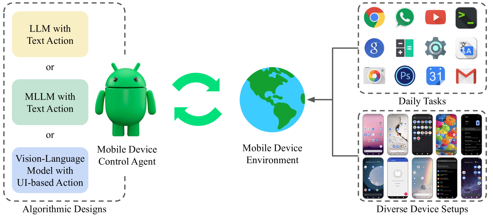
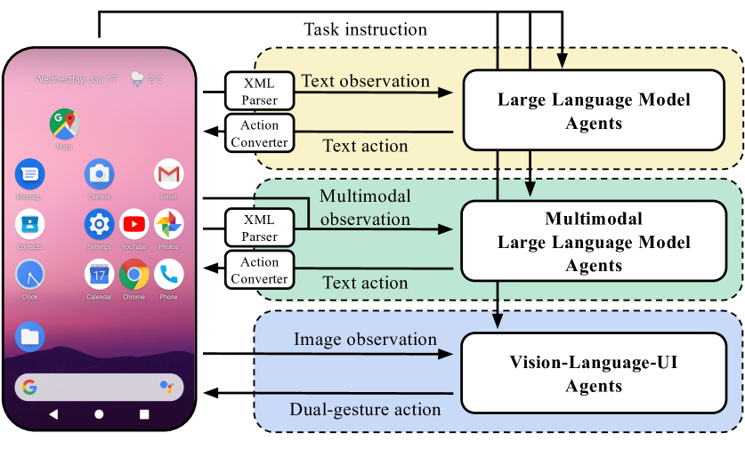
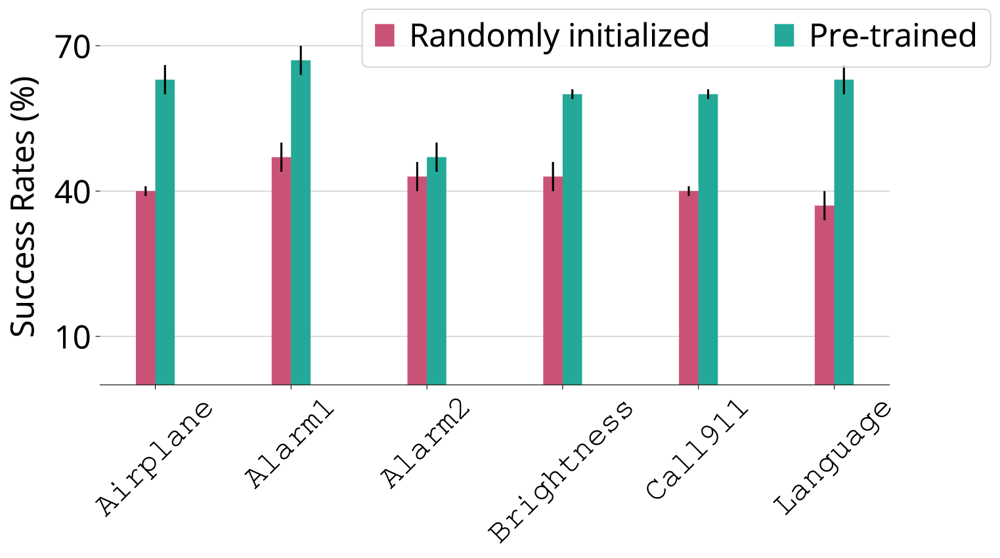
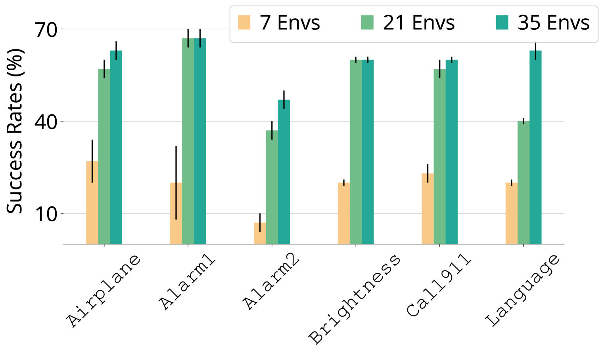
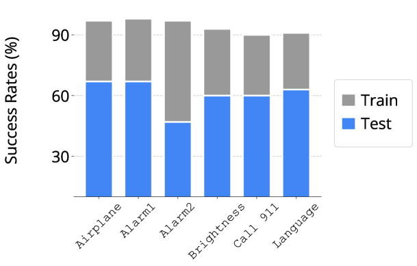
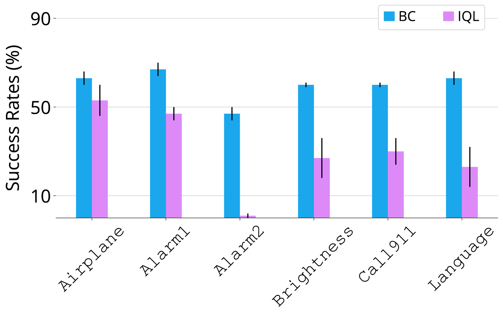
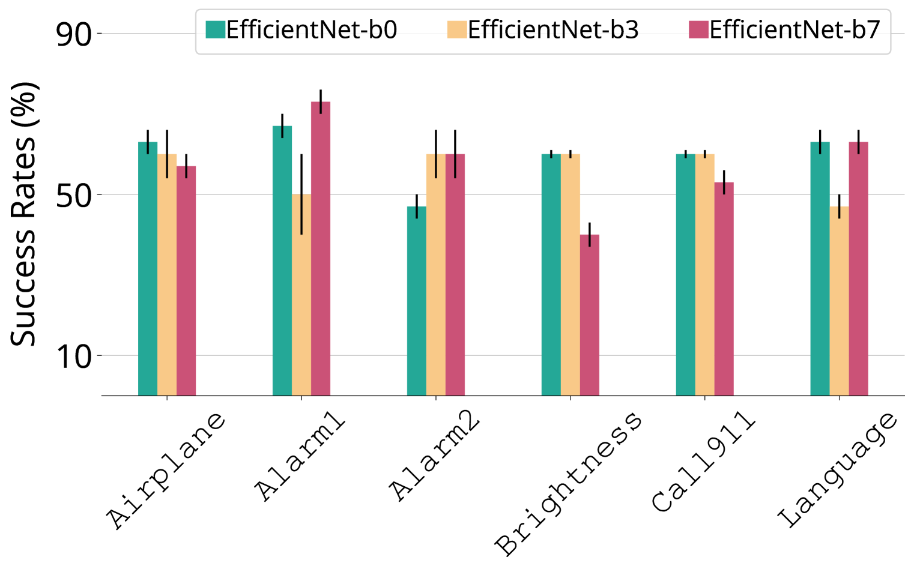

# 跨多样配置对移动设备控制代理进行性能评估。

发布时间：2024年04月25日

`Agent` `移动设备` `人工智能`

> Benchmarking Mobile Device Control Agents across Diverse Configurations

# 摘要

> 开发适用于移动设备的自主智能体，能够通过提升效率和便捷性显著改善用户体验。尽管对移动设备控制智能体的兴趣不断上升，但缺少统一的评估标准使得衡量该领域的科学进展变得困难。本研究提出了 B-MoCA，这是一个专为评估移动设备控制智能体而设计的全新基准测试。我们基于 Android 系统构建了 B-MoCA，设定了 60 项日常任务，并引入了随机化特性，以模拟用户界面布局和语言设置的变化，从而测试智能体的泛化能力。我们对多种智能体进行了评估，包括利用大型语言模型（LLMs）或多模态 LLMs 的智能体，以及完全基于人类专家示范从头训练的智能体。尽管这些智能体在处理简单任务上表现出色，但在复杂任务上的表现不佳，这为未来研究提供了提升智能体效能的重要方向。我们的源代码已在 https://b-moca.github.io 公开发布。

> Developing autonomous agents for mobile devices can significantly enhance user interactions by offering increased efficiency and accessibility. However, despite the growing interest in mobile device control agents, the absence of a commonly adopted benchmark makes it challenging to quantify scientific progress in this area. In this work, we introduce B-MoCA: a novel benchmark designed specifically for evaluating mobile device control agents. To create a realistic benchmark, we develop B-MoCA based on the Android operating system and define 60 common daily tasks. Importantly, we incorporate a randomization feature that changes various aspects of mobile devices, including user interface layouts and language settings, to assess generalization performance. We benchmark diverse agents, including agents employing large language models (LLMs) or multi-modal LLMs as well as agents trained from scratch using human expert demonstrations. While these agents demonstrate proficiency in executing straightforward tasks, their poor performance on complex tasks highlights significant opportunities for future research to enhance their effectiveness. Our source code is publicly available at https://b-moca.github.io.

[Arxiv](https://arxiv.org/abs/2404.16660)