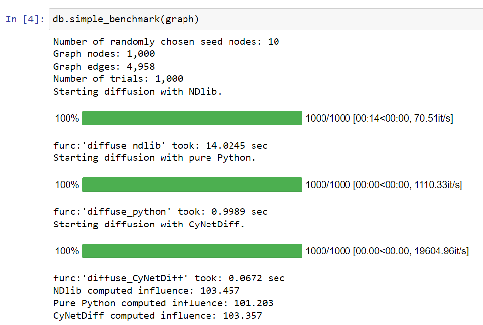
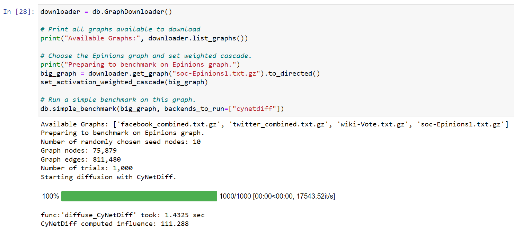
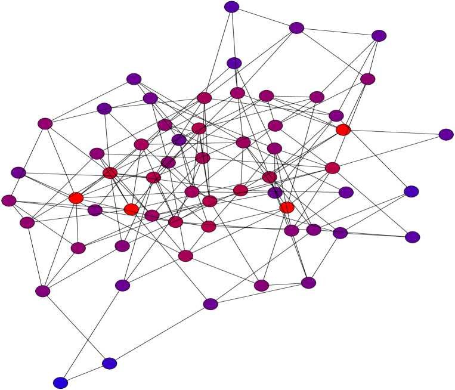

# CyNetDiff —— 一款旨在提高网络扩散模型实现效率的 Python 编程库。

发布时间：2024年04月25日

`分类：RAG` `网络科学`

> CyNetDiff -- A Python Library for Accelerated Implementation of Network Diffusion Models

# 摘要

> 近年来，网络扩散模型及其相关议题日益受到广泛关注，尤其是独立级联和线性阈值模型。当前的实验研究往往需要在大型图集上进行大量的模拟，这一过程计算成本高昂，更适合使用低级语言。尽管如此，研究者们更倾向于使用高级语言如 Python，以享受其带来的灵活性和快速开发的优势。在众多研究任务中，模拟过程往往是最为消耗计算资源的环节，因此，能够提供一个既兼容高级语言接口又具备低级语言性能的库将大有裨益。正是为了满足这一需求，我们推出了 CyNetDiff——一个用 Cython 编写关键组件的 Python 库，旨在为这些计算密集型的扩散任务提供性能上的显著提升。

> In recent years, there has been increasing interest in network diffusion models and related problems. The most popular of these are the independent cascade and linear threshold models. Much of the recent experimental work done on these models requires a large number of simulations conducted on large graphs, a computationally expensive task suited for low-level languages. However, many researchers prefer the use of higher-level languages (such as Python) for their flexibility and shorter development times. Moreover, in many research tasks, these simulations are the most computationally intensive task, so it would be desirable to have a library for these with an interface to a high-level language with the performance of a low-level language. To fill this niche, we introduce CyNetDiff, a Python library with components written in Cython to provide improved performance for these computationally intensive diffusion tasks.

[Arxiv](https://arxiv.org/abs/2404.17059)