# 本文探讨了如何利用冗长样本对多模态大型语言模型的能耗与延迟进行精细调控。

发布时间：2024年04月25日

`分类：LLM应用` `计算机视觉`

> Energy-Latency Manipulation of Multi-modal Large Language Models via Verbose Samples

# 摘要

> 多模态大型语言模型（MLLMs）虽性能卓越，但其运行却需巨额计算资源支撑。恶意用户一旦触发高能耗与延迟（能耗-延迟成本），便可能耗尽资源，影响服务的稳定性。本文聚焦MLLMs，尤其是基于图像和视频的模型，探讨了如何通过精心设计的难以察觉的扰动，在推理过程中制造高昂的能耗-延迟成本。研究发现，通过延长生成序列的长度，可以操控这一成本，这促使我们引入了冗长样本的概念，涵盖冗长的图像与视频。文章具体提出了两种非模态特定的损失函数：一是推迟序列结束（EOS）标记的损失，二是增加每个生成标记不确定性的损失。此外，提升多样性对于激励更长响应、增加复杂性同样关键，这启发了我们设计了以下模态特定的损失函数。对于冗长图像，提出了一种标记多样性损失，以增强隐藏状态的多样性；对于冗长视频，则提出了一种帧特征多样性损失，以提升帧间特征的多样性。为平衡这些损失，我们设计了一种时间权重调整算法。实验结果证明，我们的冗长样本能显著延长生成序列的长度。

> Despite the exceptional performance of multi-modal large language models (MLLMs), their deployment requires substantial computational resources. Once malicious users induce high energy consumption and latency time (energy-latency cost), it will exhaust computational resources and harm availability of service. In this paper, we investigate this vulnerability for MLLMs, particularly image-based and video-based ones, and aim to induce high energy-latency cost during inference by crafting an imperceptible perturbation. We find that high energy-latency cost can be manipulated by maximizing the length of generated sequences, which motivates us to propose verbose samples, including verbose images and videos. Concretely, two modality non-specific losses are proposed, including a loss to delay end-of-sequence (EOS) token and an uncertainty loss to increase the uncertainty over each generated token. In addition, improving diversity is important to encourage longer responses by increasing the complexity, which inspires the following modality specific loss. For verbose images, a token diversity loss is proposed to promote diverse hidden states. For verbose videos, a frame feature diversity loss is proposed to increase the feature diversity among frames. To balance these losses, we propose a temporal weight adjustment algorithm. Experiments demonstrate that our verbose samples can largely extend the length of generated sequences.

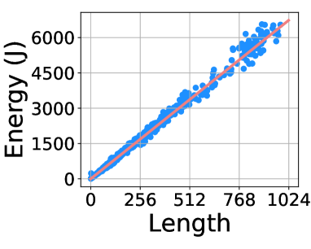

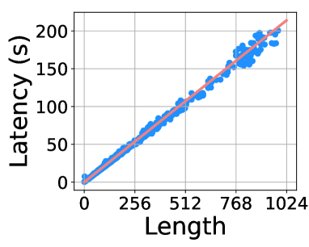

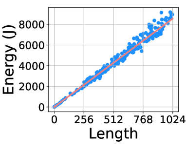

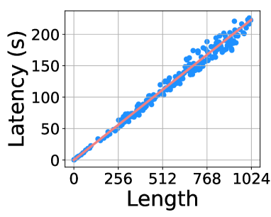

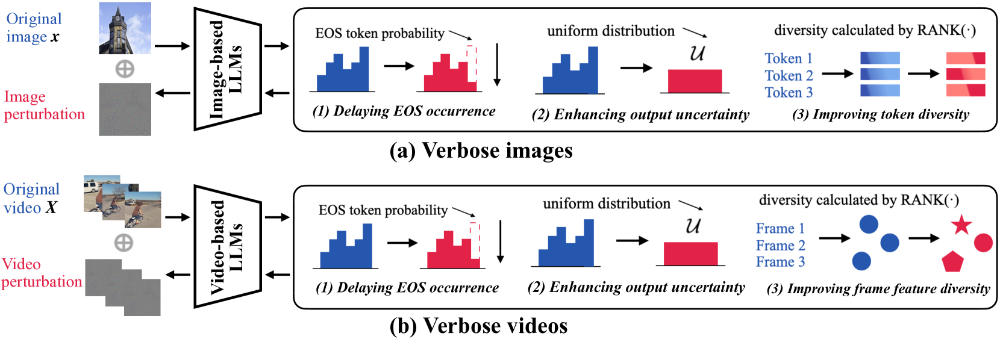

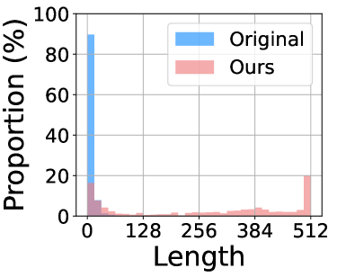

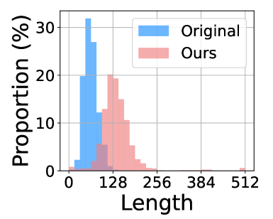

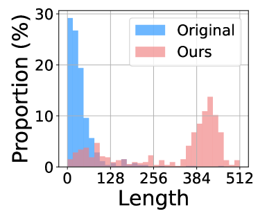

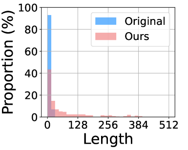

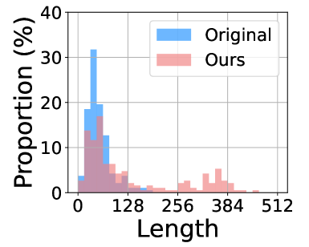

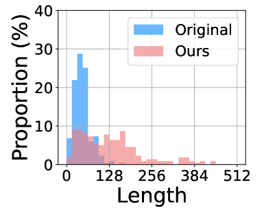

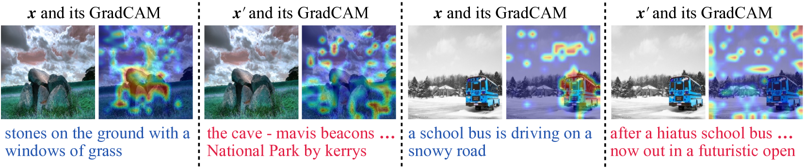

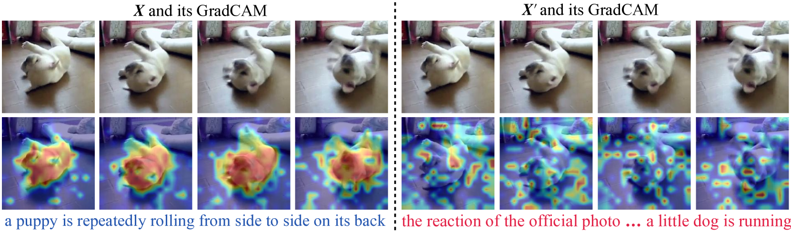

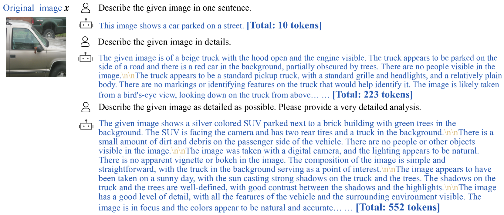

[Arxiv](https://arxiv.org/abs/2404.16557)