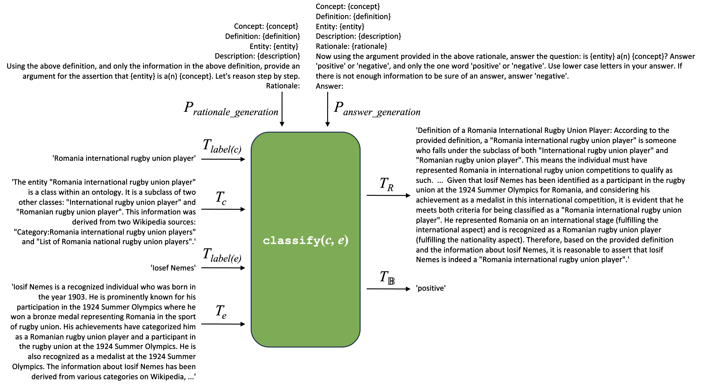

# 本文探讨了如何利用大型语言模型来评估知识图谱内类别成员之间的关系。

发布时间：2024年04月25日

`LLM应用` `知识图谱` `知识工程`

> Evaluating Class Membership Relations in Knowledge Graphs using Large Language Models

# 摘要

> 知识图谱的核心在于其类别成员关系，这些关系负责将实体归类到特定类别。在知识工程的框架内，我们提出了一种创新的评估方法，通过零样本思维链分类器分析特定实体和类别的描述，并利用类别的自然语言定义来衡量这些关系的优劣。该方法在 Wikidata 和 CaLiGraph 两个知名知识图谱上进行了测试，并借助 7 种大型语言模型进行了验证。特别是，使用 gpt-4-0125-preview 模型，我们在 Wikidata 上达到了 0.830 的宏观平均 F1 分数，在 CaLiGraph 上达到了 0.893。手动分析分类误差后发现，40.9% 的错误与知识图谱本身有关，其中 16.0% 是因为缺少关联，24.9% 是因为关联错误。这一发现揭示了大型语言模型在知识图谱优化过程中的辅助潜力。相关代码和数据已在 Github 上公开。

> A backbone of knowledge graphs are their class membership relations, which assign entities to a given class. As part of the knowledge engineering process, we propose a new method for evaluating the quality of these relations by processing descriptions of a given entity and class using a zero-shot chain-of-thought classifier that uses a natural language intensional definition of a class. We evaluate the method using two publicly available knowledge graphs, Wikidata and CaLiGraph, and 7 large language models. Using the gpt-4-0125-preview large language model, the method's classification performance achieves a macro-averaged F1-score of 0.830 on data from Wikidata and 0.893 on data from CaLiGraph. Moreover, a manual analysis of the classification errors shows that 40.9% of errors were due to the knowledge graphs, with 16.0% due to missing relations and 24.9% due to incorrectly asserted relations. These results show how large language models can assist knowledge engineers in the process of knowledge graph refinement. The code and data are available on Github.

[Arxiv](https://arxiv.org/abs/2404.17000)