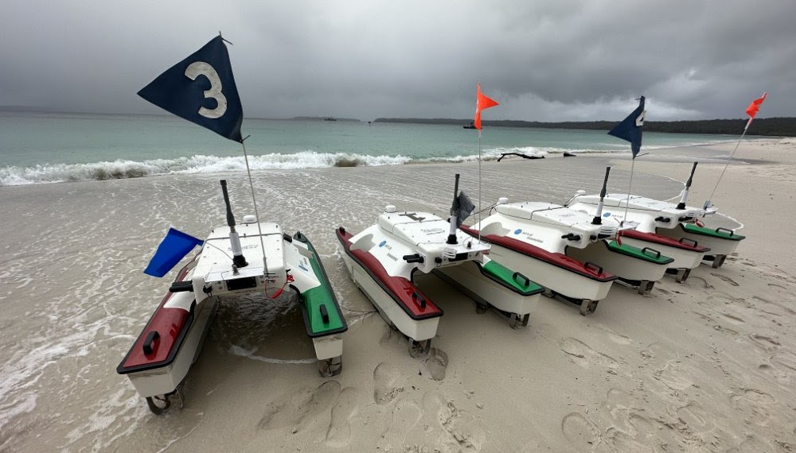
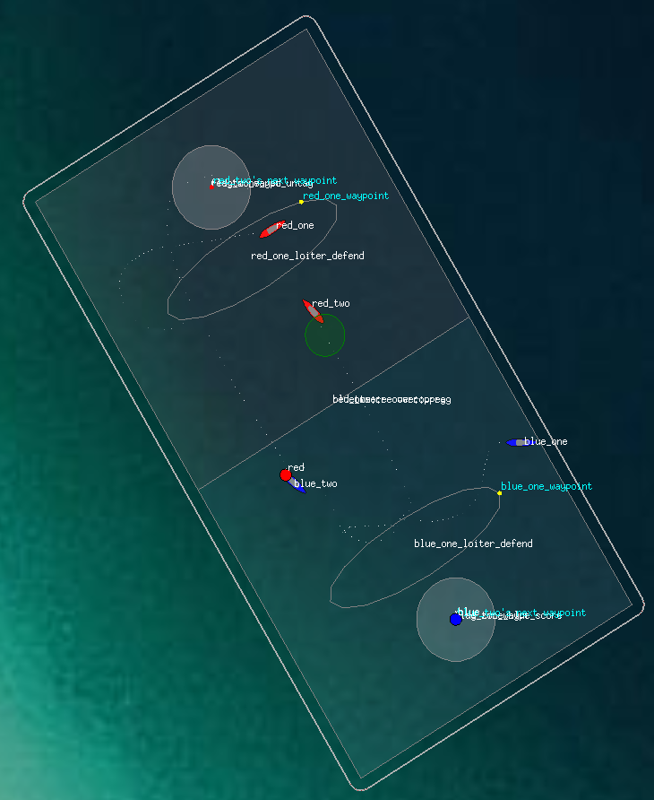
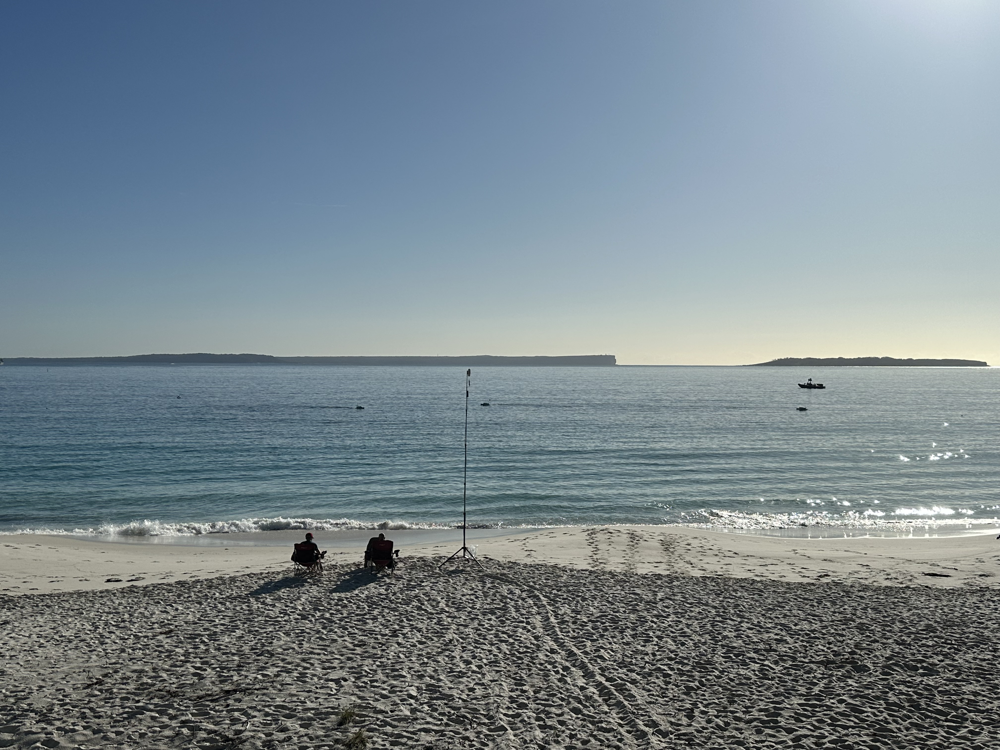
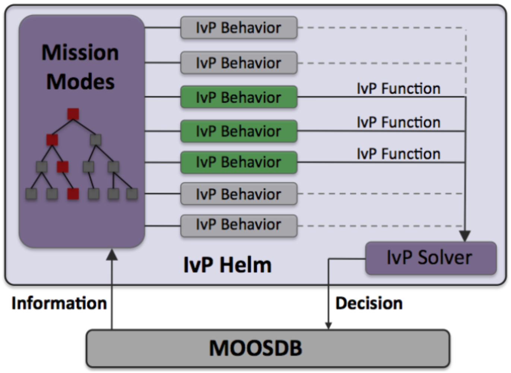
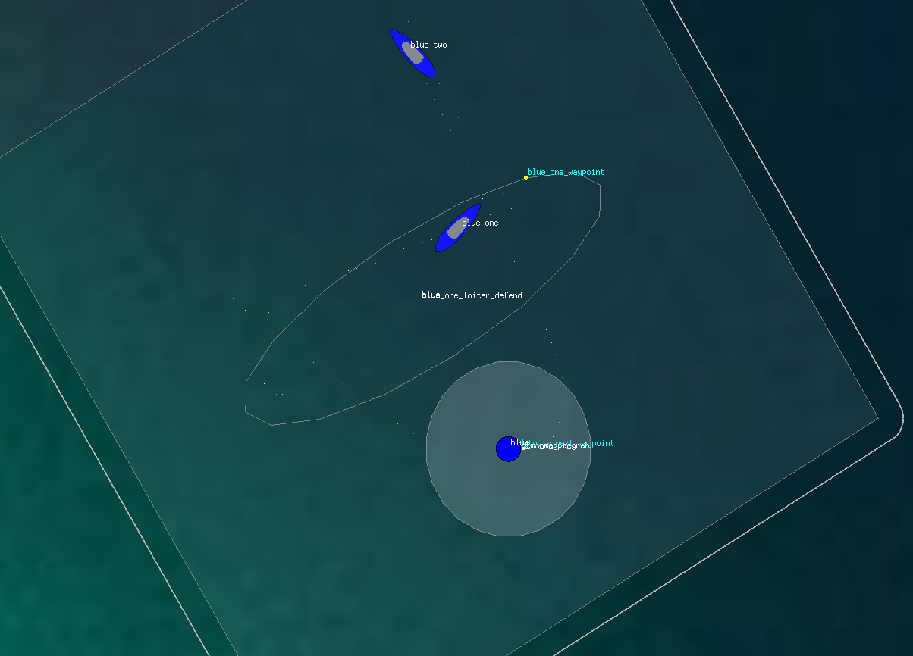
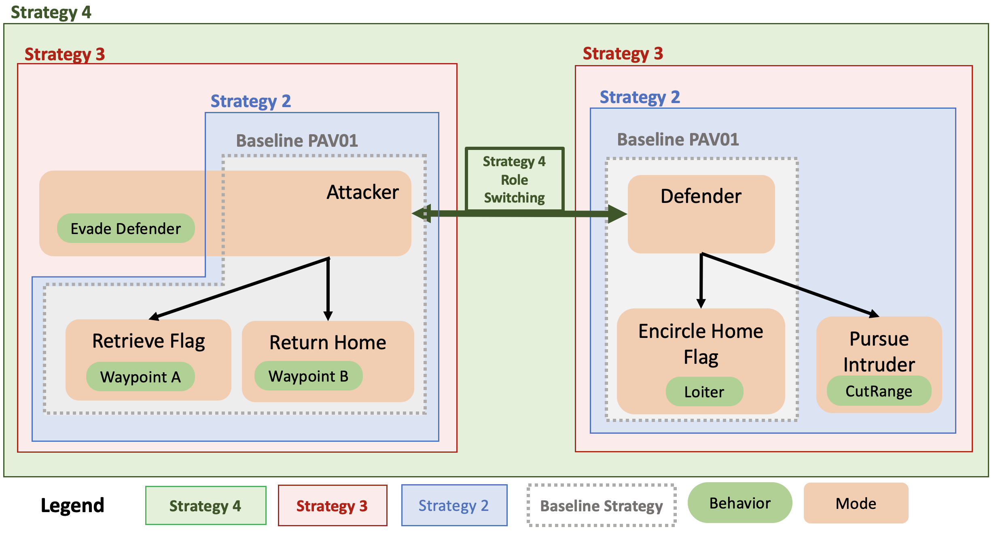
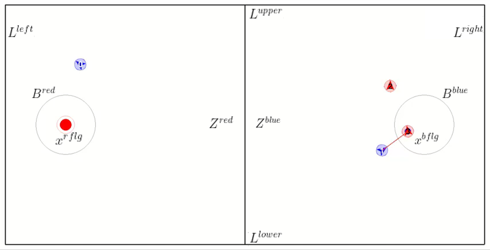
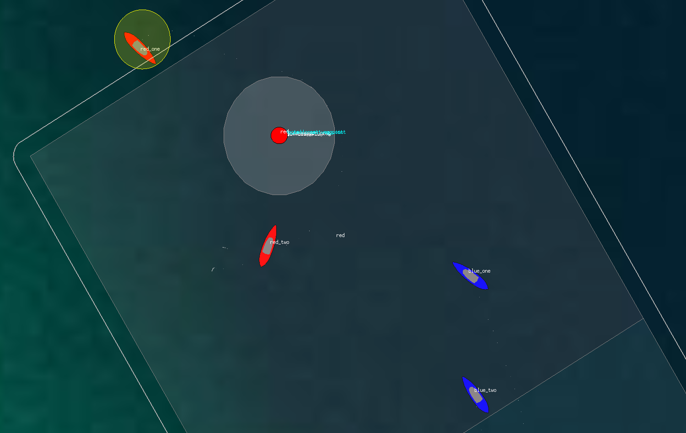

# 通过海上“夺旗”竞赛，评估在对抗环境中的协同自主性

发布时间：2024年04月25日

`Agent` `无人船只` `人工智能`

> Evaluating Collaborative Autonomy in Opposed Environments using Maritime Capture-the-Flag Competitions

# 摘要

> 本研究旨在探讨在对抗性环境中，多智能体人工智能方法在无人水面船只（USV）团队中的应用效果。通过Aquaticus测试平台，我们在现实场景中对自主智能体进行了评估，该平台采用Capture-the-Flag（CTF）风格的竞赛形式，涉及USV系统的团队对抗。我们部署了基于行为优化和深度强化学习（RL）的多种合作算法于USV系统，并在2023年秋季的比赛中进行了两两对抗的测试。利用Pyquaticus测试平台，我们实现了USV智能体的深度强化学习，该平台是一个轻量级的仿真环境，支持在低层次环境中进行CTF训练。实验结果显示，基于规则的合作策略在行为基础智能体中表现更佳，超越了深度强化学习训练的智能体。未来，我们计划将Pyquaticus环境与MOOS-IvP在配置和控制架构上进一步整合，以提升CTF游戏的竞争力。随着深度RL方法的不断进步，我们预计行为基础自主性与深度RL之间的性能差距将逐步缩小。本报告总结了比赛的整体情况、所采用的方法以及实验结果，并对未来的工作重点，如奖励机制设计、仿真到现实技术，以及如何扩展基于规则的智能体合作以响应安全和安全事件，根据人类专家的意图和规则执行安全和防护流程进行了展望。

> The objective of this work is to evaluate multi-agent artificial intelligence methods when deployed on teams of unmanned surface vehicles (USV) in an adversarial environment. Autonomous agents were evaluated in real-world scenarios using the Aquaticus test-bed, which is a Capture-the-Flag (CTF) style competition involving teams of USV systems. Cooperative teaming algorithms of various foundations in behavior-based optimization and deep reinforcement learning (RL) were deployed on these USV systems in two versus two teams and tested against each other during a competition period in the fall of 2023. Deep reinforcement learning applied to USV agents was achieved via the Pyquaticus test bed, a lightweight gymnasium environment that allows simulated CTF training in a low-level environment. The results of the experiment demonstrate that rule-based cooperation for behavior-based agents outperformed those trained in Deep-reinforcement learning paradigms as implemented in these competitions. Further integration of the Pyquaticus gymnasium environment for RL with MOOS-IvP in terms of configuration and control schema will allow for more competitive CTF games in future studies. As the development of experimental deep RL methods continues, the authors expect that the competitive gap between behavior-based autonomy and deep RL will be reduced. As such, this report outlines the overall competition, methods, and results with an emphasis on future works such as reward shaping and sim-to-real methodologies and extending rule-based cooperation among agents to react to safety and security events in accordance with human experts intent/rules for executing safety and security processes.

[Arxiv](https://arxiv.org/abs/2404.17038)