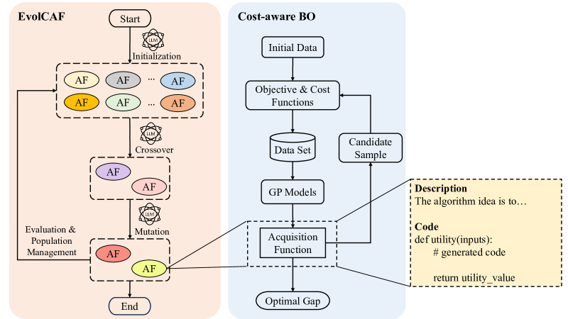
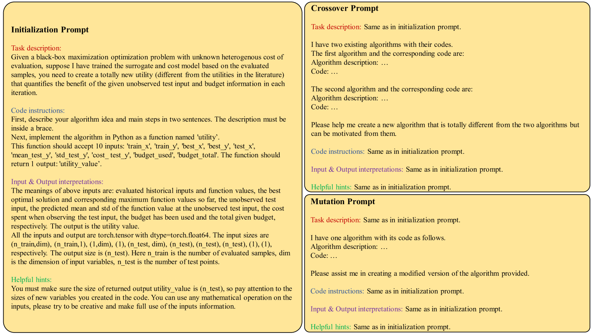
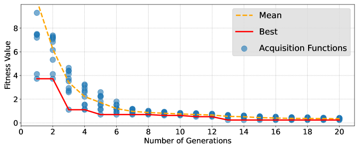
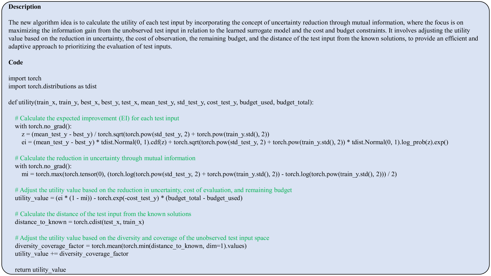
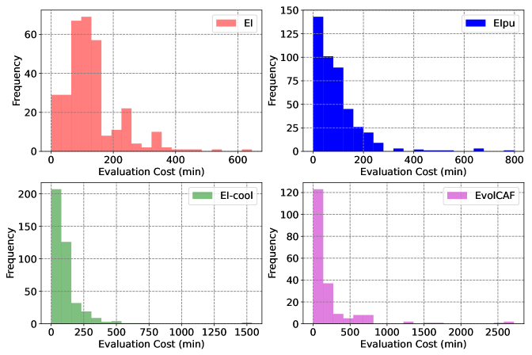

# 利用大型语言模型，我们推进了成本感知采购函数的演化。

发布时间：2024年04月25日

`LLM应用` `优化算法` `自动化设计`

> Evolve Cost-aware Acquisition Functions Using Large Language Models

# 摘要

> 在众多现实世界的优化情境中，评估成本高昂且成本结构复杂多变。面对这一难题，成本感知贝叶斯优化策略以其显著效果脱颖而出。在预算有限的情况下，如何设计出成本感知的获取函数（AFs），以经济高效的方式逼近全局最优解，成为了一个关键问题。传统上，这一设计过程依赖于深入的领域知识和繁琐的试错环节。本论文提出了EvolCAF，这是一个创新的框架，它融合了大型语言模型（LLMs）和进化计算（EC），自动化地设计出成本感知的AFs。EvolCAF通过算法空间中的交叉和变异操作，开创了一种新的设计模式，大幅降低了对专业领域知识和模型训练的依赖。所设计的AF能够充分利用历史数据、替代模型和预算细节中的信息，其新颖的设计思路为获取函数的设计领域带来了新的视角，提供了对其行为和决策过程的清晰解释。相较于人类专家设计的EIpu和EI-cool方法，EvolCAF在多个任务上展现出了卓越的效率和泛化能力，这包括12个合成问题和3个真实世界的超参数调整测试集。

> Many real-world optimization scenarios involve expensive evaluation with unknown and heterogeneous costs. Cost-aware Bayesian optimization stands out as a prominent solution in addressing these challenges. To approach the global optimum within a limited budget in a cost-efficient manner, the design of cost-aware acquisition functions (AFs) becomes a crucial step. However, traditional manual design paradigm typically requires extensive domain knowledge and involves a labor-intensive trial-and-error process. This paper introduces EvolCAF, a novel framework that integrates large language models (LLMs) with evolutionary computation (EC) to automatically design cost-aware AFs. Leveraging the crossover and mutation in the algorithm space, EvolCAF offers a novel design paradigm, significantly reduces the reliance on domain expertise and model training. The designed cost-aware AF maximizes the utilization of available information from historical data, surrogate models and budget details. It introduces novel ideas not previously explored in the existing literature on acquisition function design, allowing for clear interpretations to provide insights into its behavior and decision-making process. In comparison to the well-known EIpu and EI-cool methods designed by human experts, our approach showcases remarkable efficiency and generalization across various tasks, including 12 synthetic problems and 3 real-world hyperparameter tuning test sets.

[Arxiv](https://arxiv.org/abs/2404.16906)