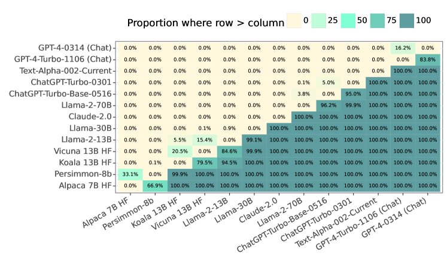

# 探究大型语言模型评估在面对基准测试分布假设时的稳健性。

发布时间：2024年04月25日

`LLM理论` `人工智能`

> Examining the robustness of LLM evaluation to the distributional assumptions of benchmarks

# 摘要

> 基准测试已成为衡量大型语言模型（LLM）性能的核心手段。研究界通常根据模型在基准测试中各测试点的平均表现来进行评估。这种做法基于一个假设，即认为测试点是来自现实世界中我们感兴趣的某种分布的随机抽样。然而，实际情况往往并非如此，我们认为感兴趣的分布应当根据具体应用场景而有所不同。我们的研究发现：（1）模型在不同测试点的表现之间存在非随机的相关性；（2）考虑这些相关性可能会在主要基准测试中改变模型的排名；（3）这些相关性的解释因素包括语义相似性以及LLM常见的失败点。

> Benchmarks have emerged as the central approach for evaluating Large Language Models (LLMs). The research community often relies on a model's average performance across the test prompts of a benchmark to evaluate the model's performance. This is consistent with the assumption that the test prompts within a benchmark represent a random sample from a real-world distribution of interest. We note that this is generally not the case; instead, we hold that the distribution of interest varies according to the specific use case. We find that (1) the correlation in model performance across test prompts is non-random, (2) accounting for correlations across test prompts can change model rankings on major benchmarks, (3) explanatory factors for these correlations include semantic similarity and common LLM failure points.

[Arxiv](https://arxiv.org/abs/2404.16966)