# 对话的长短如何影响用户的满意度？本研究通过案例分析，探讨了由大型语言模型（LLM）支持的聊天机器人在进行长度受控对话时的用户满意度。

发布时间：2024年04月25日

`分类：LLM应用` `人机交互` `聊天机器人`

> How Does Conversation Length Impact User's Satisfaction? A Case Study of Length-Controlled Conversations with LLM-Powered Chatbots

# 摘要

> 用户与大型语言模型（LLMs）的交流话题广泛，但他们有时更倾向于简洁的对话而非冗长的问答。这引出了一个引人入胜的人机交互（HCI）问题：我们如何通过调整LLMs的对话长度来优化对话质量？本研究中，我们利用GPT-4构建了两个Slack聊天机器人，它们能够灵活调整对话的长短，并进行了一项用户调研。参与者向机器人提出了从高度互动到不太适合深入讨论的问题，并与机器人进行了0至7轮的对话。研究发现，不同对话长度对质量的影响并不显著，而用户对此有着不同的反馈。这项研究揭示了LLMs在调整对话长度方面的潜力，以及这种调整可能给用户带来的益处，但也指出了文本形式的变动并不总等同于质量或内容的提升。

> Users can discuss a wide range of topics with large language models (LLMs), but they do not always prefer solving problems or getting information through lengthy conversations. This raises an intriguing HCI question: How does instructing LLMs to engage in longer or shorter conversations affect conversation quality? In this paper, we developed two Slack chatbots using GPT-4 with the ability to vary conversation lengths and conducted a user study. Participants asked the chatbots both highly and less conversable questions, engaging in dialogues with 0, 3, 5, and 7 conversational turns. We found that the conversation quality does not differ drastically across different conditions, while participants had mixed reactions. Our study demonstrates LLMs' ability to change conversation length and the potential benefits for users resulting from such changes, but we caution that changes in text form may not necessarily imply changes in quality or content.

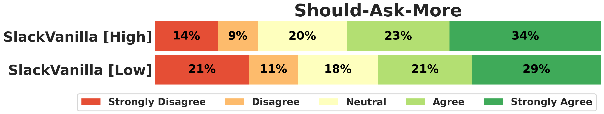

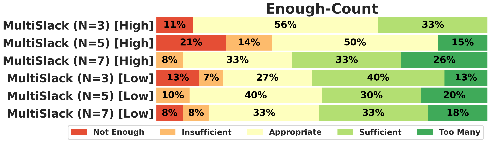

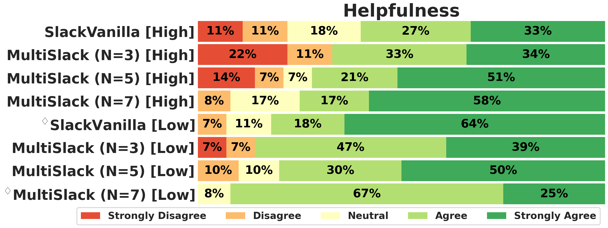

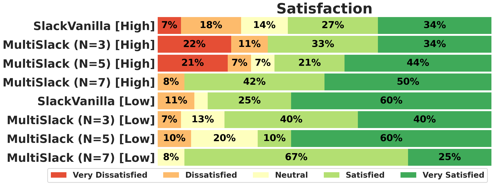

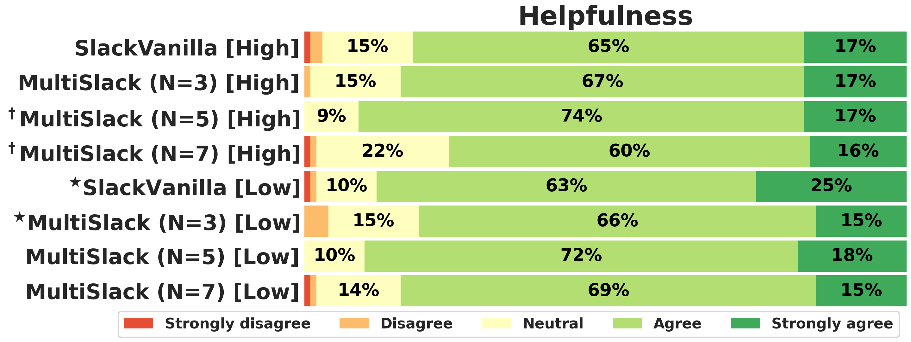

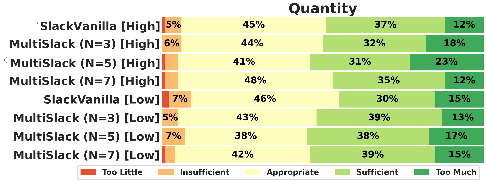

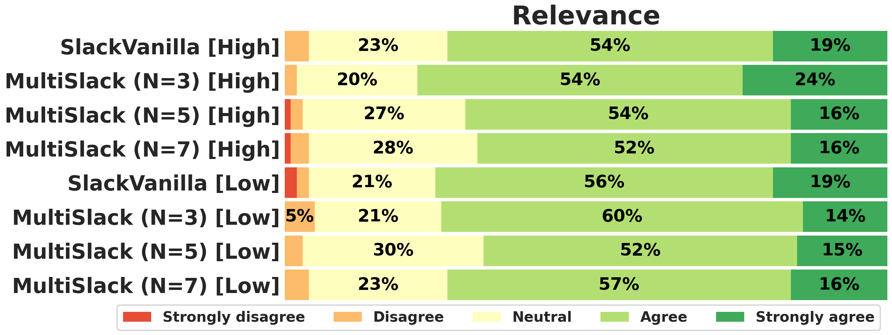

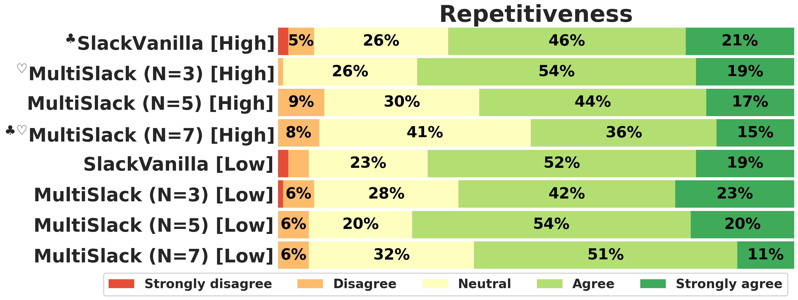

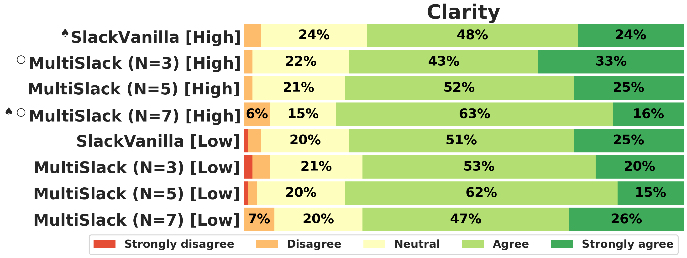

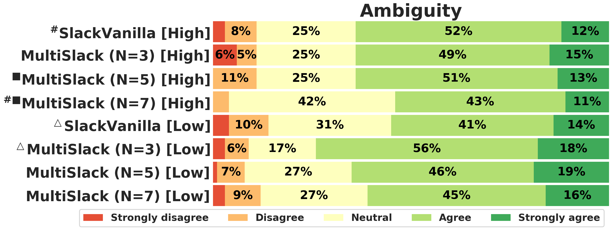

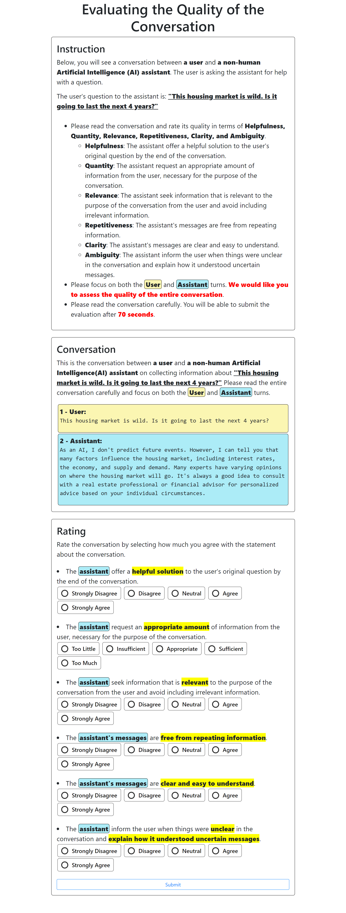

[Arxiv](https://arxiv.org/abs/2404.17025)