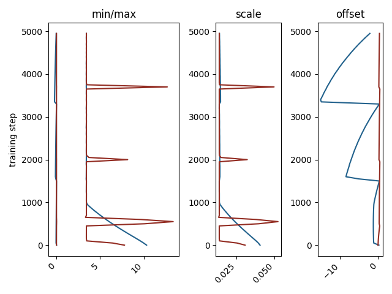

# 量化感知训练中非对称量化区间的参数化方法

发布时间：2024年04月25日

`分类：LLM理论` `机器学习`

> How to Parameterize Asymmetric Quantization Ranges for Quantization-Aware Training

# 摘要

> 本研究深入探讨了量化感知训练中三种非对称均匀量化参数化方案：（1）缩放和平移，（2）最小与最大值，（3）β与γ。通过精心设计的实验和在真实世界的大型语言模型上的应用，我们全面比较了这些参数化对训练过程的影响。研究重点在于它们如何随关键训练超参数——位宽和学习率——的变化而变化。根据我们的发现，我们提出了一系列最佳实践，旨在优化具有可学习非对称量化区间的量化感知训练的稳定性与效率。

> This paper investigates three different parameterizations of asymmetric uniform quantization for quantization-aware training: (1) scale and offset, (2) minimum and maximum, and (3) beta and gamma. We perform a comprehensive comparative analysis of these parameterizations' influence on quantization-aware training, using both controlled experiments and real-world large language models. Our particular focus is on their changing behavior in response to critical training hyperparameters, bit width and learning rate. Based on our investigation, we propose best practices to stabilize and accelerate quantization-aware training with learnable asymmetric quantization ranges.

[Arxiv](https://arxiv.org/abs/2404.16898)