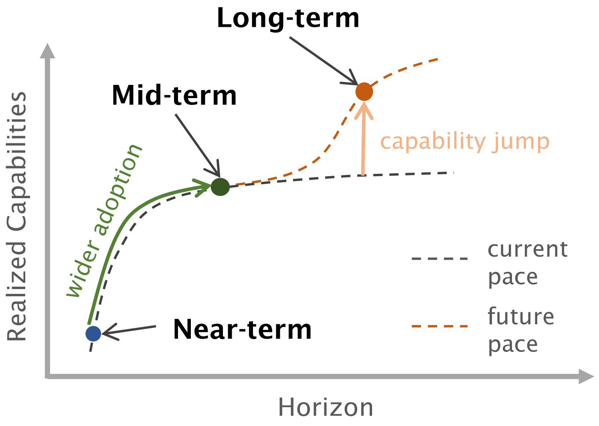
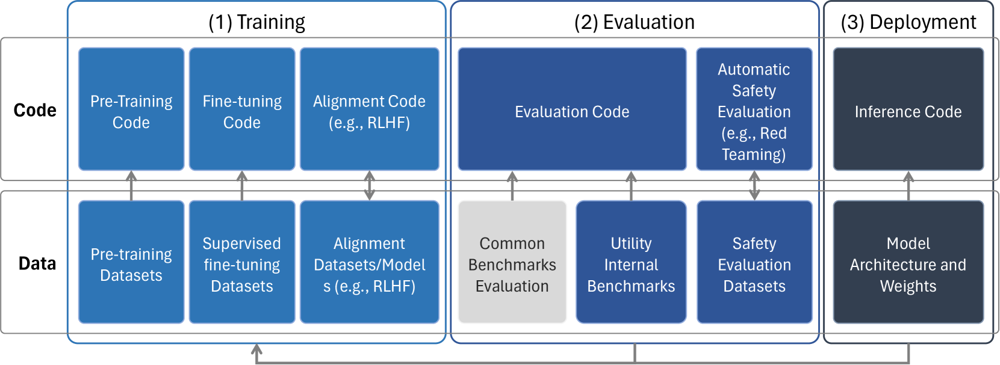
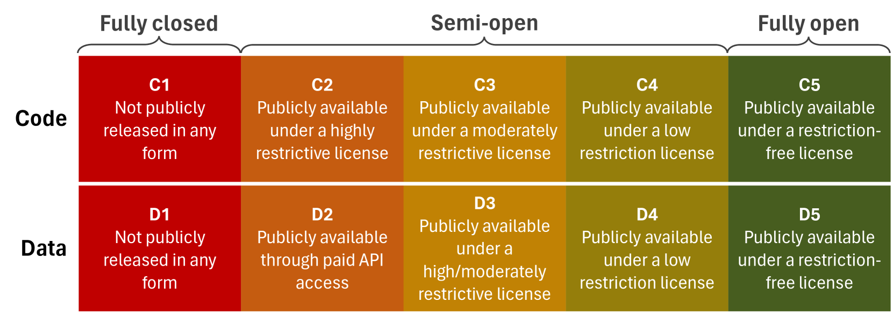
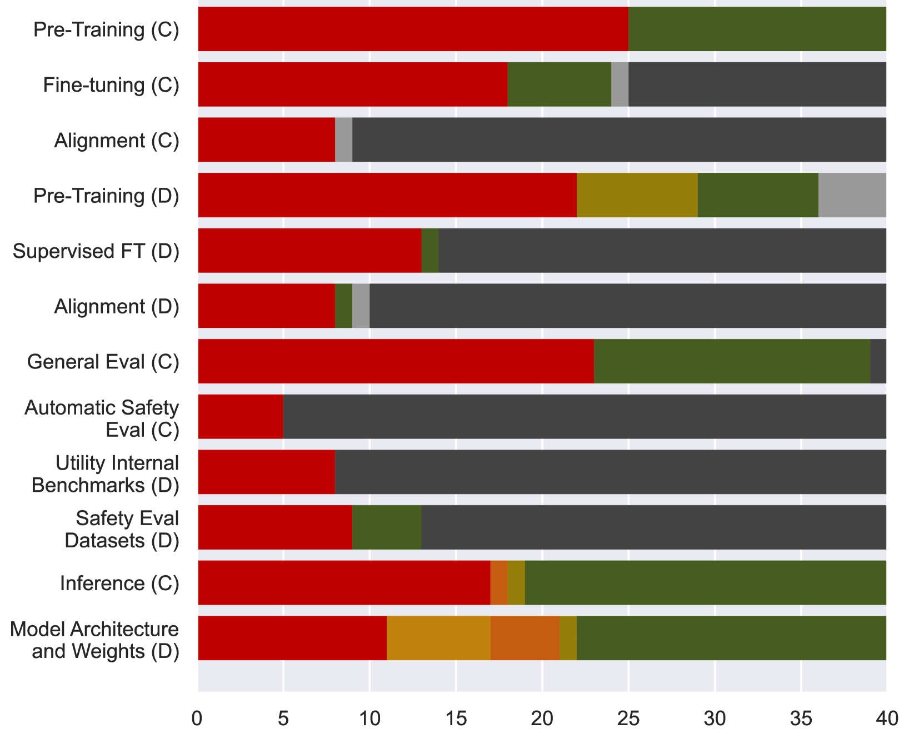

# 开源生成式AI的近期至中期风险与机遇探讨

发布时间：2024年04月25日

`LLM应用` `AI安全` `开源软件`

> Near to Mid-term Risks and Opportunities of Open Source Generative AI

# 摘要

> 未来数年，生成性AI的应用有望在科学、医学、教育等多个领域引发变革。这些可能的变革激起了对潜在风险的广泛讨论，并促使一些在AI领域领先的大型科技公司呼吁加强监管。这种监管可能会对开源生成性AI的萌芽领域构成威胁。我们提倡在短期内以负责任的态度开放生成性AI模型的源代码。为此，我们首先提出了一个AI开放性分类体系，并将其应用于40种现行的大型语言模型。接着，我们分析了开源与闭源AI的利弊，并提出了风险缓解策略，从最佳实践到技术与科学贡献的呼吁。我们期望这份报告能为当前关于AI安全与社会影响的公共讨论贡献一个迫切需要的声音。

> In the next few years, applications of Generative AI are expected to revolutionize a number of different areas, ranging from science & medicine to education. The potential for these seismic changes has triggered a lively debate about potential risks and resulted in calls for tighter regulation, in particular from some of the major tech companies who are leading in AI development. This regulation is likely to put at risk the budding field of open source Generative AI. We argue for the responsible open sourcing of generative AI models in the near and medium term. To set the stage, we first introduce an AI openness taxonomy system and apply it to 40 current large language models. We then outline differential benefits and risks of open versus closed source AI and present potential risk mitigation, ranging from best practices to calls for technical and scientific contributions. We hope that this report will add a much needed missing voice to the current public discourse on near to mid-term AI safety and other societal impact.

[Arxiv](https://arxiv.org/abs/2404.17047)