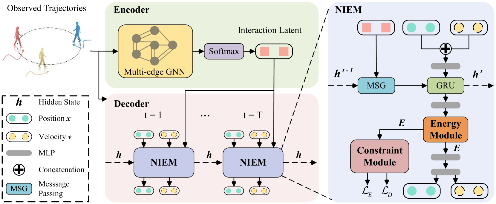
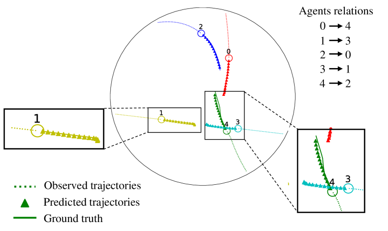
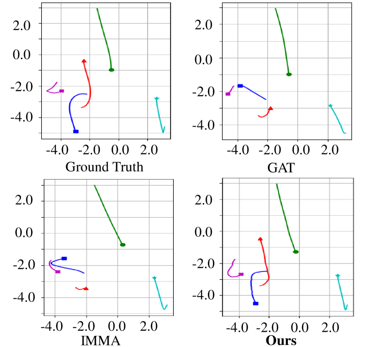
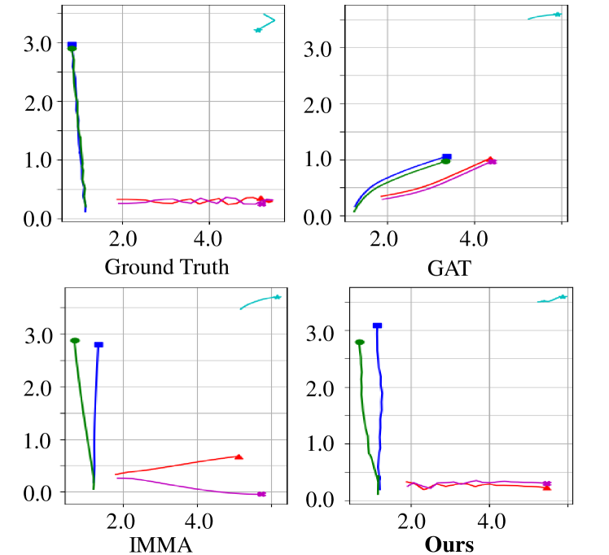
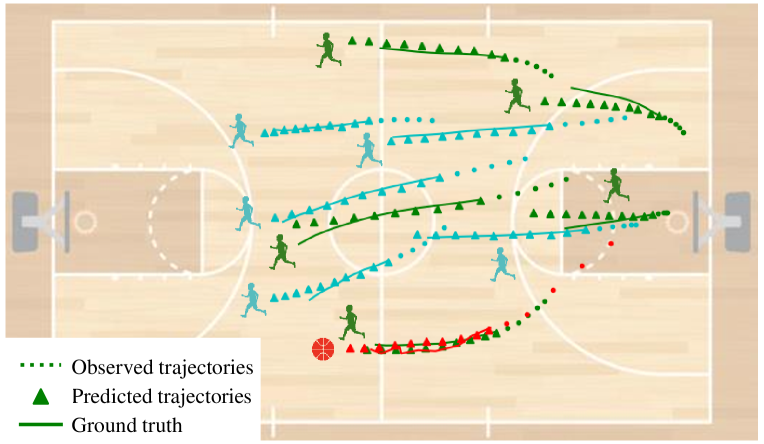
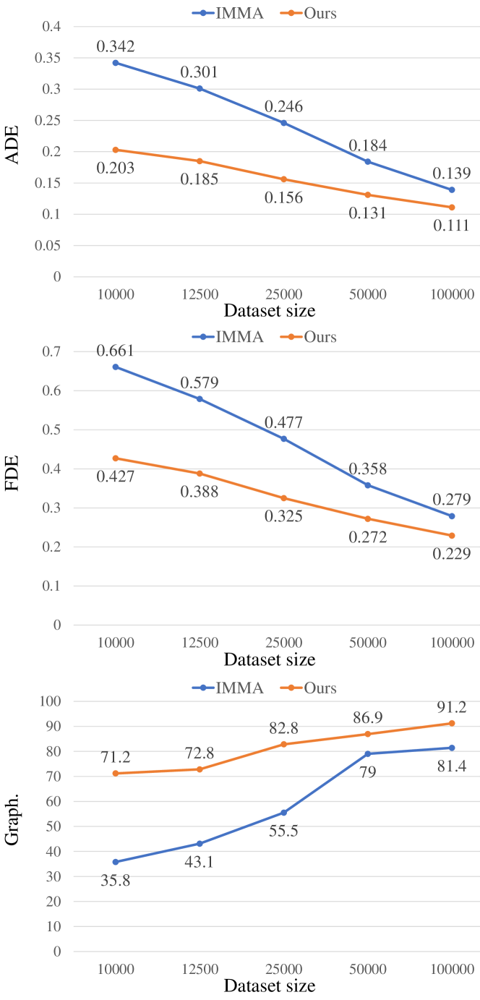

# 本文介绍了一种新颖的方法——神经交互能量，用于预测多智能体的行动轨迹。

发布时间：2024年04月25日

`Agent` `智能体轨迹预测` `多智能体系统`

> Neural Interaction Energy for Multi-Agent Trajectory Prediction

# 摘要

> 在多智能体轨迹预测领域，确保时间稳定性是关键。缺乏足够的正则化可能导致运动状态的波动，进而引发预测不一致和误差累积。本研究提出了一个名为MATE（通过神经交互能量进行多智能体轨迹预测）的框架，它利用神经交互能量来分析智能体间的互动运动，从而揭示这些互动对未来轨迹的影响。为增强时间稳定性，我们引入了两项约束：一是智能体间的交互约束，二是智能体内部的运动约束。这两项约束协同作用，确保了系统和个体层面的时间稳定性，有效减少了多智能体系统中的预测波动。在四个多样化数据集上的比较评估显示，我们的模型在预测准确性和泛化能力方面均优于现有方法。

> Maintaining temporal stability is crucial in multi-agent trajectory prediction. Insufficient regularization to uphold this stability often results in fluctuations in kinematic states, leading to inconsistent predictions and the amplification of errors. In this study, we introduce a framework called Multi-Agent Trajectory prediction via neural interaction Energy (MATE). This framework assesses the interactive motion of agents by employing neural interaction energy, which captures the dynamics of interactions and illustrates their influence on the future trajectories of agents. To bolster temporal stability, we introduce two constraints: inter-agent interaction constraint and intra-agent motion constraint. These constraints work together to ensure temporal stability at both the system and agent levels, effectively mitigating prediction fluctuations inherent in multi-agent systems. Comparative evaluations against previous methods on four diverse datasets highlight the superior prediction accuracy and generalization capabilities of our model.

[Arxiv](https://arxiv.org/abs/2404.16579)