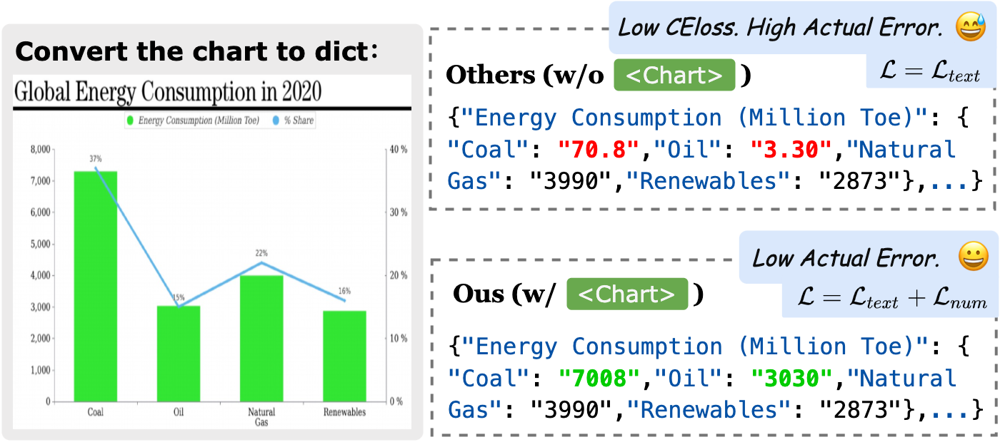
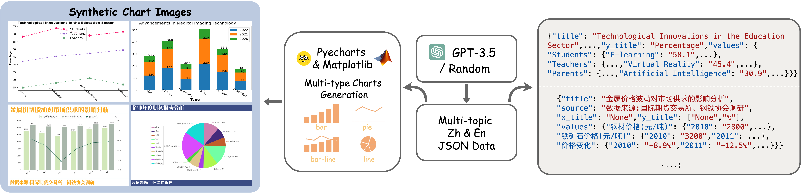
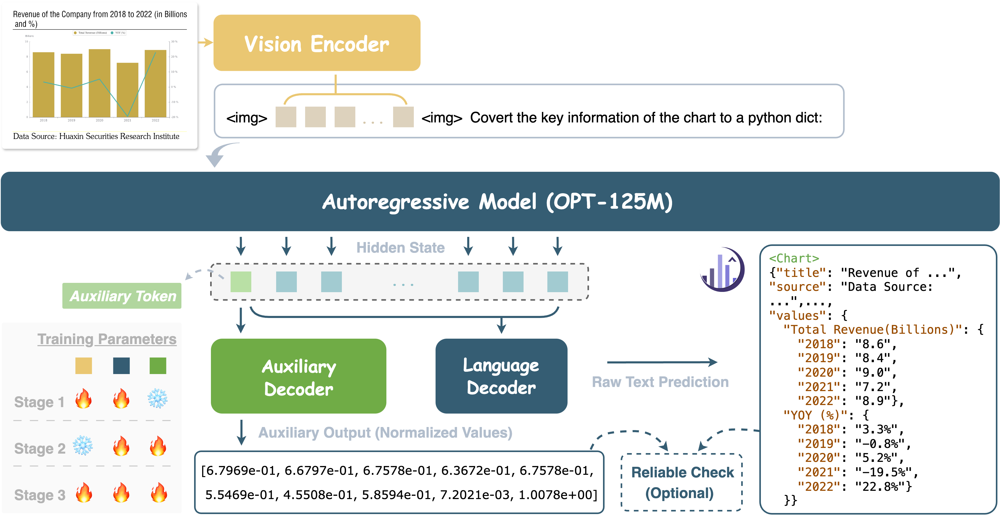
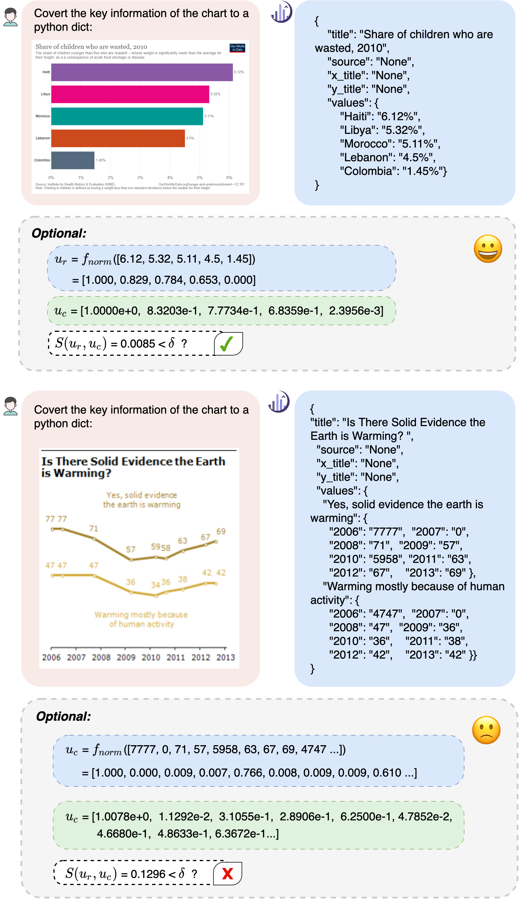
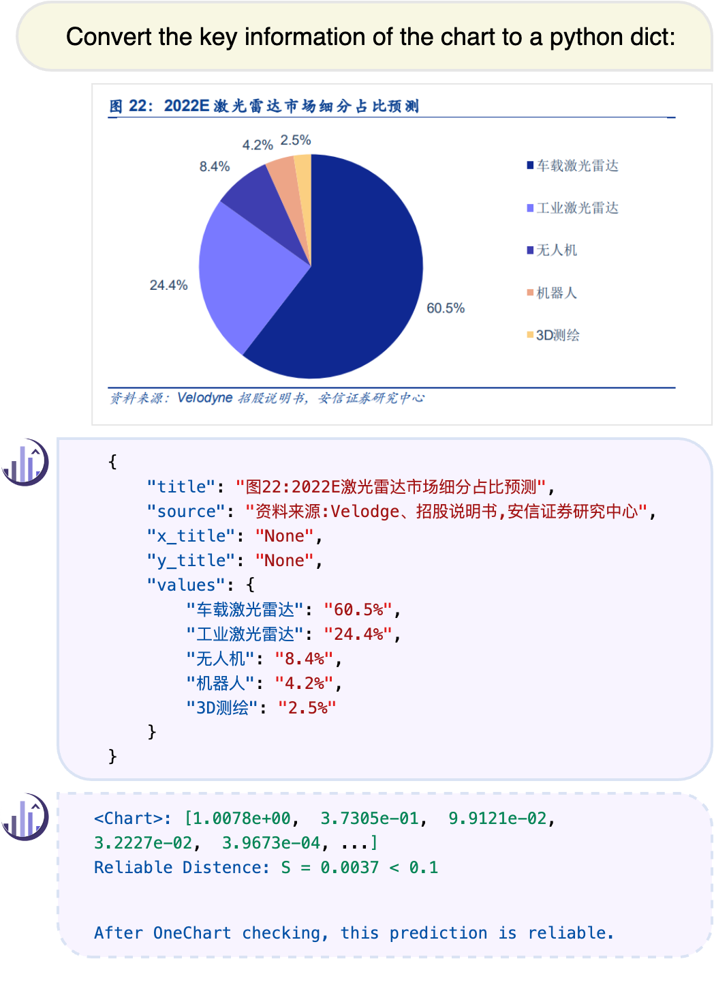
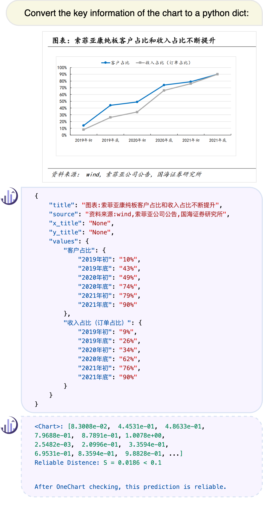
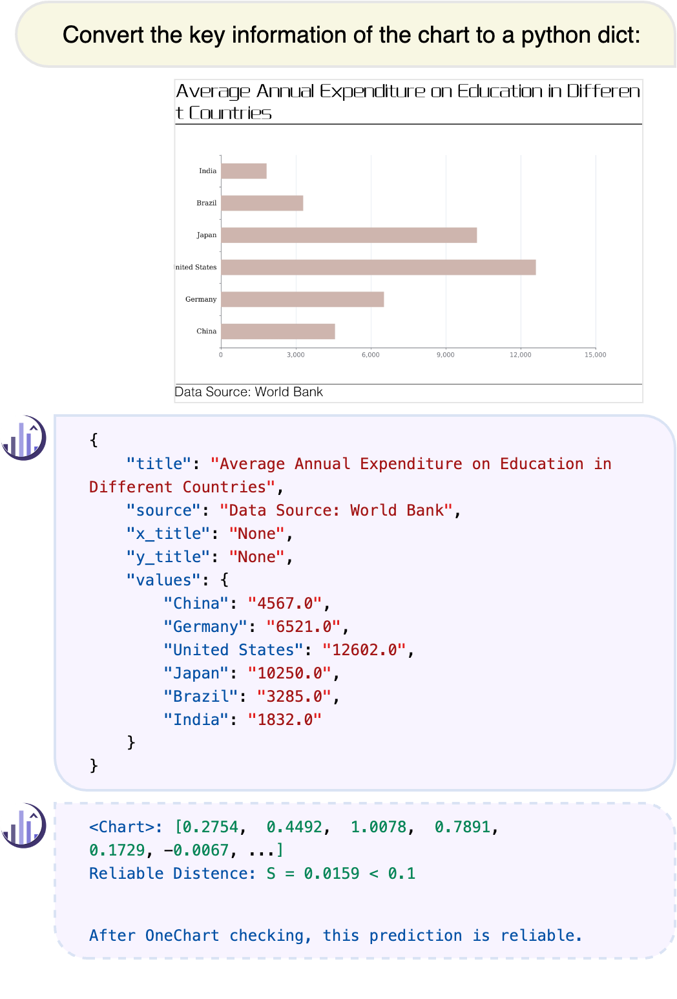
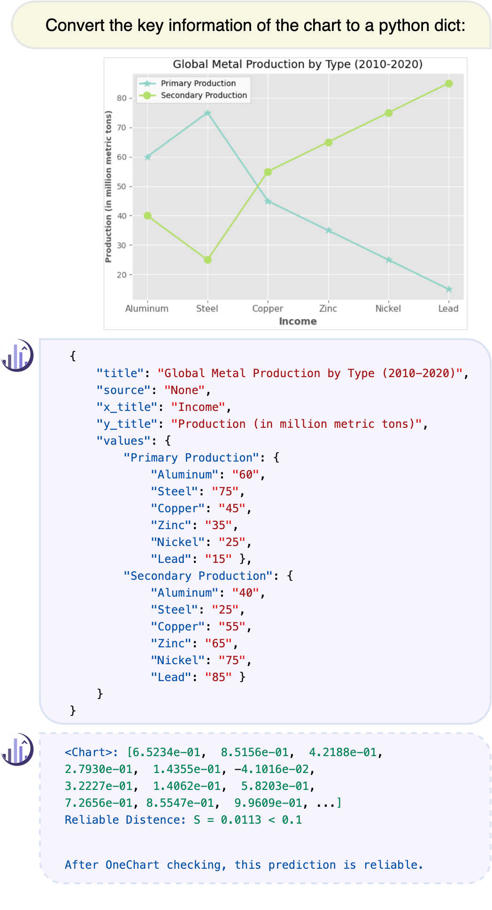
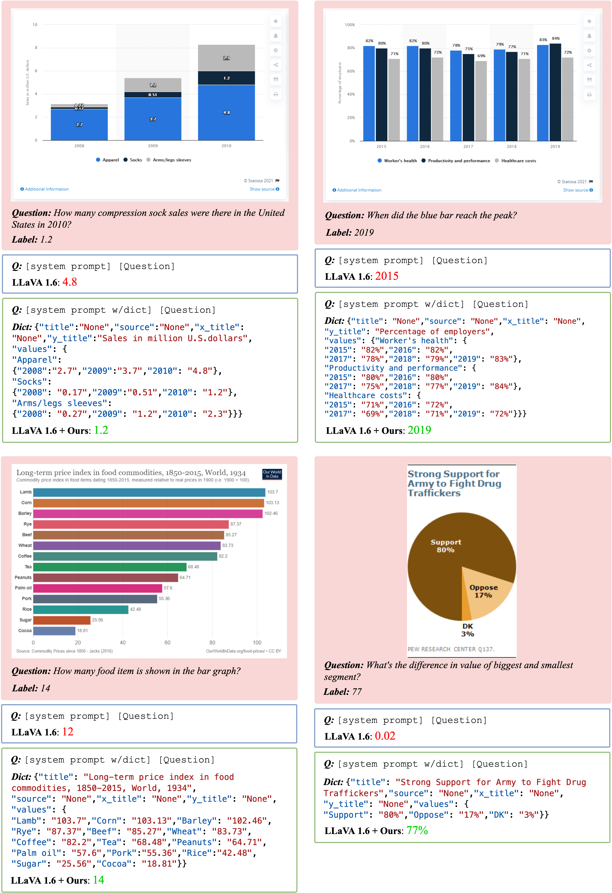

# OneChart：引入单一辅助标记，精炼图表结构的提取过程

发布时间：2024年04月25日

`Agent` `图表解析`

> OneChart: Purify the Chart Structural Extraction via One Auxiliary Token

# 摘要

> 图表解析因风格迥异、数值多样、文本繁杂等因素而充满挑战，即便是参数众多的先进视觉-语言大型模型（LVLMs）也常感力不从心。为此，我们设计了OneChart：一款专为图表信息的结构化抽取而打造的可信代理。OneChart沿用了主流LVLMs的自回归主体架构，并创新性地在总令牌序列的起始位置引入辅助令牌及附加解码器，以提升输出中数值部分的准确性。这一数值优化的辅助令牌，使得后续令牌在解析图表时能够通过因果注意力机制捕捉更为精细的数值特征。我们还引入了一种自我评估机制，使模型能够通过生成内容的置信度评分来评估其图表解析的可靠性。在与当前顶尖的图表解析模型如DePlot、ChartVLM、ChartAst等的比较中，OneChart在多个公共基准测试中的平均精度（AP）上取得了显著的领先优势，尽管其参数量仅20亿。此外，作为图表解析代理，OneChart还显著提升了流行LVLM（如LLaVA-1.6）在ChartQA基准测试中的准确率，增幅超过10%。

> Chart parsing poses a significant challenge due to the diversity of styles, values, texts, and so forth. Even advanced large vision-language models (LVLMs) with billions of parameters struggle to handle such tasks satisfactorily. To address this, we propose OneChart: a reliable agent specifically devised for the structural extraction of chart information. Similar to popular LVLMs, OneChart incorporates an autoregressive main body. Uniquely, to enhance the reliability of the numerical parts of the output, we introduce an auxiliary token placed at the beginning of the total tokens along with an additional decoder. The numerically optimized (auxiliary) token allows subsequent tokens for chart parsing to capture enhanced numerical features through causal attention. Furthermore, with the aid of the auxiliary token, we have devised a self-evaluation mechanism that enables the model to gauge the reliability of its chart parsing results by providing confidence scores for the generated content. Compared to current state-of-the-art (SOTA) chart parsing models, e.g., DePlot, ChartVLM, ChartAst, OneChart significantly outperforms in Average Precision (AP) for chart structural extraction across multiple public benchmarks, despite enjoying only 0.2 billion parameters. Moreover, as a chart parsing agent, it also brings 10%+ accuracy gains for the popular LVLM (LLaVA-1.6) in the downstream ChartQA benchmark.

[Arxiv](https://arxiv.org/abs/2404.09987)