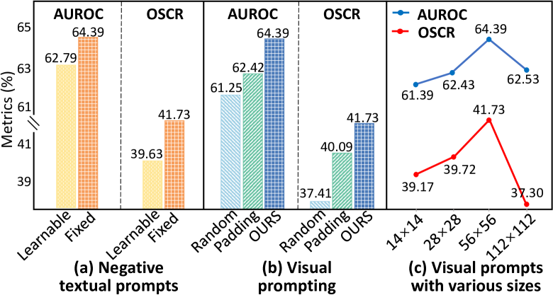

# 视频驱动的开放集人脸识别技术，引入了对人类表情变化敏感的提示机制。

发布时间：2024年04月25日

`分类：Agent

这篇论文提出了一个创新的解决方案，通过设计人类表情敏感提示（HESP）机制来提高大规模视觉-语言模型CLIP在视频驱动的面部表情识别（V-FER）任务中的性能。这个解决方案包括文本提示模块、视觉提示模块和一个开放集多任务学习框架，这些组件共同工作以提高对视频面部表情细节的建模能力。由于这个研究涉及到设计和实现一个智能代理（即HESP机制），以提高模型在特定任务上的性能，因此这篇论文可以归类为Agent。` `面部识别` `情感识别`

> Open-Set Video-based Facial Expression Recognition with Human Expression-sensitive Prompting

# 摘要

> 在视频驱动的面部表情识别（V-FER）领域，模型多在有限类别的封闭数据集上训练，却难以应对现实世界中常见的未知类别。本文提出了一项前沿的开放集视频面部表情识别（OV-FER）任务，目标是识别出训练时未见过的新兴及未知的人脸表情。尽管现有技术借助如CLIP这样的大规模视觉-语言模型来识别新类别，但这些方法在捕捉OV-FER任务所需的精细人类表情模式方面仍有不足。为克服此局限，我们设计了创新的人类表情敏感提示（HESP）机制，显著提升了CLIP对视频面部表情细节的建模能力，进而推出了一种创新的基于CLIP的OV-FER解决方案。HESP机制包含三个关键部分：首先，文本提示模块通过可学习的提示表示来强化原有CLIP的文本提示，提升已知与未知情感的文本表达；其次，视觉提示模块利用表情敏感的注意力机制从视频帧中编码时间序列情感信息，赋予CLIP更强大的视觉建模能力；最后，一个精巧设计的开放集多任务学习框架，促进了提示学习并加强了文本与视觉模块间的互动。在四项OV-FER任务设置上的广泛实验证明，HESP显著提升了CLIP的性能（AUROC提升17.93%，OSCR提升106.18%），并在其他尖端开放集视频理解方法中脱颖而出。

> In Video-based Facial Expression Recognition (V-FER), models are typically trained on closed-set datasets with a fixed number of known classes. However, these V-FER models cannot deal with unknown classes that are prevalent in real-world scenarios. In this paper, we introduce a challenging Open-set Video-based Facial Expression Recognition (OV-FER) task, aiming at identifying not only known classes but also new, unknown human facial expressions not encountered during training. While existing approaches address open-set recognition by leveraging large-scale vision-language models like CLIP to identify unseen classes, we argue that these methods may not adequately capture the nuanced and subtle human expression patterns required by the OV-FER task. To address this limitation, we propose a novel Human Expression-Sensitive Prompting (HESP) mechanism to significantly enhance CLIP's ability to model video-based facial expression details effectively, thereby presenting a new CLIP-based OV-FER approach. Our proposed HESP comprises three components: 1) a textual prompting module with learnable prompt representations to complement the original CLIP textual prompts and enhance the textual representations of both known and unknown emotions, 2) a visual prompting module that encodes temporal emotional information from video frames using expression-sensitive attention, equipping CLIP with a new visual modeling ability to extract emotion-rich information, 3) a delicately designed open-set multi-task learning scheme that facilitates prompt learning and encourages interactions between the textual and visual prompting modules. Extensive experiments conducted on four OV-FER task settings demonstrate that HESP can significantly boost CLIP's performance (a relative improvement of 17.93% on AUROC and 106.18% on OSCR) and outperform other state-of-the-art open-set video understanding methods by a large margin.

[Arxiv](https://arxiv.org/abs/2404.17100)