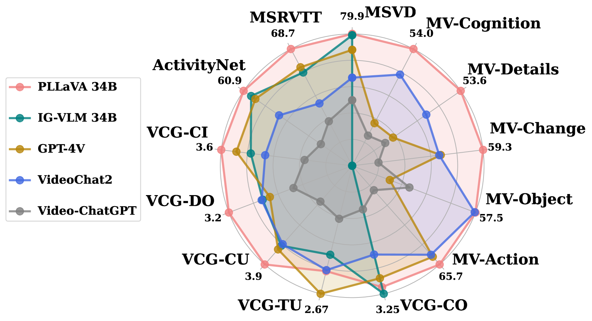
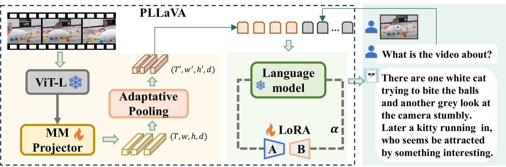

# PLLaVA：一种无需额外参数即可将 LLaVA 从图像扩展到视频的技术，专为视频密集字幕生成设计。

发布时间：2024年04月25日

`分类：LLM应用

这篇论文的摘要描述了一种针对视频任务的预训练模型优化方法，旨在实现深度视频理解。它提出了一种新的模型 PLLaVA，该模型在视频问答和字幕制作等任务中取得了优异的性能。这篇论文主要关注于如何改进现有的图像-语言预训练模型以适应视频任务，因此它属于LLM应用类别。` `视频理解` `人工智能`

> PLLaVA : Parameter-free LLaVA Extension from Images to Videos for Video Dense Captioning

# 摘要

> 视觉-语言预训练技术在图像-语言应用领域取得了显著成效。但视频任务的预训练却因对计算和数据资源的巨大需求而进展缓慢。本研究提出了一种简洁高效且资源消耗低的方法，用于优化现有的图像-语言预训练模型，以实现深度视频理解。我们的初步测试发现，直接对视频数据集进行多帧输入的预训练模型微调，可能会导致性能停滞甚至下降，这主要归咎于学习到的高范数视觉特征的偏颇。基于这一发现，我们设计了一种简单而有效的池化策略，用以沿时间维度平滑特征分布，减少极端特征的影响。新模型命名为 Pooling LLaVA（简称 PLLaVA）。PLLaVA 在视频问答和字幕制作等现代基准测试中刷新了最佳性能记录。特别值得一提的是，在最新的 Video ChatGPT 基准测试中，PLLaVA 的平均得分为 3.48 分（满分 5 分），较之前的最佳成绩提升了 9%。在多选基准测试 MVBench 中，PLLaVA 的平均准确度达到 58.1%，在 20 个子任务中比 IG-VLM 高出 14.5%。相关代码已在 \url{https://github.com/magic-research/PLLaVA} 上发布。

> Vision-language pre-training has significantly elevated performance across a wide range of image-language applications. Yet, the pre-training process for video-related tasks demands exceptionally large computational and data resources, which hinders the progress of video-language models. This paper investigates a straightforward, highly efficient, and resource-light approach to adapting an existing image-language pre-trained model for dense video understanding. Our preliminary experiments reveal that directly fine-tuning pre-trained image-language models with multiple frames as inputs on video datasets leads to performance saturation or even a drop. Our further investigation reveals that it is largely attributed to the bias of learned high-norm visual features. Motivated by this finding, we propose a simple but effective pooling strategy to smooth the feature distribution along the temporal dimension and thus reduce the dominant impacts from the extreme features. The new model is termed Pooling LLaVA, or \nameofmethod{} in short. \nameofmethod{} achieves new state-of-the-art performance on modern benchmark datasets for both video question-answer and captioning tasks. Notably, on the recent popular Video ChatGPT benchmark, PLLaVA achieves a score of 3.48 out of 5 on average of five evaluated dimensions, exceeding the previous SOTA results from GPT4V (IG-VLM) by 9\%. On the latest multi-choice benchmark MVBench, PLLaVA achieves 58.1\% accuracy on average across 20 sub-tasks, 14.5\% higher than GPT4V (IG-VLM). Code is available at \url{https://github.com/magic-research/PLLaVA}.

[Arxiv](https://arxiv.org/abs/2404.16994)