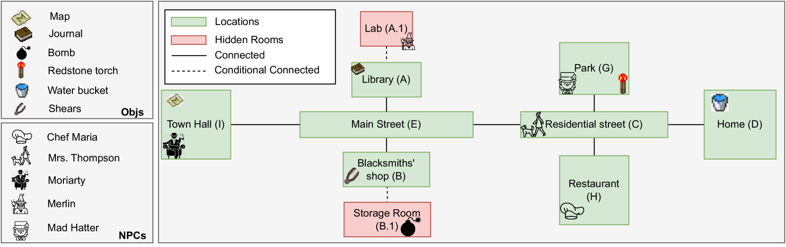
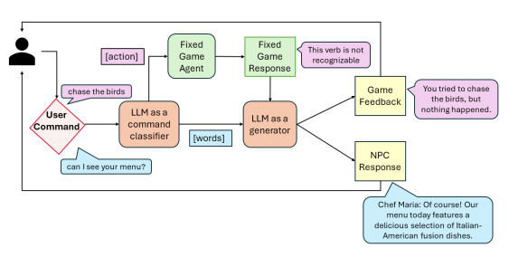
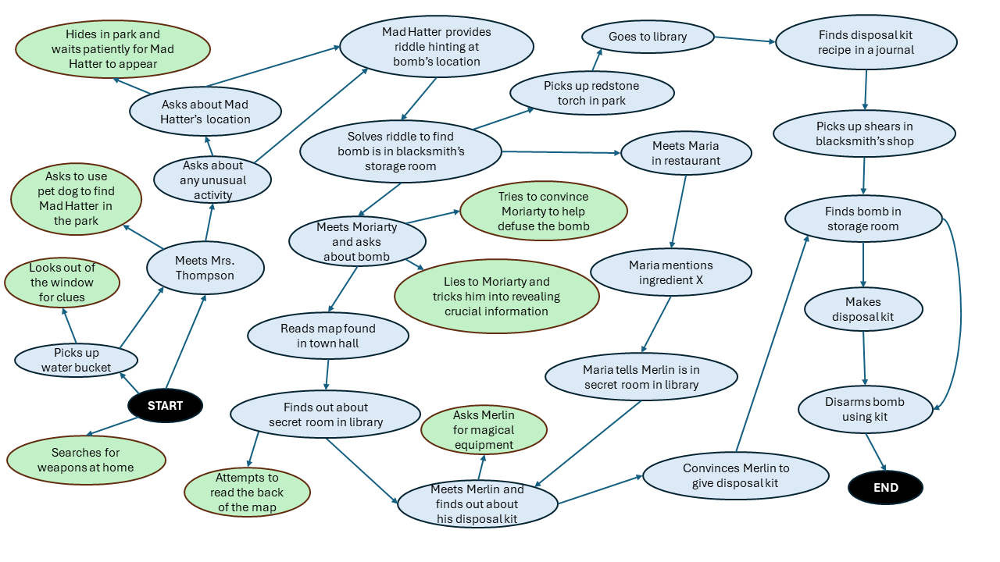

# 在大型语言模型（LLM）驱动的游戏叙事中，玩家的主动参与催生了新的发展。

发布时间：2024年04月25日

`分类：LLM应用` `游戏开发` `人工智能`

> Player-Driven Emergence in LLM-Driven Game Narrative

# 摘要

> 本研究深入探讨了与大型语言模型（LLM）互动如何催生新行为，让玩家在游戏叙事的演进中扮演角色。实验平台是一个文本冒险游戏，玩家需在既定叙事框架下解开谜题，同时能与GPT-4生成的非玩家角色自由互动。我们邀请了28位玩家参与游戏，利用GPT-4将游戏记录自动转化为节点图，以此映射玩家游戏过程中的叙事结构。研究发现，玩家与LLM的非确定性互动促使他们发掘出原本叙事之外的新颖节点，这些节点虽非初衷，却同样引人入胜。那些创造出最多新颖节点的玩家，往往是热衷于探索、发现和实验性游戏的爱好者。

> We explore how interaction with large language models (LLMs) can give rise to emergent behaviors, empowering players to participate in the evolution of game narratives. Our testbed is a text-adventure game in which players attempt to solve a mystery under a fixed narrative premise, but can freely interact with non-player characters generated by GPT-4, a large language model. We recruit 28 gamers to play the game and use GPT-4 to automatically convert the game logs into a node-graph representing the narrative in the player's gameplay. We find that through their interactions with the non-deterministic behavior of the LLM, players are able to discover interesting new emergent nodes that were not a part of the original narrative but have potential for being fun and engaging. Players that created the most emergent nodes tended to be those that often enjoy games that facilitate discovery, exploration and experimentation.

[Arxiv](https://arxiv.org/abs/2404.17027)