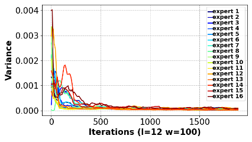
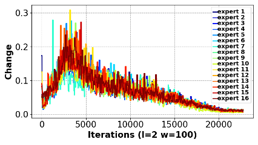

# 预测即足矣：MoE 中的专家负载分配趋向稳定。

发布时间：2024年04月25日

`LLM理论` `人工智能` `计算优化`

> Prediction Is All MoE Needs: Expert Load Distribution Goes from Fluctuating to Stabilizing

# 摘要

> MoE 技术通过改变计算复杂度与参数数量的线性关系，推动了大型模型的发展。在此过程中，稀疏门控网络负责为每个待处理的标记分配专家组，但这可能导致不同专家在连续迭代中的工作量出现波动，影响计算的并行性和资源的有效利用。在本研究中，我们对多个大型语言模型的专家负载进行了跟踪分析，并区分了“显著负载波动”的瞬态状态与“时间局部性”的稳定状态。针对这两种状态及计算开销，我们采用了三种经典预测算法，对专家负载进行了准确预测。以 GPT3 350M 模型为例，预测未来 1,000 步和 2,000 步的专家负载比例，平均误差率分别约为 1.3% 和 1.8%。本研究为 MoE 模型训练中的专家布局和资源配置提供了重要参考。未来，我们将进一步提出适用于瞬态和稳定状态的专家布局方案。

> MoE facilitates the development of large models by making the computational complexity of the model no longer scale linearly with increasing parameters. The learning sparse gating network selects a set of experts for each token to be processed; however, this may lead to differences in the number of tokens processed by each expert over several successive iterations, i.e., the expert load fluctuations, which reduces computational parallelization and resource utilization. To this end, we traced and analyzed loads of each expert in the training iterations for several large language models in this work, and defined the transient state with "obvious load fluctuation" and the stable state with "temporal locality". Moreover, given the characteristics of these two states and the computational overhead, we deployed three classical prediction algorithms that achieve accurate expert load prediction results. For the GPT3 350M model, the average error rates for predicting the expert load proportion over the next 1,000 and 2,000 steps are approximately 1.3% and 1.8%, respectively. This work can provide valuable guidance for expert placement or resource allocation for MoE model training. Based on this work, we will propose an expert placement scheme for transient and stable states in our coming work.

[Arxiv](https://arxiv.org/abs/2404.16914)