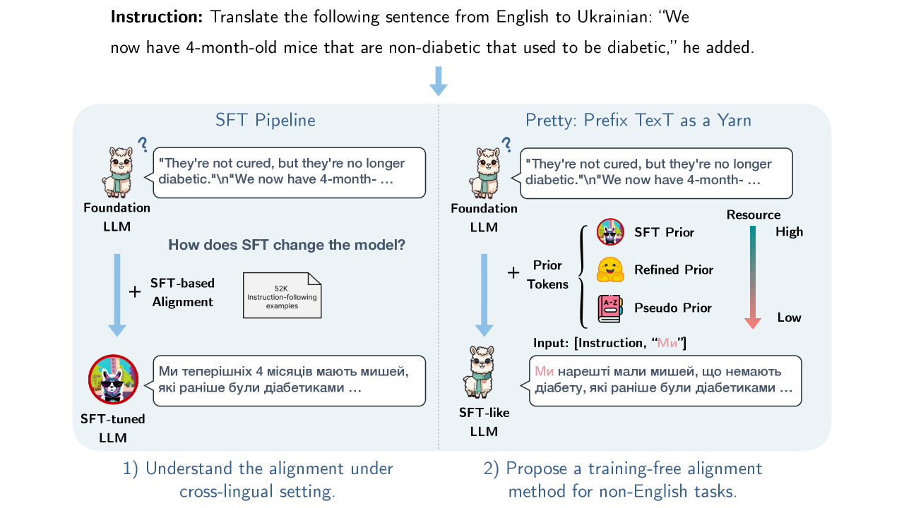
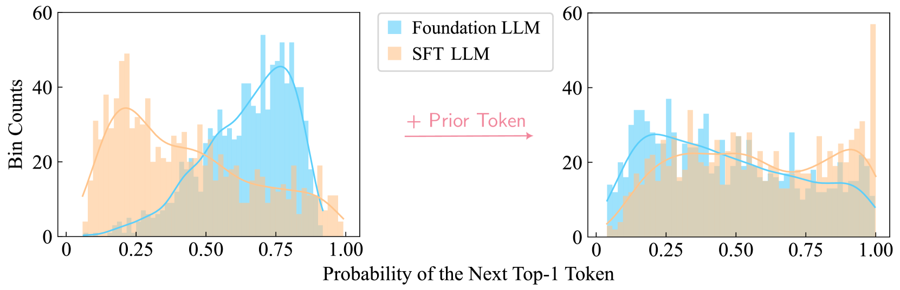

# 将前缀文本比作引线：在基础语言模型中诱发非英语的对应关系

发布时间：2024年04月25日

`LLM应用` `机器翻译`

> Prefix Text as a Yarn: Eliciting Non-English Alignment in Foundation Language Model

# 摘要

> 监督式微调（SFT）虽然直接有效，能够根据特定需求调整大型语言模型（LLM）的输出，但其对齐深度却受到质疑，被批评为仅是表面功夫。本文针对跨语言生成任务，对这一假设进行了深入探讨，并指出SFT可能因依赖先前标记来指导跨语言生成而受限。为了解决SFT所需非英语数据的获取成本高昂和资源有限的问题，我们提出了一种创新的无需训练的对齐方法——PreTTY。该方法仅利用极少的任务相关先前标记，就能将基础LLM与SFT LLM相连接，达到与训练相当的性能。通过在八种语言的机器翻译和词性标注任务上的实验，我们证明了PreTTY在跨语言环境中的有效性。特别值得一提的是，基础LLM在解码过程中只需一两个先前标记，就能与经过SFT的模型相媲美。这一方法不仅经济高效，还为多语言LLM的普及提供了新的可能性。

> While supervised fine-tuning (SFT) has been a straightforward approach for tailoring the output of foundation large language model (LLM) to specific preferences, concerns have been raised about the depth of this alignment, with some critiques suggesting it is merely "superficial". We critically examine this hypothesis within the scope of cross-lingual generation tasks, proposing that the effectiveness of SFT may be constrained by its reliance on prior tokens to guide cross-lingual generation. Based on this crucial insight, and in response to the challenges posed by the costly and limited availability of non-English data for SFT, we introduce a novel training-free alignment method named PreTTY, which employs minimal task-related prior tokens to bridge the foundation LLM and the SFT LLM, achieving comparable performance without training. Experiments on machine translation and part-of-speech tagging across eight languages demonstrate the efficacy of PreTTY in cross-lingual settings. Remarkably, by initiating the decoding process with only one or two prior tokens, foundation LLMs can achieve performance comparable to their SFT counterparts. This method presents a cost-effective alternative to SFT and advances the democratization of multilingual LLMs.

[Arxiv](https://arxiv.org/abs/2404.16766)