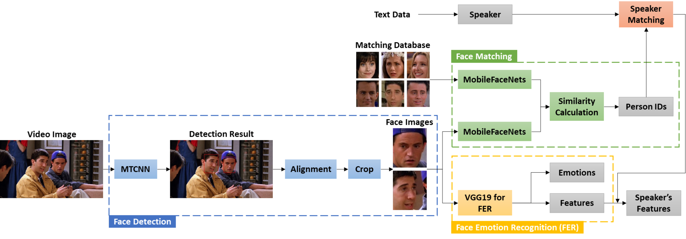

# 三星中国研究院北京分部在 SemEval-2024 竞赛的第三项任务中提出了一种多阶段框架，专门用于在对话中提取情感及其成因的配对。

发布时间：2024年04月25日

`Agent` `人机交互` `情感分析`

> Samsung Research China-Beijing at SemEval-2024 Task 3: A multi-stage framework for Emotion-Cause Pair Extraction in Conversations

# 摘要

> 在人机互动领域，理解并回应人类情感对于智能代理来说极为关键，而探究情感背后的成因则更为复杂。本研究提出了一项名为“对话中多模态情感-原因对抽取”的新任务，旨在识别情感并找出其成因。我们设计了一个分阶段的框架，旨在生成情感并针对特定目标情感抽取情感因果对。首先，利用基于 Llama-2 的 InstructERC 来识别对话中每句话的情感类型。情感识别完成后，我们采用双流注意力模型来抽取针对目标情感的情感因果对，以完成子任务 2；同时，使用 MuTEC 来抽取子任务 1 的因果跨度。在竞赛中，我们的方案在两个子任务上均荣获第一名。

> In human-computer interaction, it is crucial for agents to respond to human by understanding their emotions. Unraveling the causes of emotions is more challenging. A new task named Multimodal Emotion-Cause Pair Extraction in Conversations is responsible for recognizing emotion and identifying causal expressions. In this study, we propose a multi-stage framework to generate emotion and extract the emotion causal pairs given the target emotion. In the first stage, Llama-2-based InstructERC is utilized to extract the emotion category of each utterance in a conversation. After emotion recognition, a two-stream attention model is employed to extract the emotion causal pairs given the target emotion for subtask 2 while MuTEC is employed to extract causal span for subtask 1. Our approach achieved first place for both of the two subtasks in the competition.

[Arxiv](https://arxiv.org/abs/2404.16905)