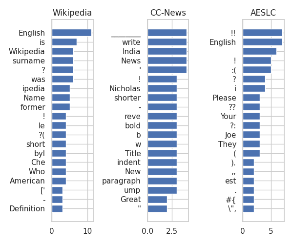

# 探究谬误：深入理解大型语言模型如何处理对抗性的无意义输入

发布时间：2024年04月25日

`分类：LLM理论` `人工智能`

> Talking Nonsense: Probing Large Language Models' Understanding of Adversarial Gibberish Inputs

# 摘要

> 大型语言模型（LLMs）在理解人类语言方面表现出色，但它们是否能理解那些对我们而言毫无意义的自身语言呢？本研究旨在探究这一谜题，揭示LLMs这种行为背后的原理。我们利用贪心坐标梯度优化器精心构造提示，激发LLMs从看似荒谬的输入中产出有意义的回答。我们将这类输入命名为“语言模型巴别塔”（LM Babel），并系统性地分析了LLMs在这些提示操控下的行为模式。研究发现，操控的效率与目标文本的长度和困惑度密切相关，巴别塔提示往往处于比自然提示更低的损失最小值区域。我们还深入分析了巴别塔提示的结构，并对其鲁棒性进行了评估。尤为引人注意的是，我们发现引导模型产出有害文本的难度并不大于产出良性文本，这暗示了对于非典型提示，模型的对齐度存在缺失。

> Large language models (LLMs) exhibit excellent ability to understand human languages, but do they also understand their own language that appears gibberish to us? In this work we delve into this question, aiming to uncover the mechanisms underlying such behavior in LLMs. We employ the Greedy Coordinate Gradient optimizer to craft prompts that compel LLMs to generate coherent responses from seemingly nonsensical inputs. We call these inputs LM Babel and this work systematically studies the behavior of LLMs manipulated by these prompts. We find that the manipulation efficiency depends on the target text's length and perplexity, with the Babel prompts often located in lower loss minima compared to natural prompts. We further examine the structure of the Babel prompts and evaluate their robustness. Notably, we find that guiding the model to generate harmful texts is not more difficult than into generating benign texts, suggesting lack of alignment for out-of-distribution prompts.

[Arxiv](https://arxiv.org/abs/2404.17120)