# TinyChart：一种高效的图表理解方法，它结合了视觉标记融合技术和思维程序学习方法。

发布时间：2024年04月25日

`LLM应用` `数据可视化` `人工智能`

> TinyChart: Efficient Chart Understanding with Visual Token Merging and Program-of-Thoughts Learning

# 摘要

> 图表在阐释和展示复杂数据关系方面扮演着关键角色。近期，多模态大型语言模型（MLLMs）在多项图表理解任务上展现了卓越才能。但是，这些模型因参数众多和计算需求高而难以在资源紧张的环境中应用。本文提出了TinyChart，一个仅含3B参数的高效MLLM，专为图表理解设计。TinyChart解决了两个主要问题：首先，通过思维程序（PoT）学习策略减轻了学习数值计算的负担，该策略训练模型生成用于数值运算的Python程序；其次，通过视觉令牌合并模块简化了视觉变换器为高分辨率图像生成的冗长视觉特征序列，该模块逐步合并高度相似的视觉令牌。大量实验证明，我们的3B TinyChart在ChartQA、Chart-to-Text、Chart-to-Table、OpenCQA和ChartX等多个图表理解基准测试中达到了最先进的性能。它超越了拥有高达13B参数的ChartLlama和ChartAst等图表理解MLLM，以及封闭源的通用MLLM GPT-4V。此外，由于模型更小巧和视觉编码更高效，TinyChart在推理过程中展现出更高的吞吐量和优越的效率。我们的代码和模型已在 https://github.com/X-PLUG/mPLUG-DocOwl/tree/main/TinyChart 上发布。

> Charts are important for presenting and explaining complex data relationships. Recently, multimodal large language models (MLLMs) have shown remarkable capabilities in various chart understanding tasks. However, the sheer size of these models in terms of parameters and computational requirements limits their use in resource-constrained environments. In this paper, we present TinyChart, an efficient MLLM for chart understanding with only 3B parameters. TinyChart overcomes two key challenges in efficient chart understanding: (1) reduce the burden of learning numerical computations through a Program-of-Thoughts (PoT) learning strategy, which trains the model to generate Python programs for numerical calculations, and (2) reduce lengthy vision feature sequences produced by the vision transformer for high-resolution images through a Vision Token Merging module, which gradually merges most similar vision tokens. Extensive experiments demonstrate that our 3B TinyChart achieves SOTA performance on a variety of chart understanding benchmarks including ChartQA, Chart-to-Text, Chart-to-Table, OpenCQA, and ChartX. It outperforms several chart understanding MLLM with up to 13B parameters such as ChartLlama and ChartAst, and close-sourced general-purpose MLLM GPT-4V on ChartQA. It also demonstrates its superior efficiency with higher throughput during inference due to a smaller model scale and more efficient vision encoding. Our code and model are available at https://github.com/X-PLUG/mPLUG-DocOwl/tree/main/TinyChart.

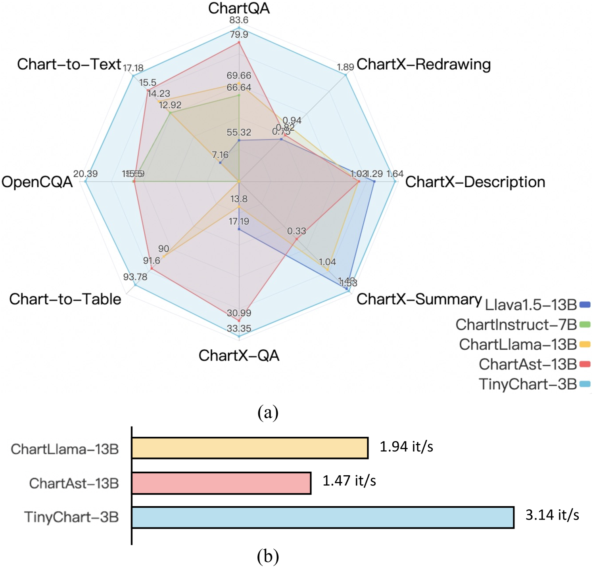

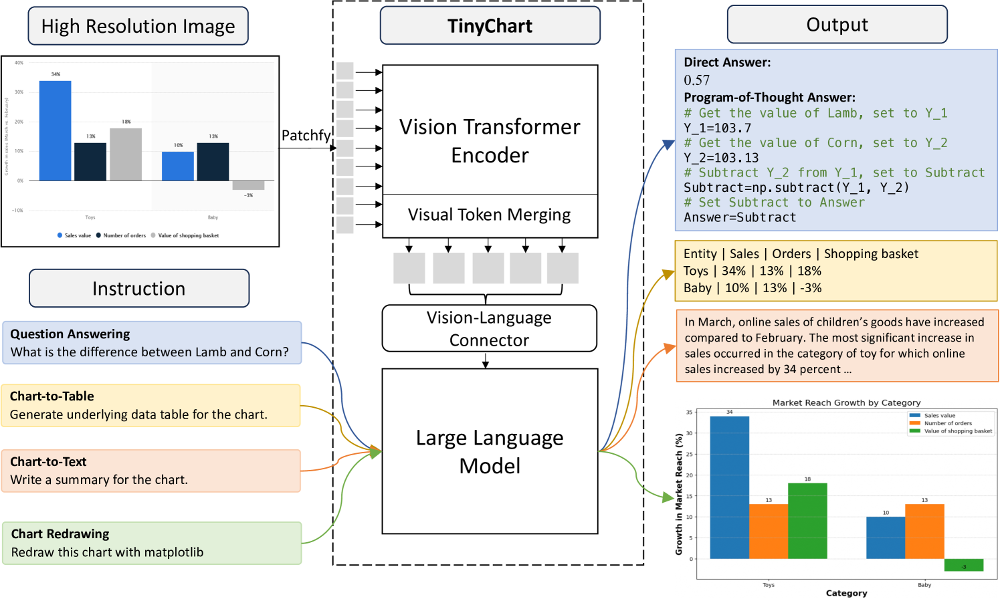

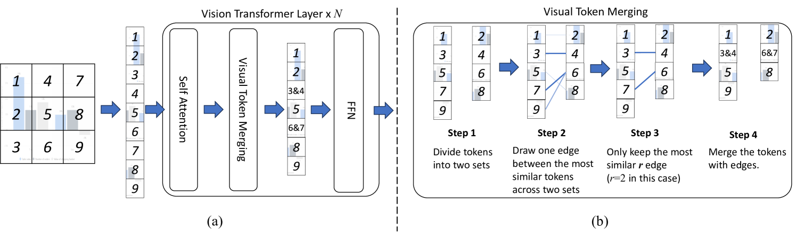

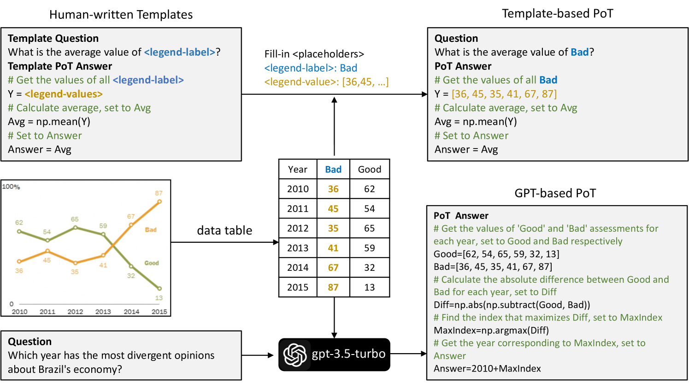

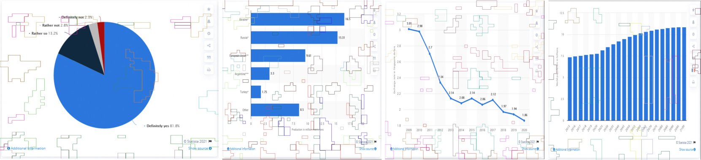

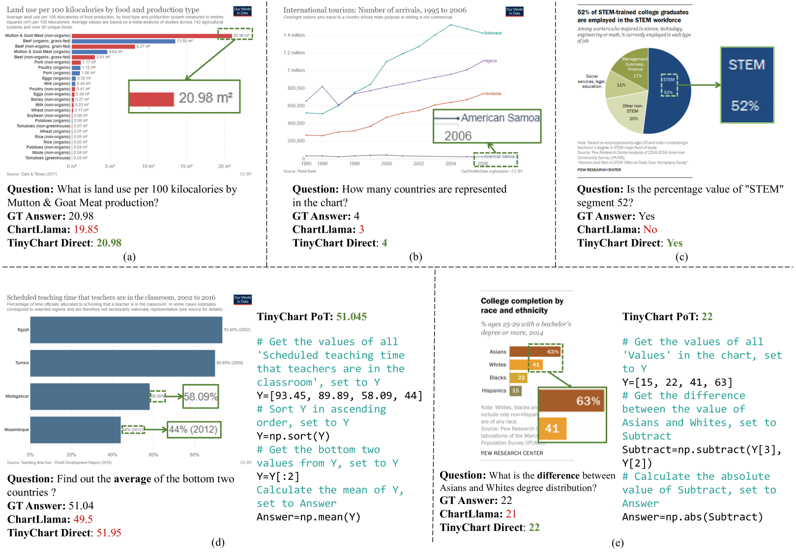

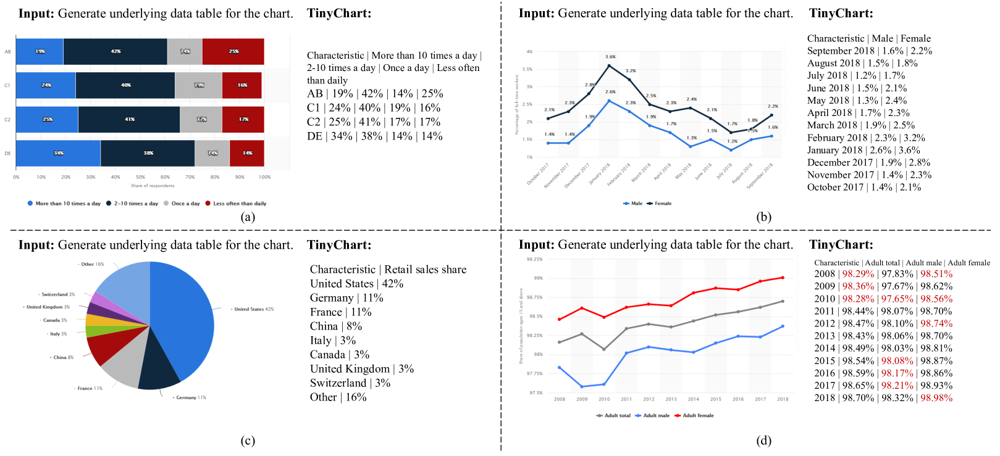

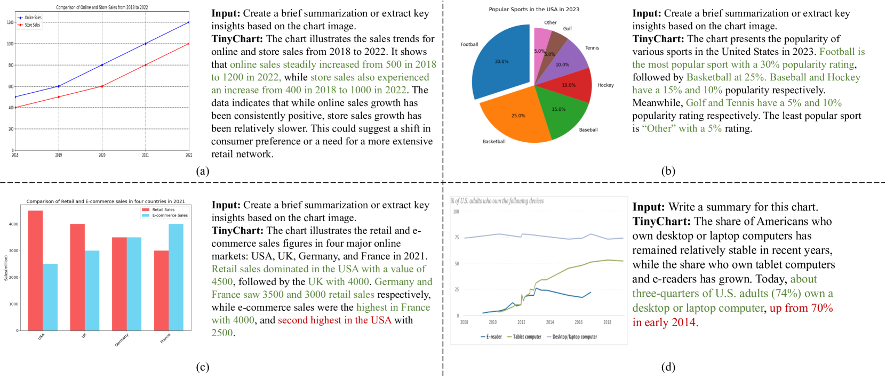

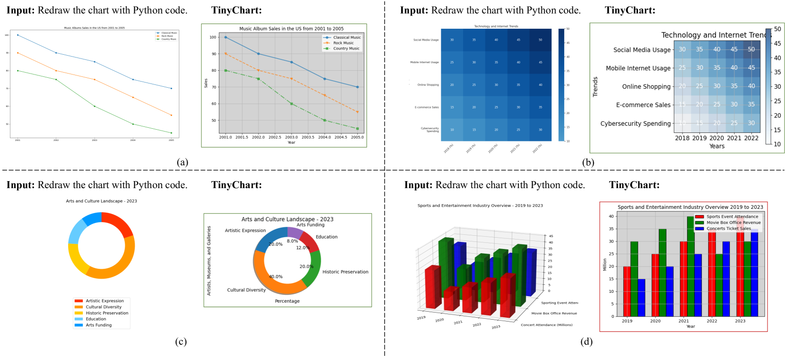

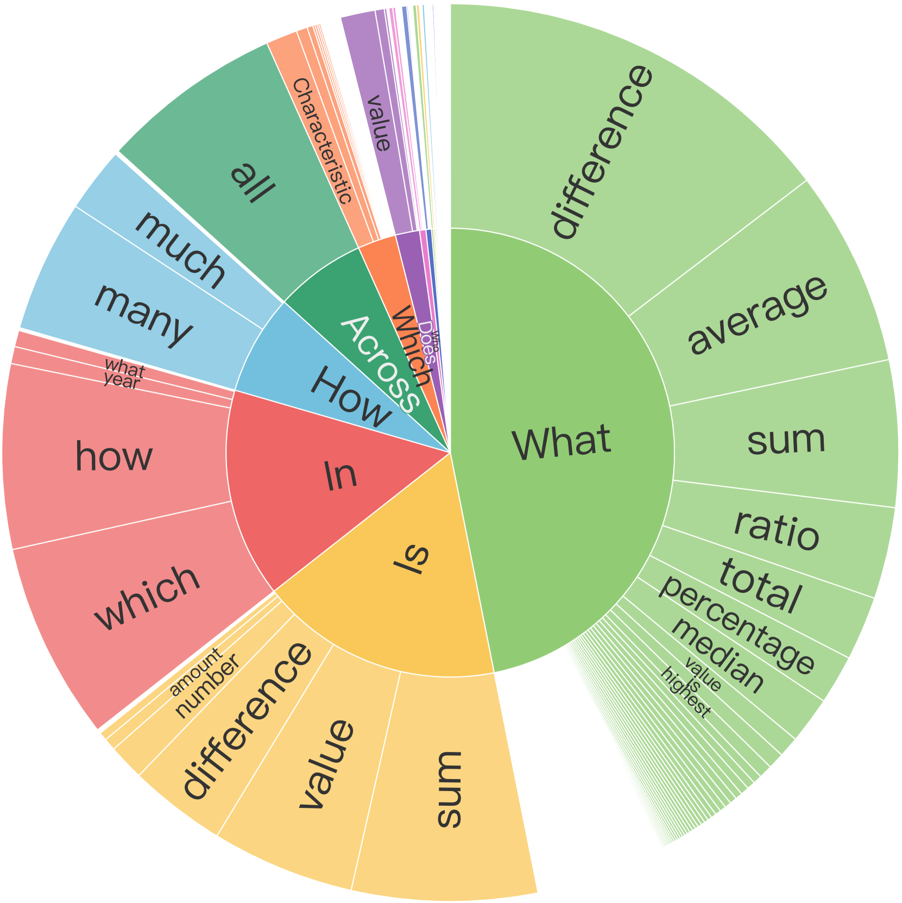

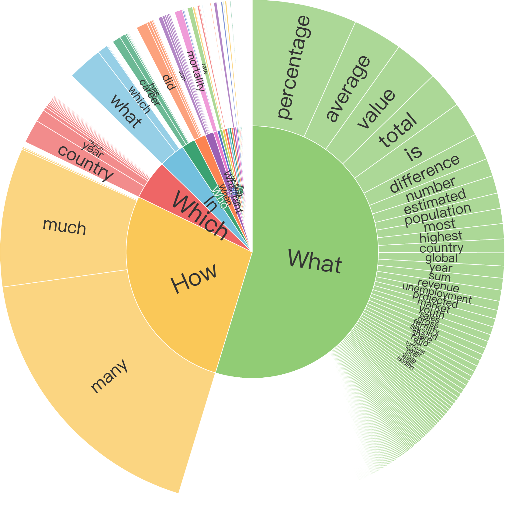

[Arxiv](https://arxiv.org/abs/2404.16635)