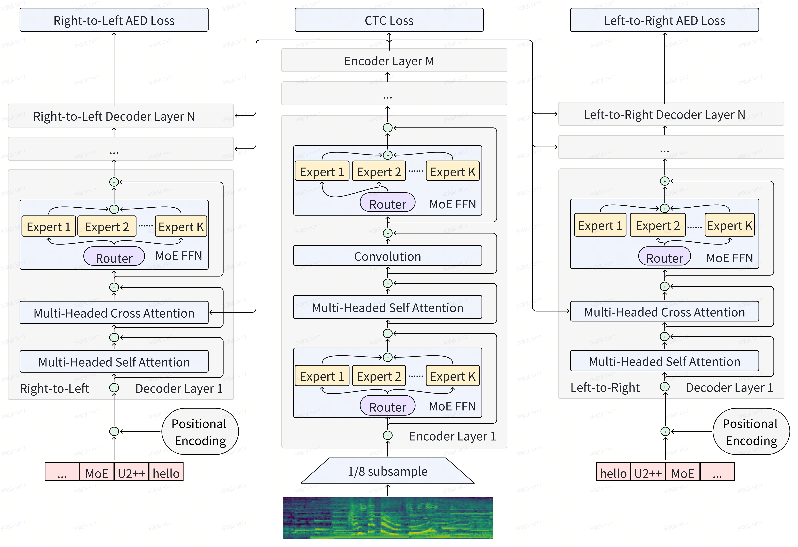

# U2++ MoE：在几乎不影响实时因子的前提下，实现了参数规模的4.7倍增长。

发布时间：2024年04月25日

`LLM应用` `自动语音识别`

> U2++ MoE: Scaling 4.7x parameters with minimal impact on RTF

# 摘要

> 规模的扩大为自然语言处理领域带来了新的突破，但同时也带来了高昂的成本。为了应对这一挑战，专家混合（MoE）模型通过在训练和推理过程中仅激活部分参数，提出了一种更为节能的解决方案，旨在推动语言模型向更大规模和更高能力发展。这种新模型的发展趋势在自动语音识别（ASR）领域尤为明显。近期的研究工作将MoE技术融入ASR模型，采用了复杂的设计策略，包括通过辅助嵌入网络进行帧路由、增强专家的多语言处理能力，以及使用专门的辅助损失来平衡专家负载或处理特定语言。然而，我们的研究发现，这些复杂的设计并非必需，简单地用MoE层替换所有前馈网络（FFN）层，就足以胜任ASR任务。具体而言，我们在大规模内部数据集（160,000小时）上对模型进行了测试，结果表明，我们可以将基线Conformer模型（Dense-225M）扩展到MoE版本（MoE-1B），在保持Dense-225M级别的实时因子（RTF）的同时，达到Dense-1B级别的字错误率（WER）。此外，通过引入统一的双向注意力解码器两遍框架（U2++），我们在单一的MoE模型中实现了流式和非流式解码模式，即U2++ MoE模型。我们期望本研究能够推动语音基础模型的扩展研究，同时保持部署的高效率。

> Scale has opened new frontiers in natural language processing, but at a high cost. In response, by learning to only activate a subset of parameters in training and inference, Mixture-of-Experts (MoE) have been proposed as an energy efficient path to even larger and more capable language models and this shift towards a new generation of foundation models is gaining momentum, particularly within the field of Automatic Speech Recognition (ASR). Recent works that incorporating MoE into ASR models have complex designs such as routing frames via supplementary embedding network, improving multilingual ability for the experts, and utilizing dedicated auxiliary losses for either expert load balancing or specific language handling. We found that delicate designs are not necessary, while an embarrassingly simple substitution of MoE layers for all Feed-Forward Network (FFN) layers is competent for the ASR task. To be more specific, we benchmark our proposed model on a large scale inner-source dataset (160k hours), the results show that we can scale our baseline Conformer (Dense-225M) to its MoE counterparts (MoE-1B) and achieve Dense-1B level Word Error Rate (WER) while maintaining a Dense-225M level Real Time Factor (RTF). Furthermore, by applying Unified 2-pass framework with bidirectional attention decoders (U2++), we achieve the streaming and non-streaming decoding modes in a single MoE based model, which we call U2++ MoE. We hope that our study can facilitate the research on scaling speech foundation models without sacrificing deployment efficiency.

[Arxiv](https://arxiv.org/abs/2404.16407)