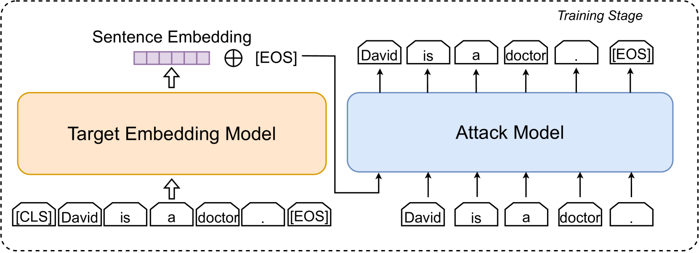
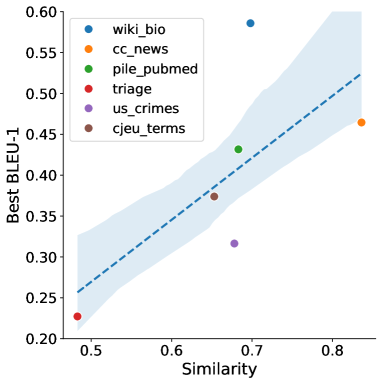
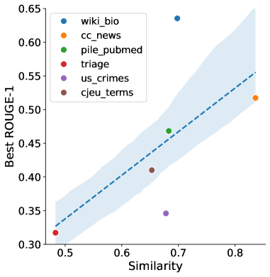
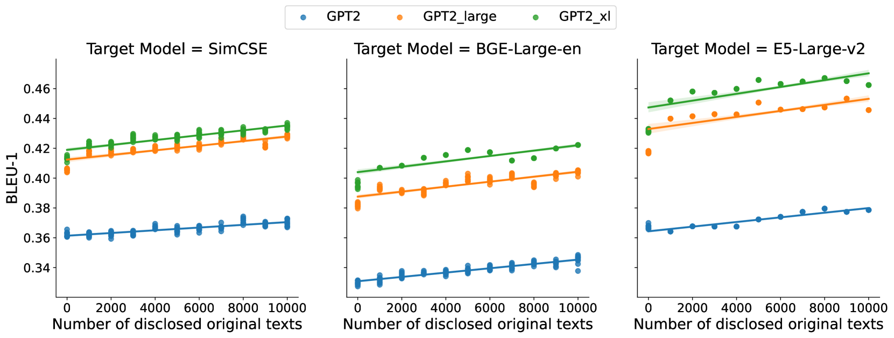
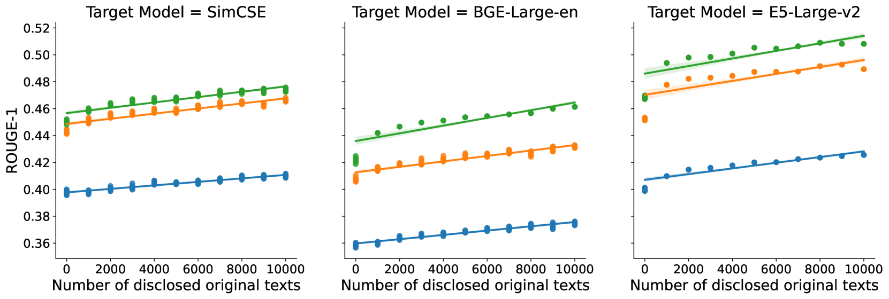
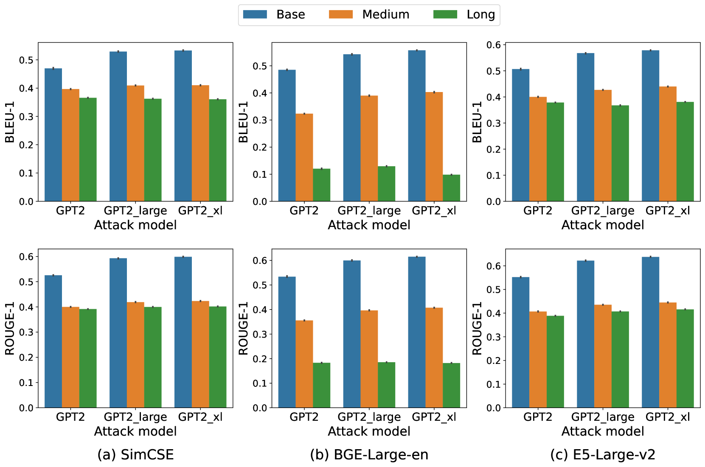
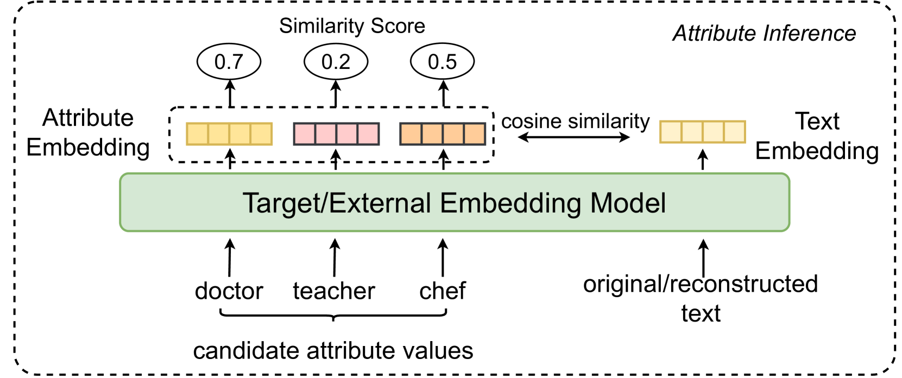

# 深入探究大型语言模型所诱发的嵌入技术背后的隐私隐患

发布时间：2024年04月25日

`分类：LLM应用` `人工智能` `隐私保护`

> Understanding Privacy Risks of Embeddings Induced by Large Language Models

# 摘要

> 大型语言模型（LLMs）初显人工通用智能的端倪，却也面临着幻觉的挑战。一种缓解幻觉的潜在方法是将外部知识嵌入化，以增强LLMs的检索增强生成能力。但这种做法可能会侵犯隐私，因为研究表明，预训练的语言模型能够从文本嵌入中部分还原原始文本。LLMs相较于传统预训练模型的优势可能会加剧对隐私的担忧。本研究探讨了使用LLMs时，从嵌入中重建原始知识和预测实体属性的有效性。实验结果显示，LLMs在两项评估任务的准确性上显著超越了预训练模型，无论文本是否符合分布。这突显了LLMs可能对用户隐私构成更大威胁，也反映了它们普及使用的潜在负面影响。文章还进一步讨论了减轻这一风险的初步策略。

> Large language models (LLMs) show early signs of artificial general intelligence but struggle with hallucinations. One promising solution to mitigate these hallucinations is to store external knowledge as embeddings, aiding LLMs in retrieval-augmented generation. However, such a solution risks compromising privacy, as recent studies experimentally showed that the original text can be partially reconstructed from text embeddings by pre-trained language models. The significant advantage of LLMs over traditional pre-trained models may exacerbate these concerns. To this end, we investigate the effectiveness of reconstructing original knowledge and predicting entity attributes from these embeddings when LLMs are employed. Empirical findings indicate that LLMs significantly improve the accuracy of two evaluated tasks over those from pre-trained models, regardless of whether the texts are in-distribution or out-of-distribution. This underscores a heightened potential for LLMs to jeopardize user privacy, highlighting the negative consequences of their widespread use. We further discuss preliminary strategies to mitigate this risk.

[Arxiv](https://arxiv.org/abs/2404.16587)