# 多模态上下文内学习为何奏效？

发布时间：2024年04月25日

`分类：LLM应用

这篇论文探讨了大型语言模型在多模态上下文学习（M-ICL）方面的性能和局限性。它评估了顶尖的开源多模态模型，并研究了M-ICL在多模态任务中的表现。这篇论文主要关注大型语言模型在实际应用中的表现和潜在问题，因此将其归类为LLM应用。` `人工智能` `多模态学习`

> What Makes Multimodal In-Context Learning Work?

# 摘要

> 大型语言模型在多样化任务上展现了惊人的表现，能够通过少量示例的上下文学习迅速掌握新技能。本研究提出了一个深入的框架，专门针对大型多模态模型中的多模态上下文学习（M-ICL）进行探究。我们评估了顶尖的开源多模态模型，如IDEFICS和OpenFlamingo，并涵盖了一系列多模态任务。研究发现了几个关键点：首先，M-ICL主要依赖文本驱动机制，图像模态的影响微乎其微；其次，即使采用高级ICL策略如RICES，M-ICL的性能也并未超越基于上下文示例的简单多数投票策略。此外，我们还发现了M-ICL的几个潜在偏见和局限，这些在实际应用前需要被充分考虑。相关代码已在 https://gitlab.com/folbaeni/multimodal-icl 上公开。

> Large Language Models have demonstrated remarkable performance across various tasks, exhibiting the capacity to swiftly acquire new skills, such as through In-Context Learning (ICL) with minimal demonstration examples. In this work, we present a comprehensive framework for investigating Multimodal ICL (M-ICL) in the context of Large Multimodal Models. We consider the best open-source multimodal models (e.g., IDEFICS, OpenFlamingo) and a wide range of multimodal tasks. Our study unveils several noteworthy findings: (1) M-ICL primarily relies on text-driven mechanisms, showing little to no influence from the image modality. (2) When used with advanced-ICL strategy (like RICES), M-ICL is not better than a simple strategy based on majority voting over context examples. Moreover, we identify several biases and limitations of M-ICL that warrant consideration prior to deployment. Code available at https://gitlab.com/folbaeni/multimodal-icl

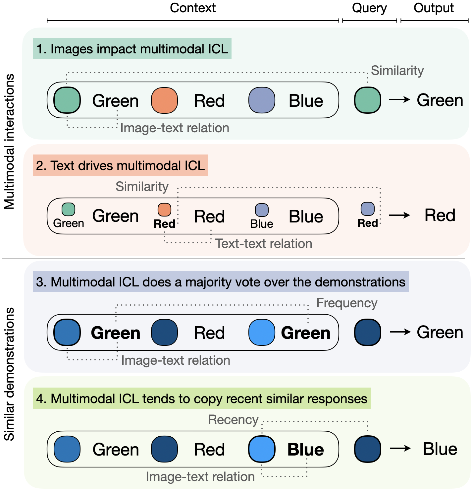

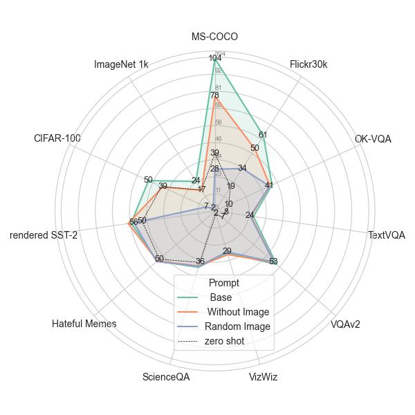

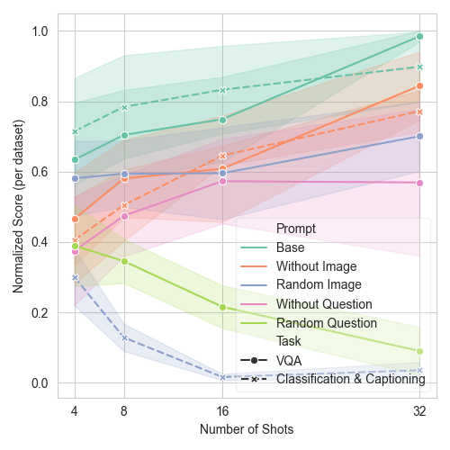

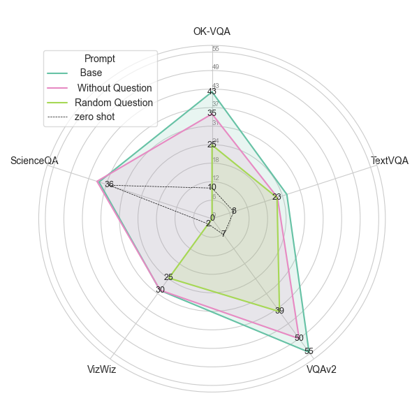

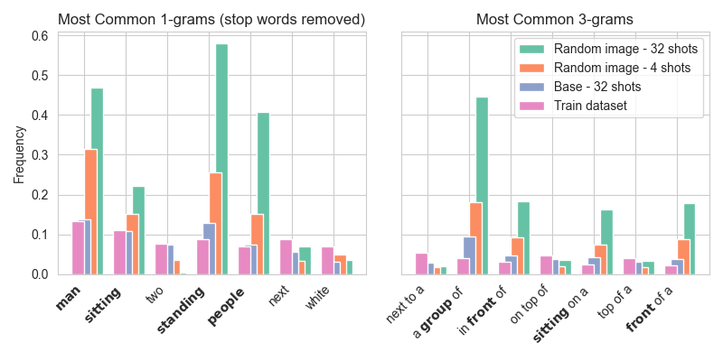

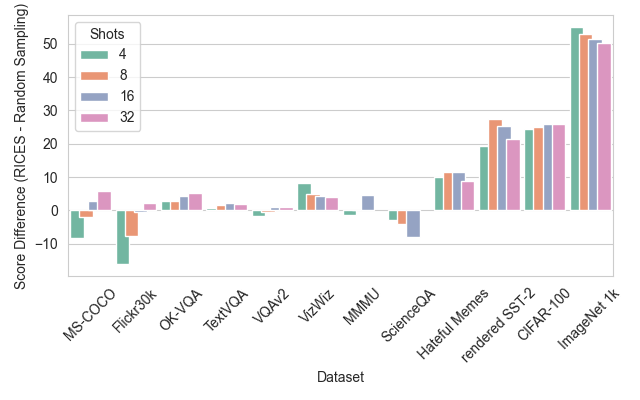

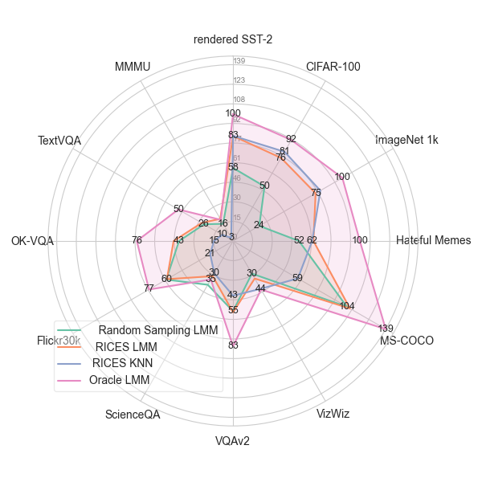

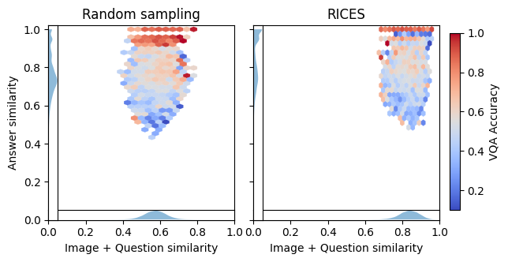

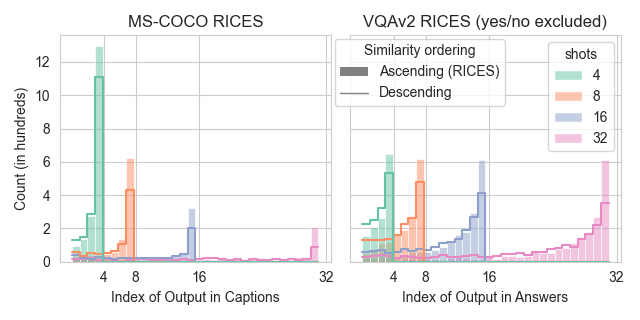

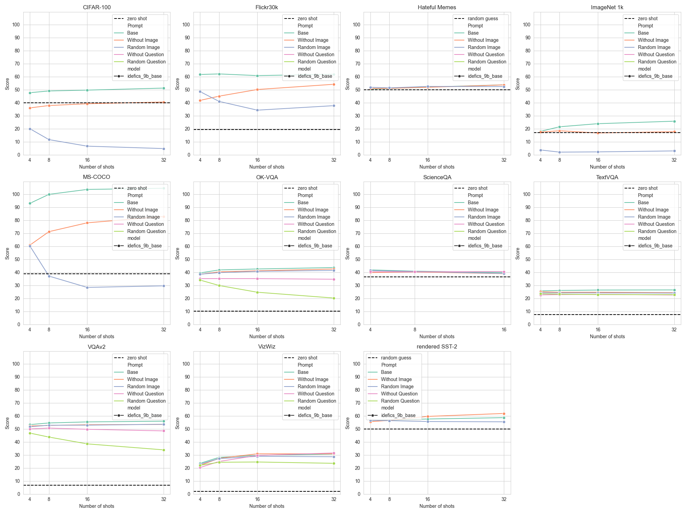

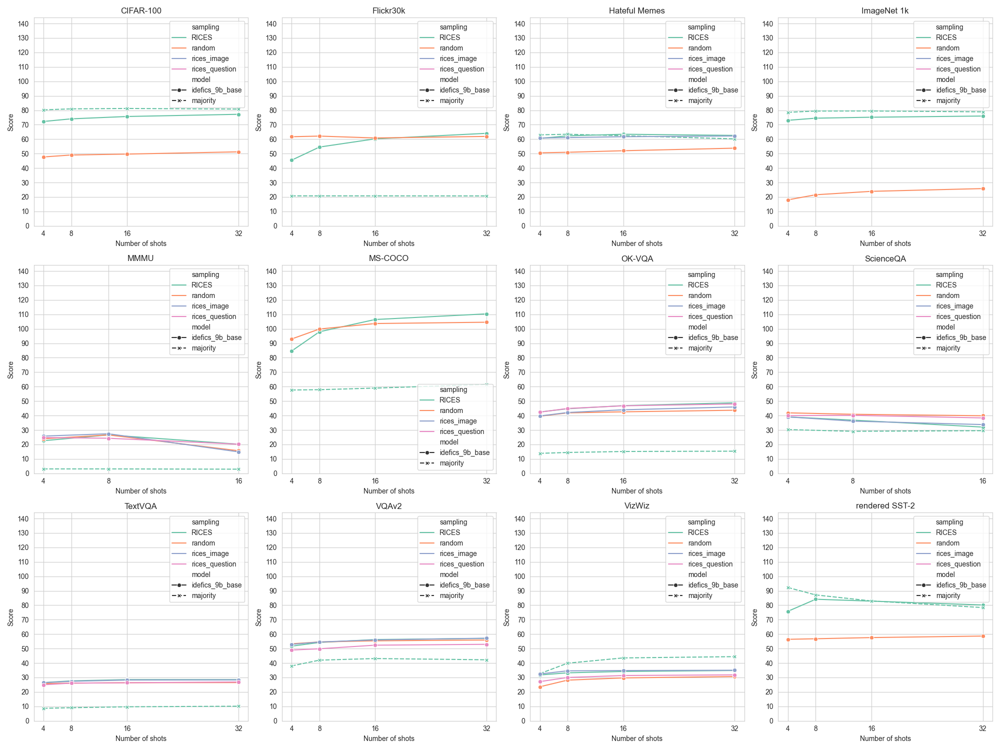

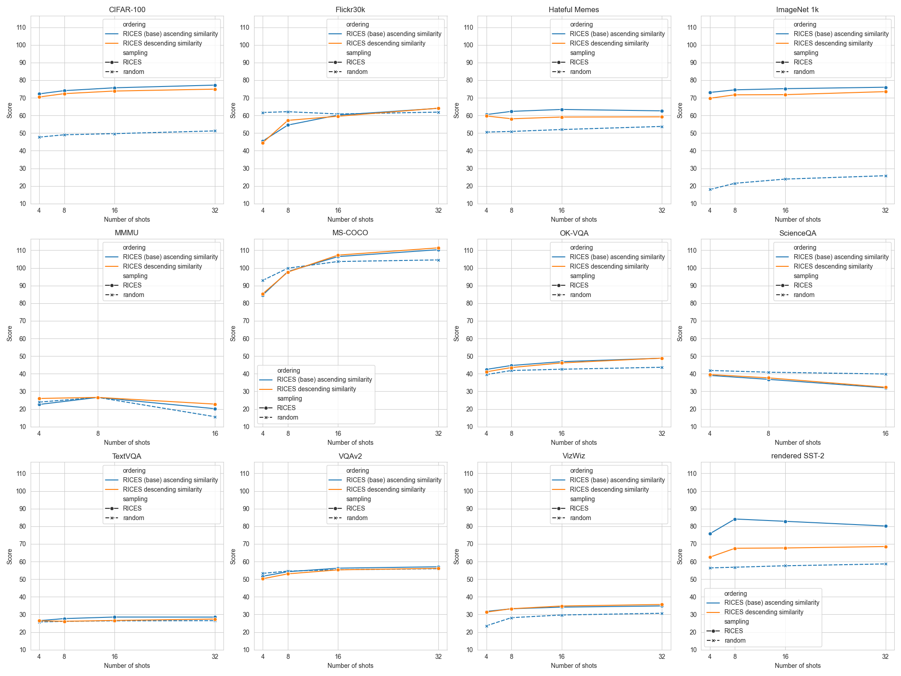

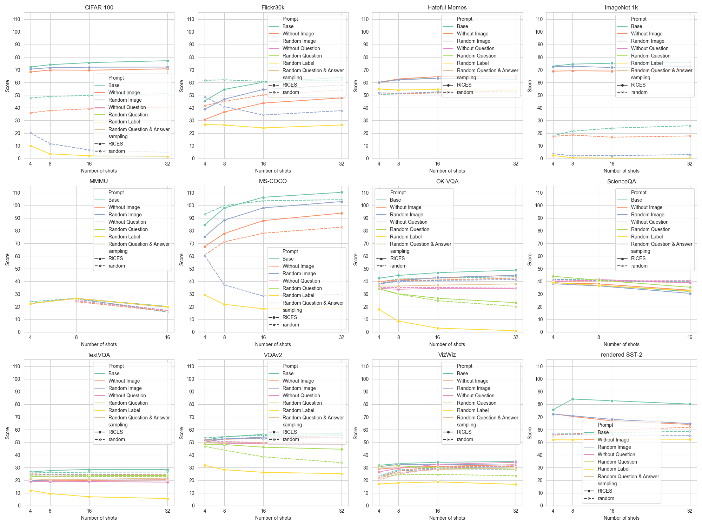

[Arxiv](https://arxiv.org/abs/2404.15736)