# 本文全面审视了大型语言模型在事件推理方面的表现。

发布时间：2024年04月26日

`分类：LLM应用` `人工智能` `事件推理`

> A Comprehensive Evaluation on Event Reasoning of Large Language Models

# 摘要

> 事件推理是支撑众多应用的基本技能，它依赖于事件模式知识以进行全局推理，并需应对事件间复杂关系及多样化的推理范式。目前，大型语言模型（LLMs）在不同关系和推理范式上的事件推理表现尚未明确。为了填补这一空白，我们对LLMs的事件推理能力进行了全面评估，并推出了EV2这一新的基准测试平台，旨在全面评估事件推理能力。EV2包含模式和实例两个层面的评估，覆盖了广泛的事件关系和推理范式。通过在EV2上的广泛实验，我们发现LLMs虽具备事件推理能力，但其表现尚有较大提升空间。我们还观察到LLMs在事件推理能力上存在不平衡现象。此外，尽管LLMs具备事件模式知识，但它们在如何应用这些知识上与人类存在差异。针对这些发现，我们提出了两种方法，引导LLMs更好地利用事件模式知识，两者均取得了显著提升。

> Event reasoning is a fundamental ability that underlies many applications. It requires event schema knowledge to perform global reasoning and needs to deal with the diversity of the inter-event relations and the reasoning paradigms. How well LLMs accomplish event reasoning on various relations and reasoning paradigms remains unknown. To mitigate this disparity, we comprehensively evaluate the abilities of event reasoning of LLMs. We introduce a novel benchmark EV2 for EValuation of EVent reasoning. EV2 consists of two levels of evaluation of schema and instance and is comprehensive in relations and reasoning paradigms. We conduct extensive experiments on EV2. We find that LLMs have abilities to accomplish event reasoning but their performances are far from satisfactory. We also notice the imbalance of event reasoning abilities in LLMs. Besides, LLMs have event schema knowledge, however, they're not aligned with humans on how to utilize the knowledge. Based on these findings, we introduce two methods to guide the LLMs to utilize the event schema knowledge. Both methods achieve improvements.

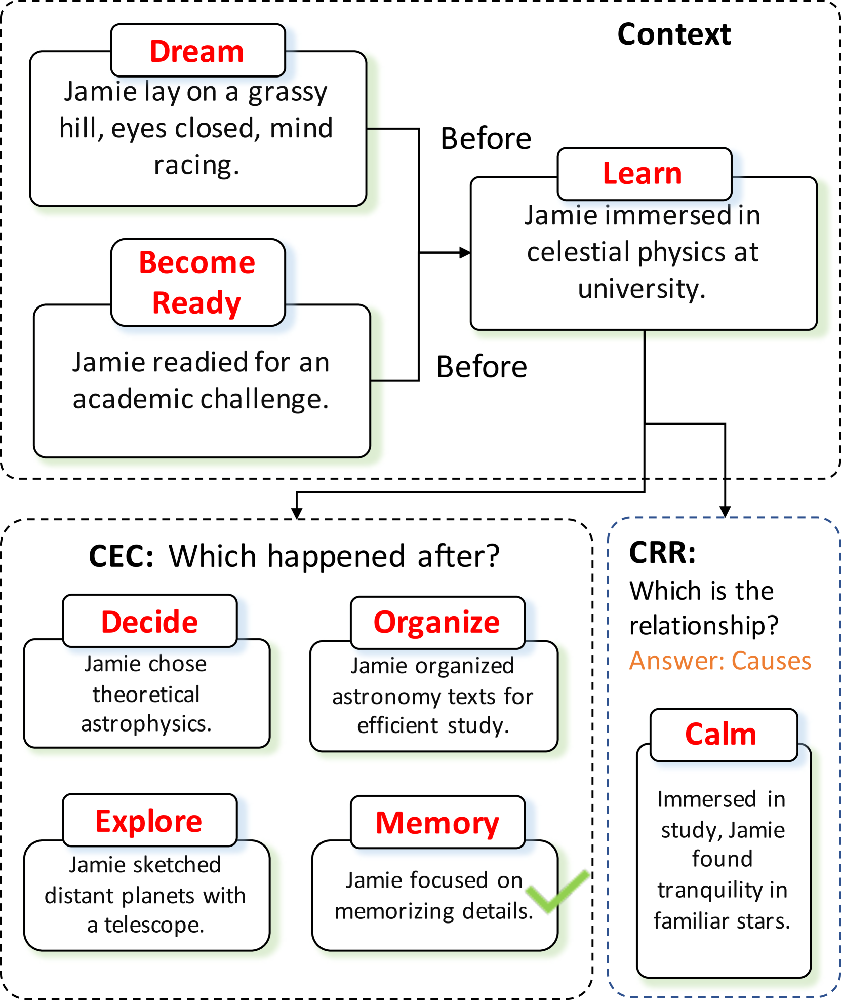

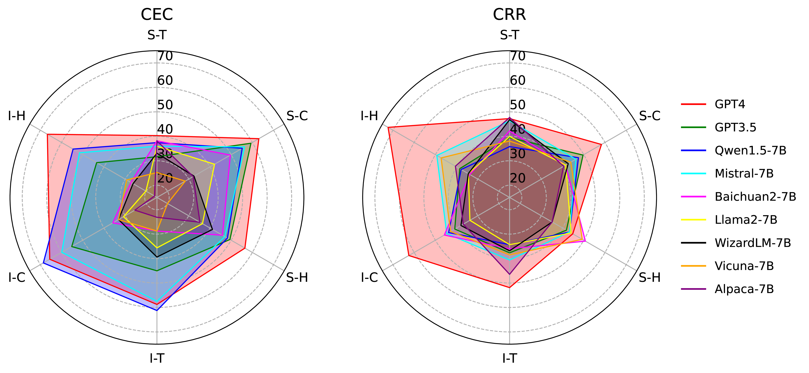

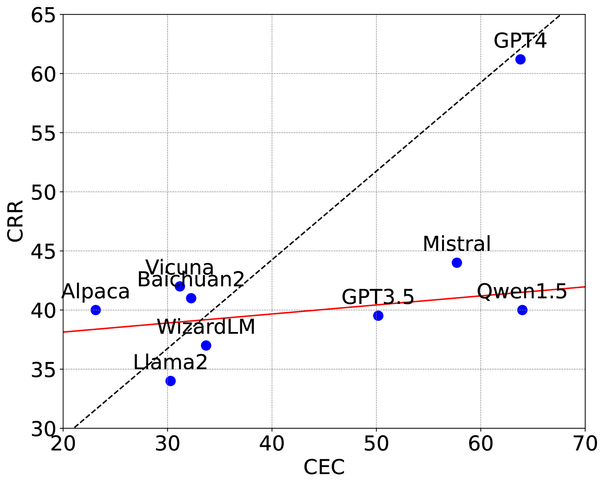

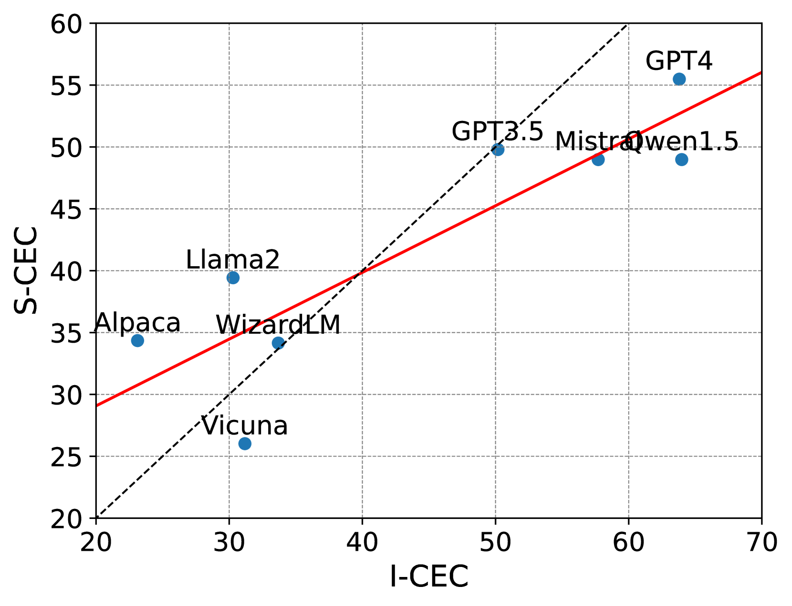

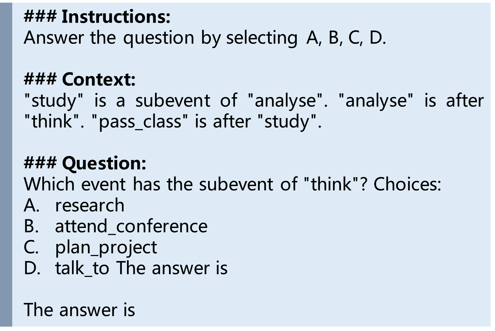

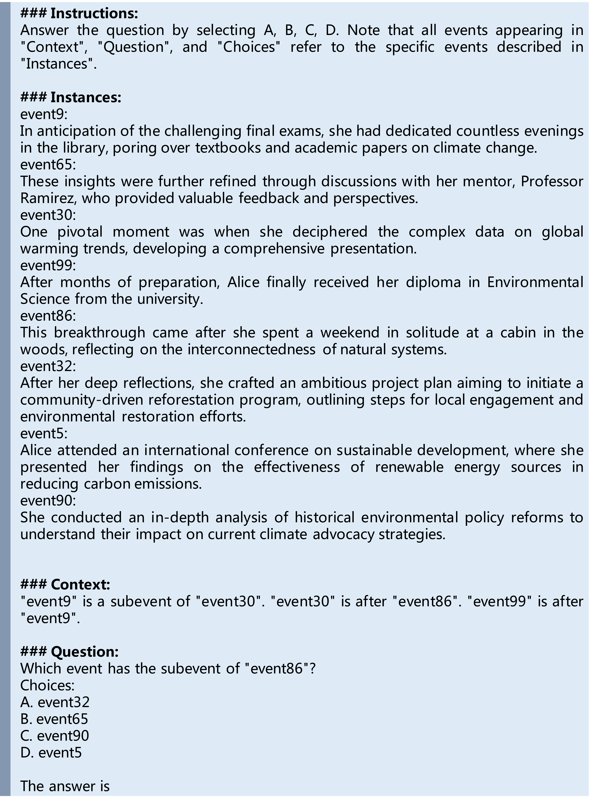

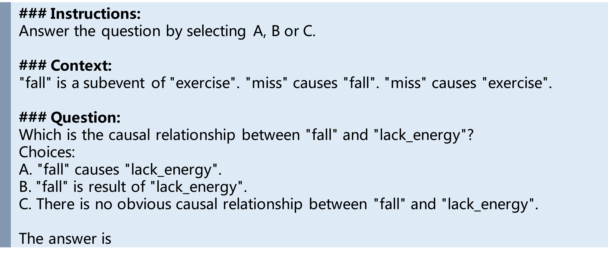

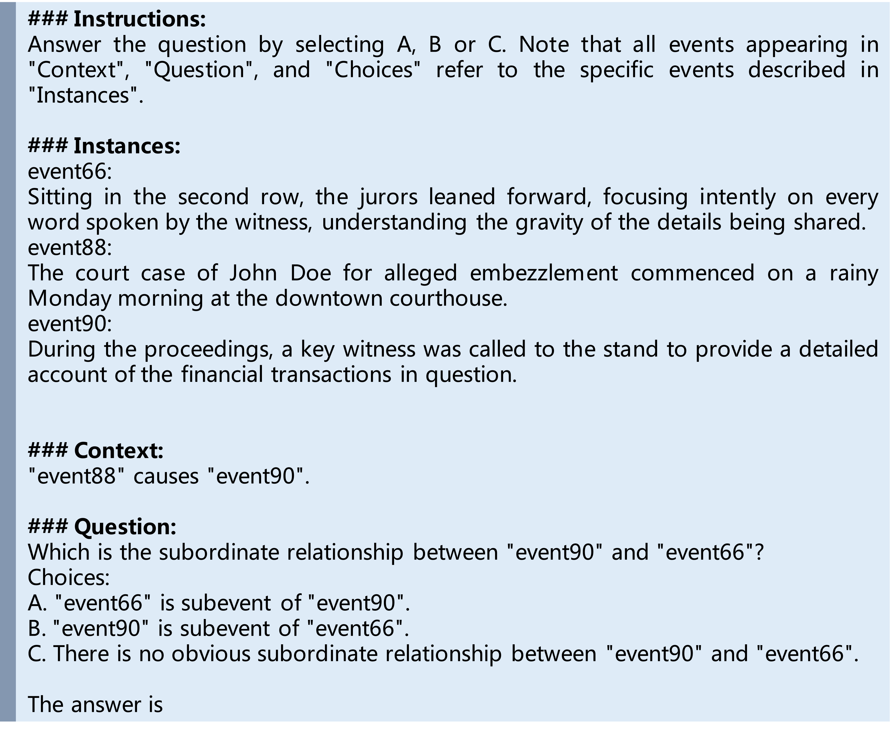

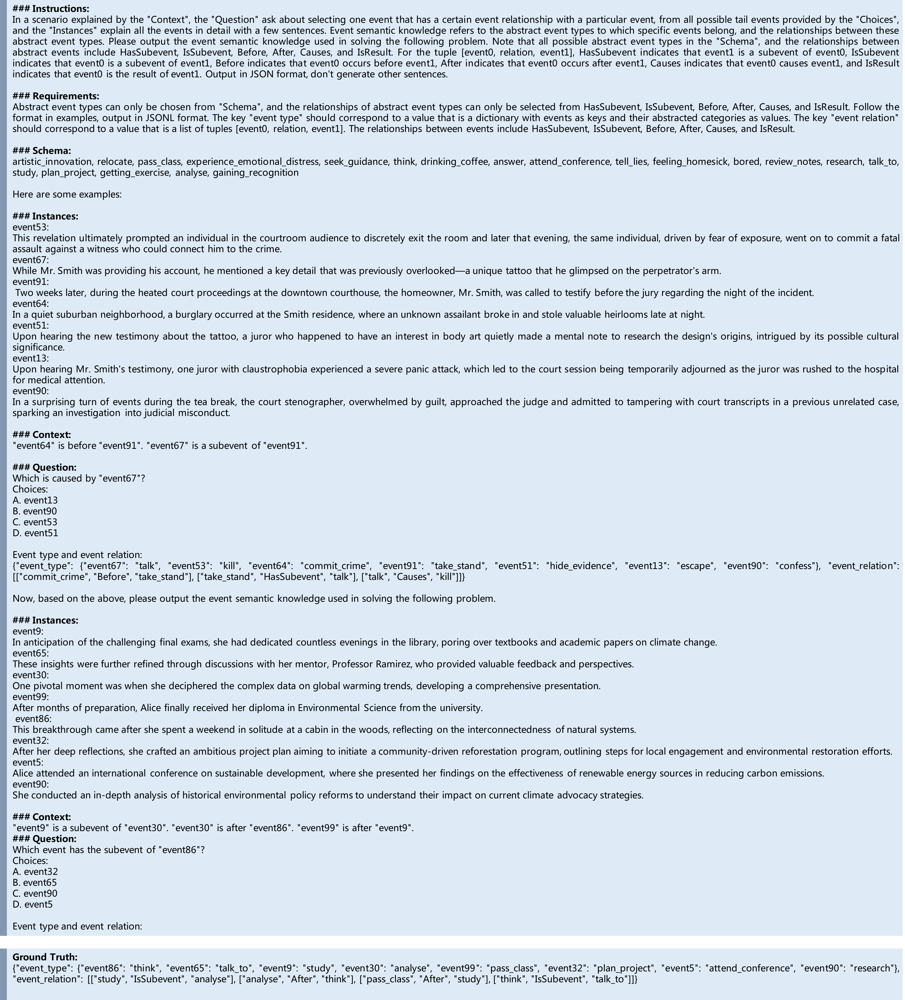

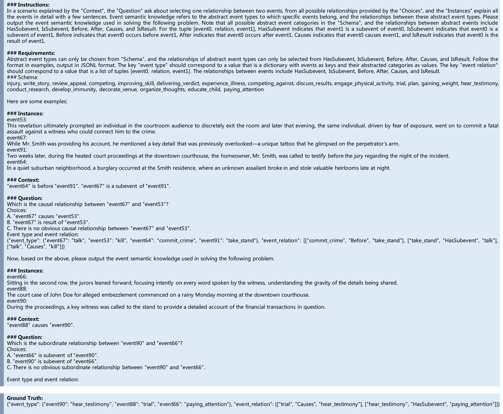

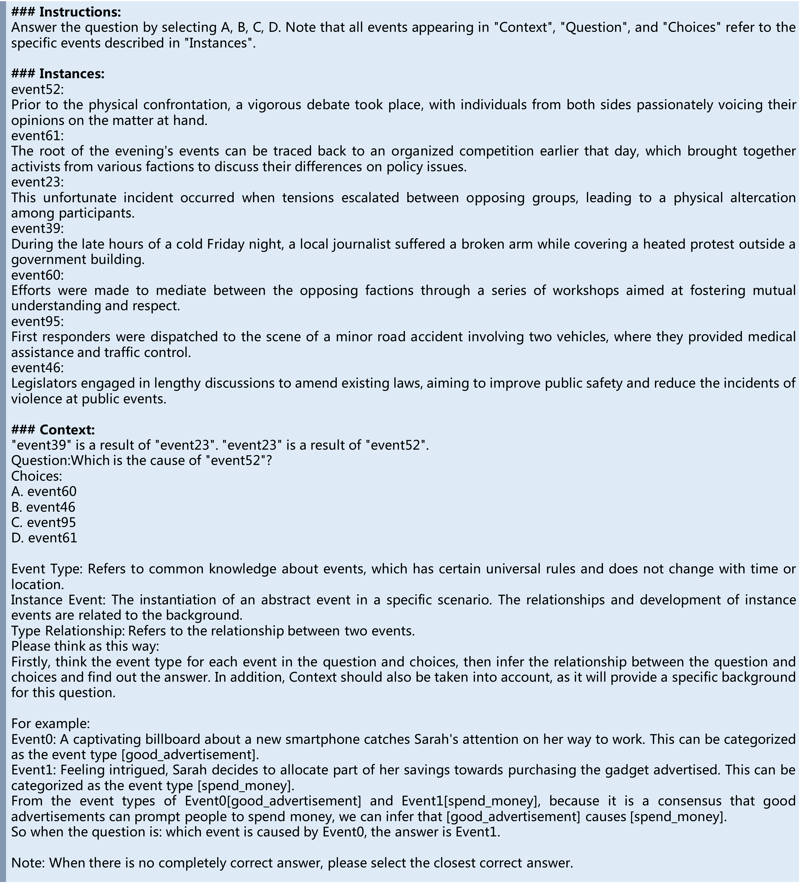

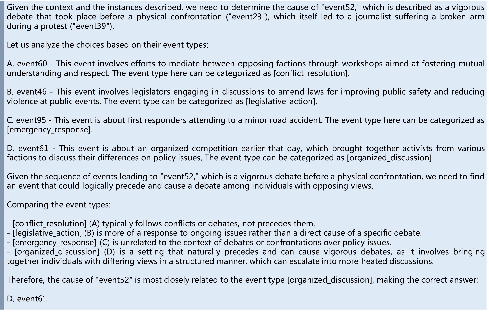

[Arxiv](https://arxiv.org/abs/2404.17513)