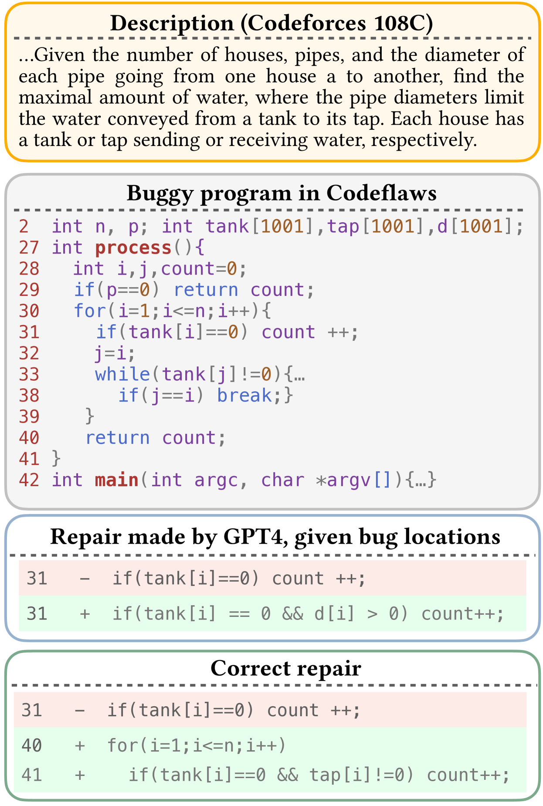
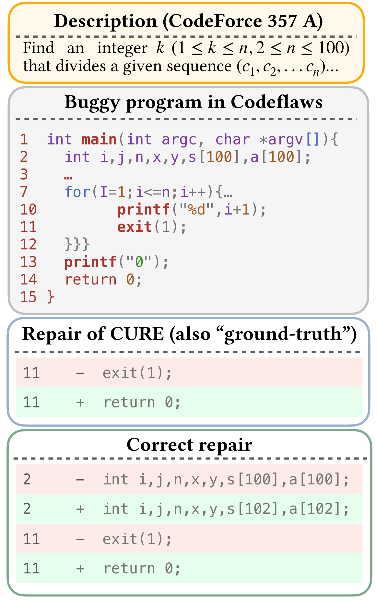
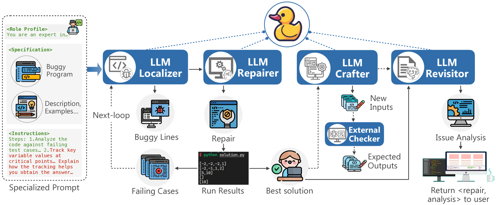
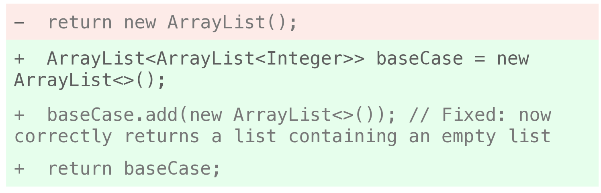

# 本文提出了一种基于大型语言模型（LLM）的多代理协同统一调试方法，旨在优化调试流程，提高问题解决效率。

发布时间：2024年04月26日

`Agent` `软件工程` `自动化调试`

> A Unified Debugging Approach via LLM-Based Multi-Agent Synergy

# 摘要

> 为了简化软件调试这一繁琐过程，包括故障定位和修复生成，人们投入了巨大的努力。近期，大型语言模型（LLMs）在自动化调试领域展现出巨大潜力。尽管如此，我们发现传统及基于LLM的调试工具面临三大挑战：故障定位的不精确性会波及后续的修复工作；在处理复杂逻辑错误方面的不足；以及对程序上下文的忽略。针对这些问题，我们首次提出了一个自动化、集成的调试框架——FixAgent，它通过LLM代理的协同作用实现。FixAgent能够一站式完成漏洞的定位、修复和分析。我们洞察到，LLMs可以借鉴人类开发者在调试过程中采用的通用软件工程原则，例如橡皮鸭调试法，以促进对程序功能和逻辑错误的深入理解。因此，我们设计了三种受橡皮鸭调试法启发的机制来应对这些挑战：代理的专业化与协同、关键变量追踪以及程序上下文理解，这些机制要求LLMs提供清晰的解释，并引导它们关注程序逻辑的关键信息。在广泛使用的QuixBugs数据集上的测试显示，FixAgent成功修复了80个漏洞中的79个，其中9个是之前未被修复的。即便在没有漏洞位置信息和低于0.6%的采样次数的条件下，它在CodeFlaws上修复的缺陷数量也比最佳修复工具多1.9倍。平均来说，与使用不同LLMs的基础模型相比，FixAgent在合理和正确修复方面提升了大约20%，证明了我们设计的成效。此外，FixAgent的正确率高达97.26%，这表明它可能有能力解决现有方法中存在的过拟合问题。

> Tremendous efforts have been devoted to automating software debugging, a time-consuming process involving fault localization and repair generation. Recently, Large Language Models (LLMs) have shown great potential in automated debugging. However, we identified three challenges posed to traditional and LLM-based debugging tools: 1) the upstream imperfection of fault localization affects the downstream repair, 2) the deficiency in handling complex logic errors, and 3) the ignorance of program contexts. In this context, we propose the first automated, unified debugging framework, FixAgent, via LLM agent synergy. FixAgent can perform end-to-end localization, repair, and analysis of bugs. Our insight is that LLMs can benefit from general software engineering principles recognized by human developers in debugging, such as rubber duck debugging, enabling a better understanding of program functionality and logic bugs. Hence, we create three designs inspired by rubber ducking to address these challenges. They are agent specialization and synergy, key variable tracking, and program context comprehension, which request LLMs to provide explicit explanations and force them to focus on crucial program logic information. Experiments on the widely used dataset QuixBugs show that FixAgent correctly fixes 79 out of 80 bugs, 9 of which have never been fixed. It also plausibly patches 1.9X more defects than the best-performing repair tool on CodeFlaws, even with no bug location information and fewer than 0.6% sampling times. On average, FixAgent increases about 20% plausible and correct fixes compared to its base model using different LLMs, showing the effectiveness of our designs. Moreover, the correctness rate of FixAgent reaches remarkably 97.26%, indicating that FixAgent can potentially overcome the overfitting issue of the existing approaches.

[Arxiv](https://arxiv.org/abs/2404.17153)