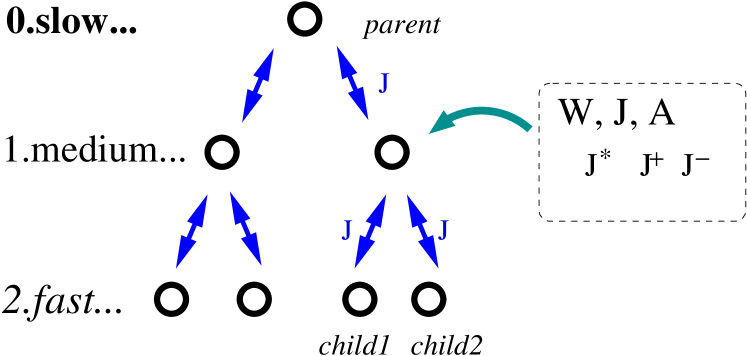
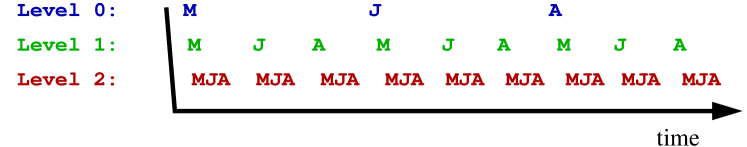
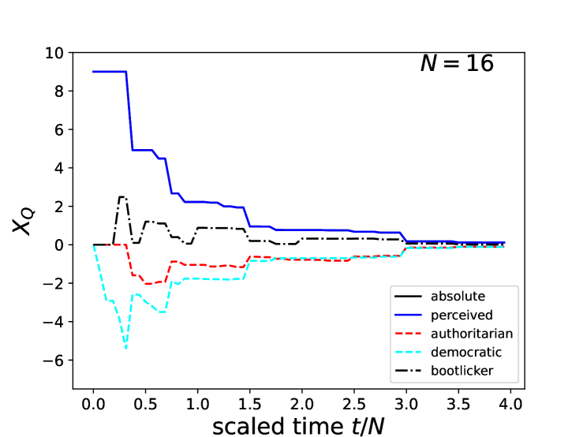
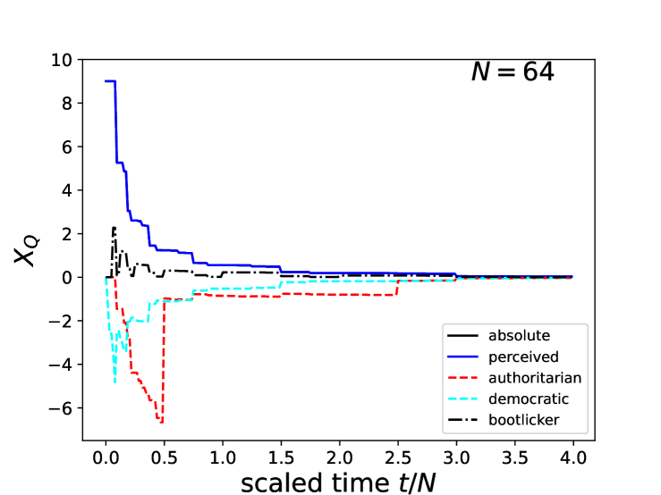
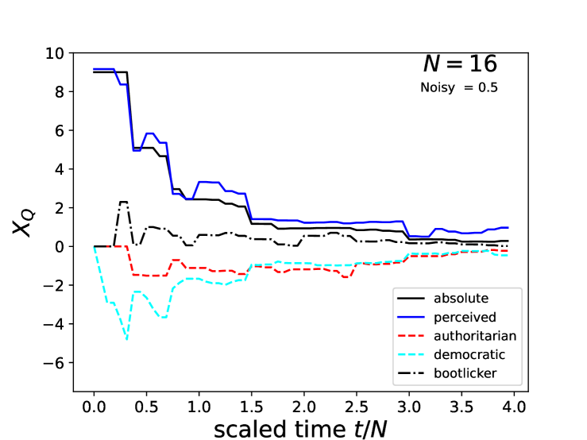
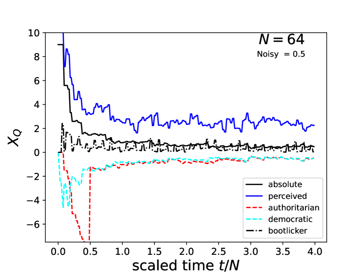
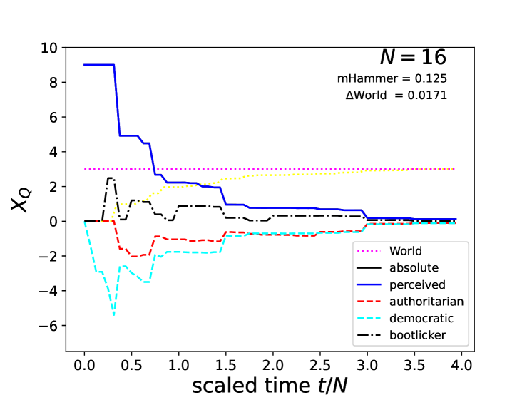
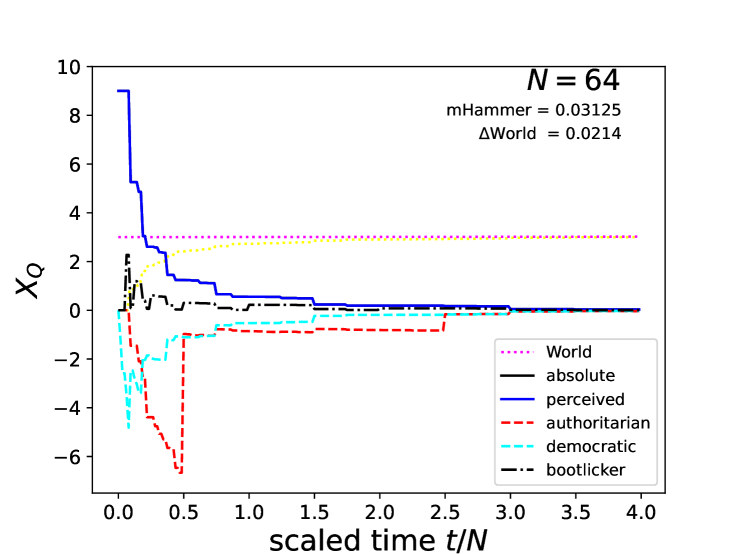
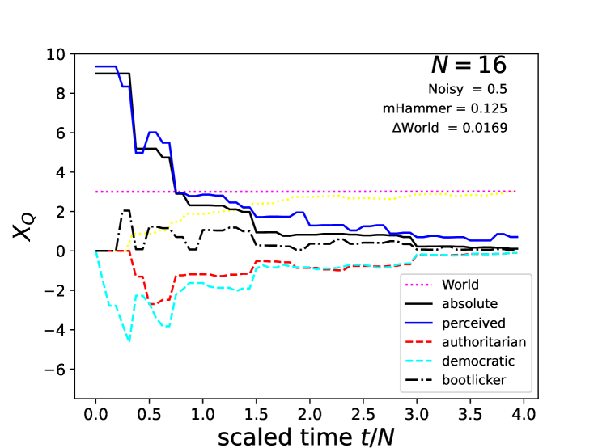
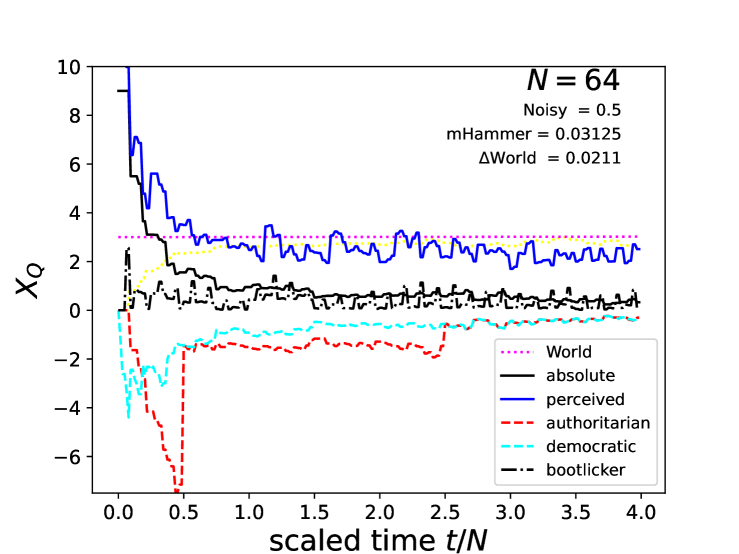

# 一个分层决策过程的多智能体模型

发布时间：2024年04月26日

`Agent` `决策模型` `协调机制`

> A multi-agent model of hierarchical decision dynamics

# 摘要

> 在众多参与者可能追求各自最优结果而需协调或竞争的情境下，做出决策可能颇具挑战。本文介绍了一种结构清晰的分层二叉树决策模型，并探讨了该模型如何通过合作来采取与其对世界不确定性状态的不同评估相匹配的行动。该代理行为的显著特点包括：（a）决策过程被划分为观察、判断和行动三个独立阶段；（b）通过共享判断来促进协调机制的发展。

> Decision making can be difficult when there are many actors (or agents) who may be coordinating or competing to achieve their various ideas of the optimum outcome. Here I present a simple decision making model with an explicitly hierarchical binary-tree structure, and evaluate how this might cooperate to take actions that match its various evaluations of the uncertain state of the world. Key features of agent behaviour are (a) the separation of its decision making process into three distinct steps: observation, judgement, and action; and (b) the evolution of coordination by the sharing of judgements.

[Arxiv](https://arxiv.org/abs/2404.17477)