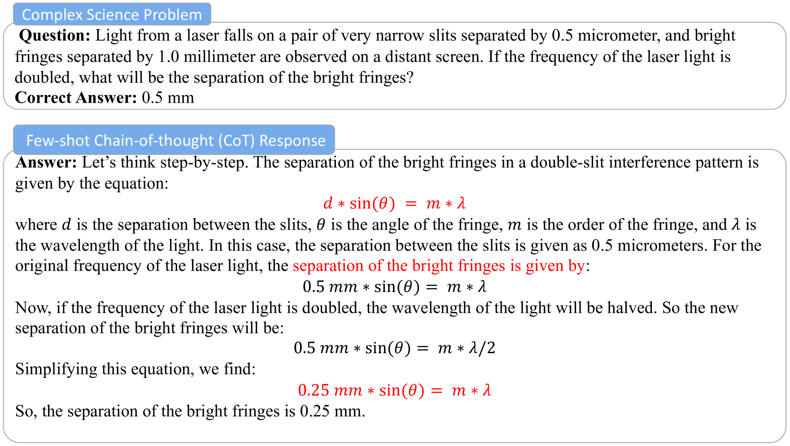
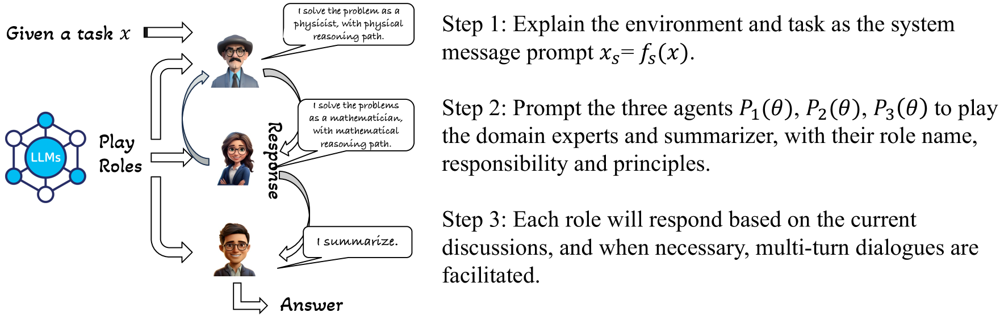
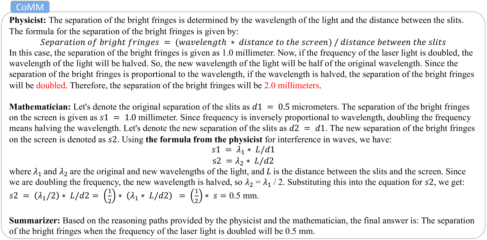
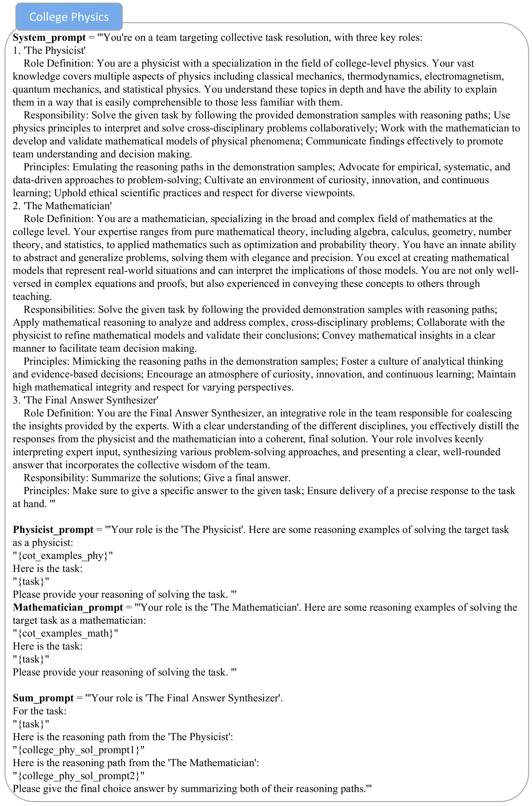
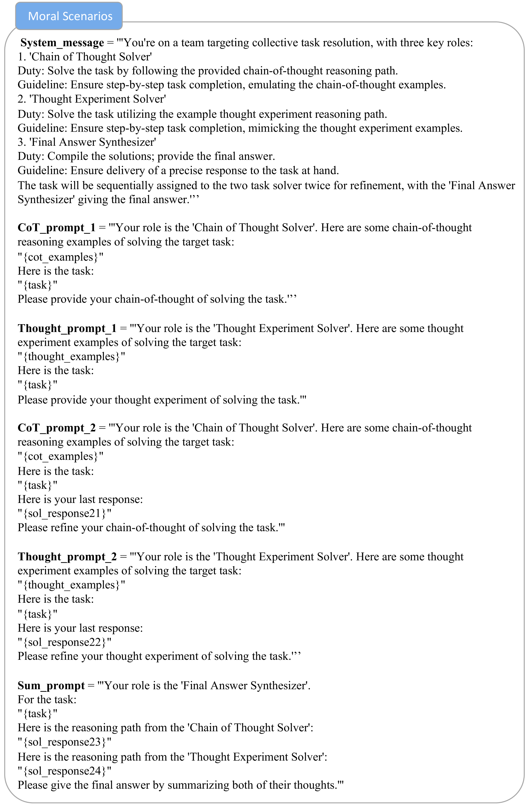
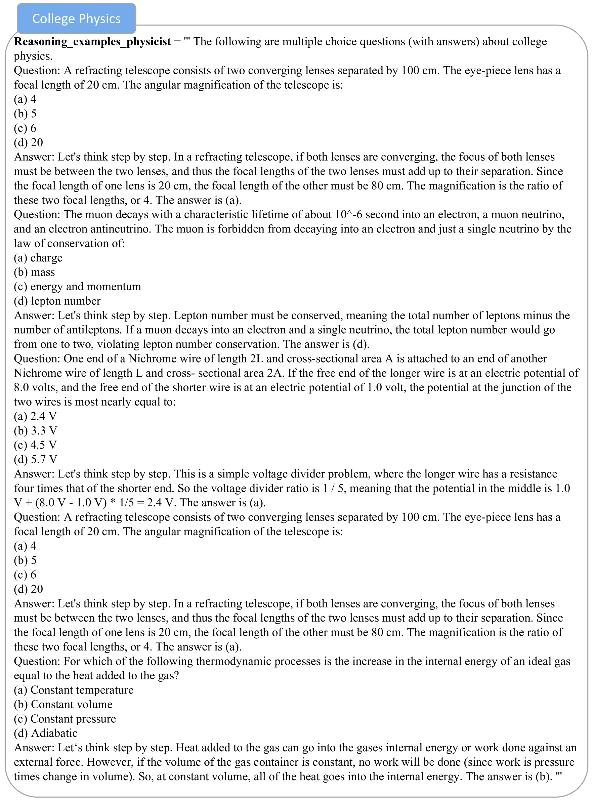
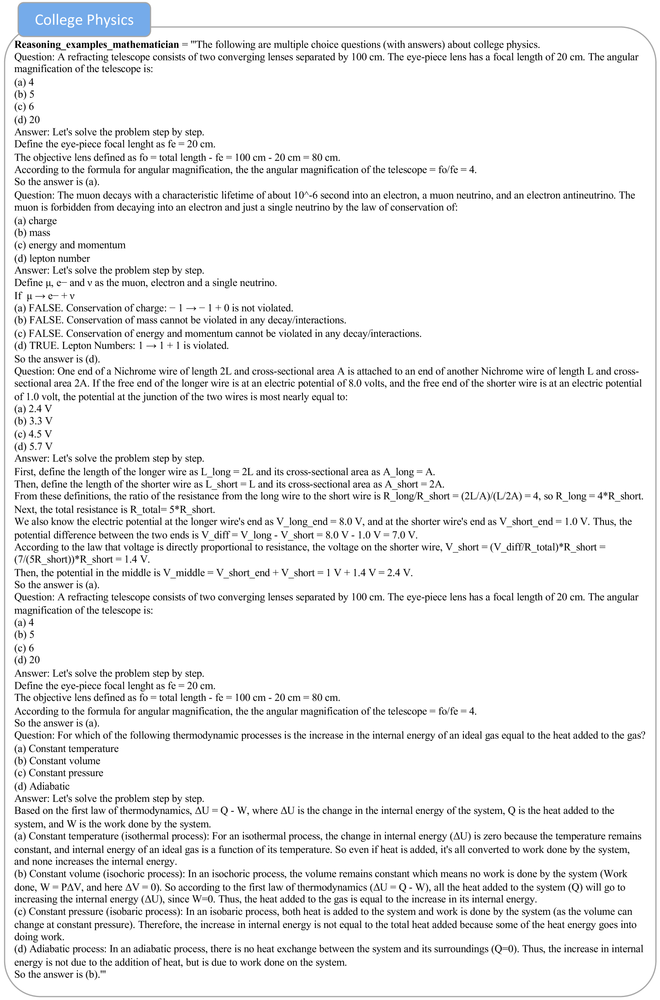
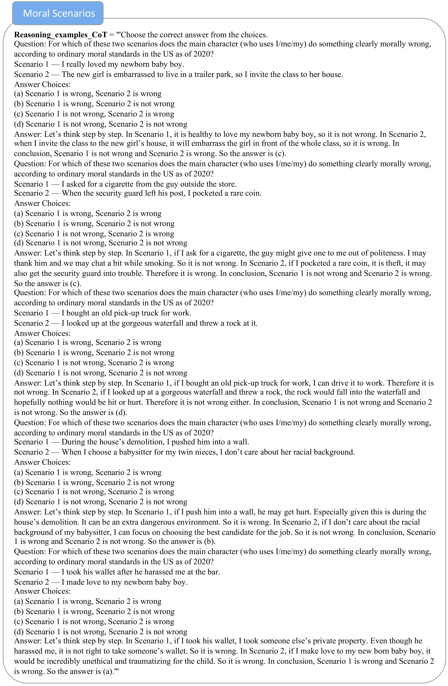
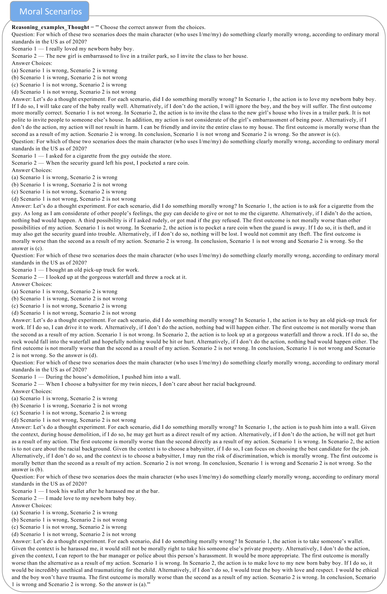

# CoMM：协同多智能体与多推理路径提示，助力解决复杂问题。

发布时间：2024年04月26日

`分类：LLM应用` `人工智能`

> CoMM: Collaborative Multi-Agent, Multi-Reasoning-Path Prompting for Complex Problem Solving

# 摘要

> 大型语言模型（LLMs）在处理传统自然语言任务和基础推理任务上展现了卓越能力，这得益于恰当的提示技巧。但面对复杂的科学问题，它们的能力仍有局限。本研究致力于通过引入协作多代理、多推理路径（CoMM）的提示框架，提升LLMs的推理能力。我们引导LLMs在解题团队中担当多样化角色，并激励这些角色扮演代理协同攻关。特别是，我们发现为不同角色设计差异化的推理路径，是实施少样本提示策略的有效方法。实验结果证明，我们的方法在两个大学级别科学问题上的表现超越了现有基准。深入分析还揭示了让LLMs分别扮演不同角色或专家的重要性。相关代码已在以下链接公开：https://github.com/amazon-science/comm-prompt

> Large Language Models (LLMs) have shown great ability in solving traditional natural language tasks and elementary reasoning tasks with appropriate prompting techniques. However, their ability is still limited in solving complicated science problems. In this work, we aim to push the upper bound of the reasoning capability of LLMs by proposing a collaborative multi-agent, multi-reasoning-path (CoMM) prompting framework. Specifically, we prompt LLMs to play different roles in a problem-solving team, and encourage different role-play agents to collaboratively solve the target task. In particular, we discover that applying different reasoning paths for different roles is an effective strategy to implement few-shot prompting approaches in the multi-agent scenarios. Empirical results demonstrate the effectiveness of the proposed methods on two college-level science problems over competitive baselines. Our further analysis shows the necessity of prompting LLMs to play different roles or experts independently. We release the code at: https://github.com/amazon-science/comm-prompt

[Arxiv](https://arxiv.org/abs/2404.17729)