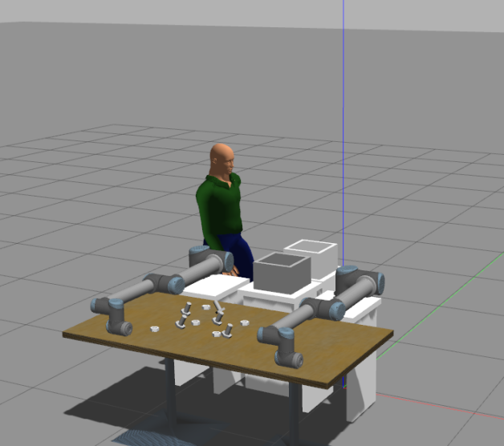
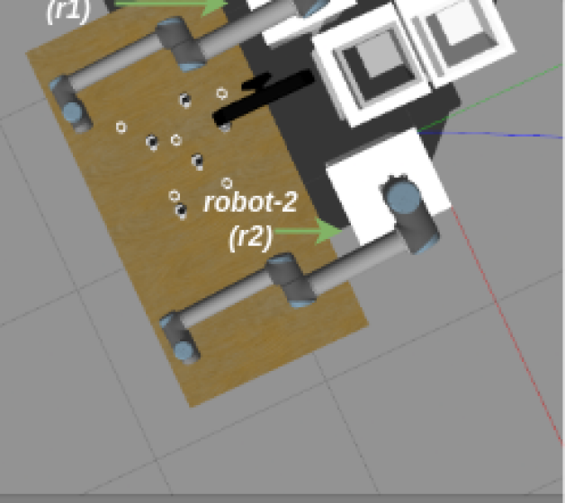
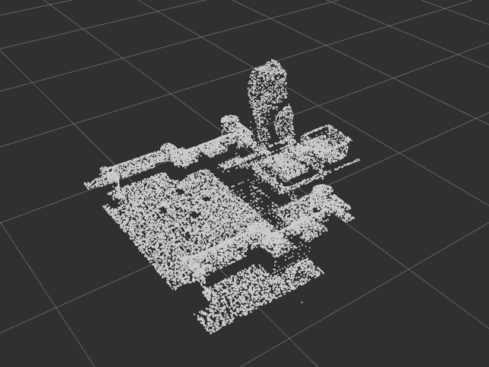
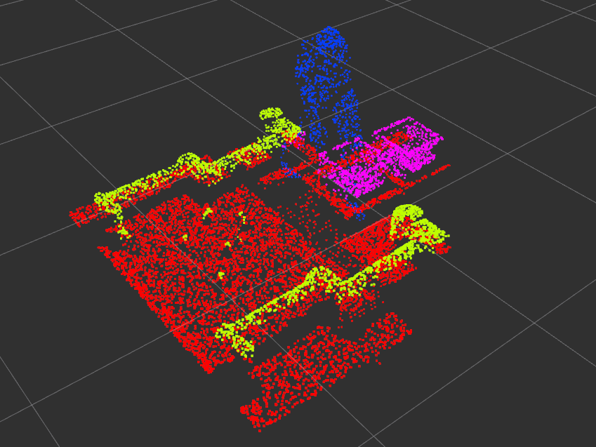
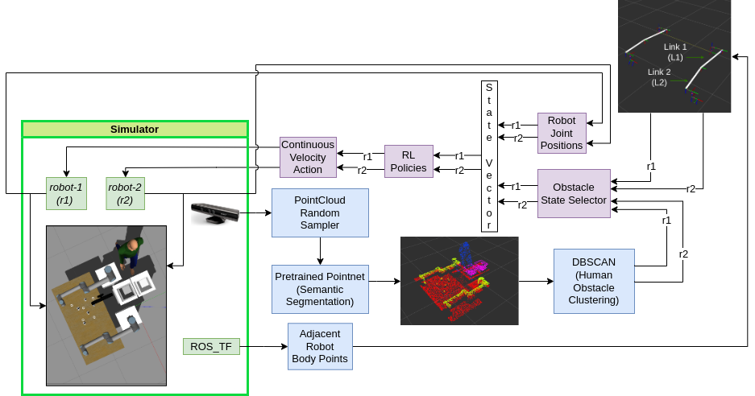
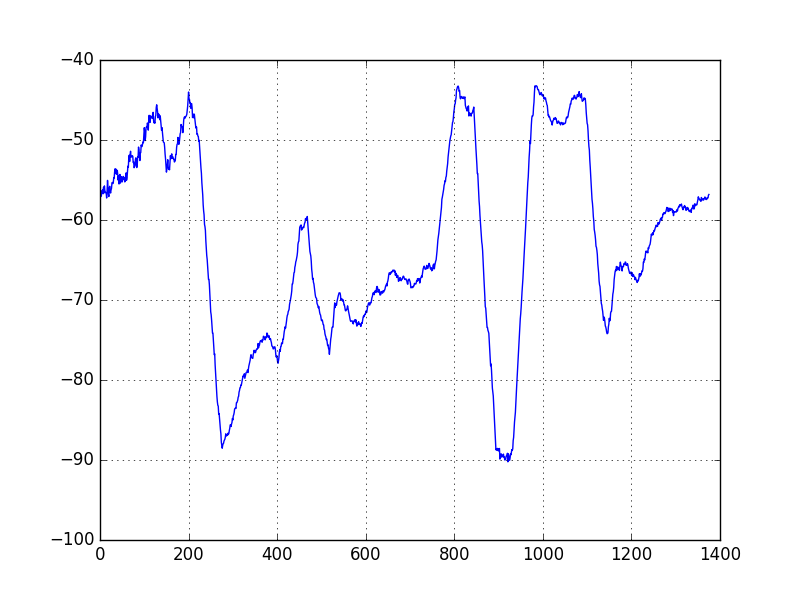
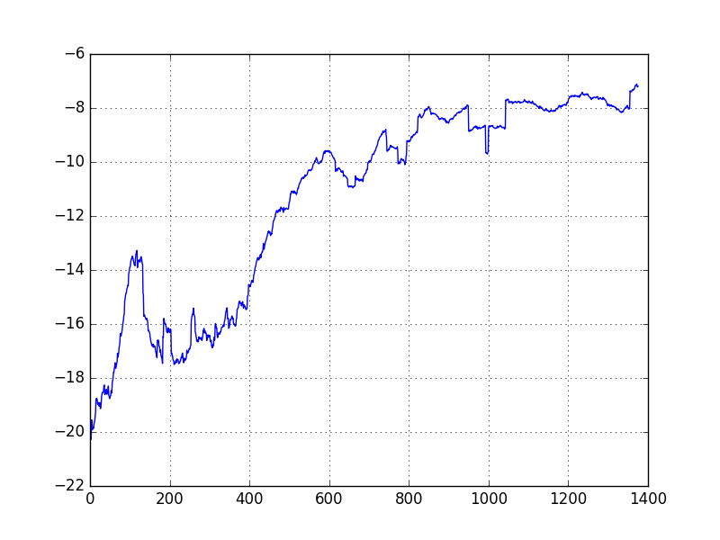

# 探索在动态且共享的三维空间里执行操控任务的学习过程。

发布时间：2024年04月26日

`Agent` `工业自动化` `机器人技术`

> Learning Manipulation Tasks in Dynamic and Shared 3D Spaces

# 摘要

> 对于任何面临大量物料处理、重复性操作和潜在风险的行业而言，实现分离流程的自动化是迫切需求。通过引入协作式自主系统，如机械臂，可以高效地掌握自动化的拣选与放置操作。本文提出了一种深度强化学习策略，旨在教导代理如何在双机械手共享的工作空间中识别多类物品，并将它们放置到多个预定目标地点，前提是拣选动作已经完成。该策略首先采用随机演员-评论家框架来训练代理的策略网络，然后利用一个包含静态和动态障碍物（如人为因素和机器人伙伴）的动态3D Gym环境，构建马尔可夫决策过程的状态空间。在Gazebo模拟器中进行的学习实验显示，远离人为因素的代理累积奖励函数有所提升。未来的研究将进一步探索，以同步提升两个代理的任务执行效率。

> Automating the segregation process is a need for every sector experiencing a high volume of materials handling, repetitive and exhaustive operations, in addition to risky exposures. Learning automated pick-and-place operations can be efficiently done by introducing collaborative autonomous systems (e.g. manipulators) in the workplace and among human operators. In this paper, we propose a deep reinforcement learning strategy to learn the place task of multi-categorical items from a shared workspace between dual-manipulators and to multi-goal destinations, assuming the pick has been already completed. The learning strategy leverages first a stochastic actor-critic framework to train an agent's policy network, and second, a dynamic 3D Gym environment where both static and dynamic obstacles (e.g. human factors and robot mate) constitute the state space of a Markov decision process. Learning is conducted in a Gazebo simulator and experiments show an increase in cumulative reward function for the agent further away from human factors. Future investigations will be conducted to enhance the task performance for both agents simultaneously.

[Arxiv](https://arxiv.org/abs/2404.17673)