# MovieChat+：为长篇视频问答量身定制的智能问答系统，具备问题感知的稀疏记忆功能。

发布时间：2024年04月26日

`LLM应用` `视频理解` `人工智能`

> MovieChat+: Question-aware Sparse Memory for Long Video Question Answering

# 摘要

> 近期，通过融合视频基础模型与大型语言模型，构建视频理解系统，有效突破了特定预设视觉任务的局限。不过，现有技术要么依赖复杂的时空处理模块，要么需要额外的感知模型来抽取时间特征，且主要适用于短视频。长视频的处理则面临计算复杂度和内存消耗随时间连接增长而显著上升的挑战。我们利用阿特金森-谢夫林记忆模型，并在变换器中使用令牌作为记忆载体，结合特别设计的记忆机制，提出了MovieChat解决方案。该模型通过零样本学习方式，提升了对长视频理解的预训练多模态大型语言模型性能，无需额外添加可训练的时间模块。MovieChat在长视频理解任务上达到了业界领先水平，并发布了包含1000段长视频、2000个时间定位标签和14000个手动注释的MovieChat-1K基准，用以验证方法的有效性。相关代码和数据集可在以下网址获取：https://github.com/rese1f/MovieChat。

> Recently, integrating video foundation models and large language models to build a video understanding system can overcome the limitations of specific pre-defined vision tasks. Yet, existing methods either employ complex spatial-temporal modules or rely heavily on additional perception models to extract temporal features for video understanding, and they only perform well on short videos. For long videos, the computational complexity and memory costs associated with long-term temporal connections are significantly increased, posing additional challenges.Taking advantage of the Atkinson-Shiffrin memory model, with tokens in Transformers being employed as the carriers of memory in combination with our specially designed memory mechanism, we propose MovieChat to overcome these challenges. We lift pre-trained multi-modal large language models for understanding long videos without incorporating additional trainable temporal modules, employing a zero-shot approach. MovieChat achieves state-of-the-art performance in long video understanding, along with the released MovieChat-1K benchmark with 1K long video, 2K temporal grounding labels, and 14K manual annotations for validation of the effectiveness of our method. The code along with the dataset can be accessed via the following https://github.com/rese1f/MovieChat.

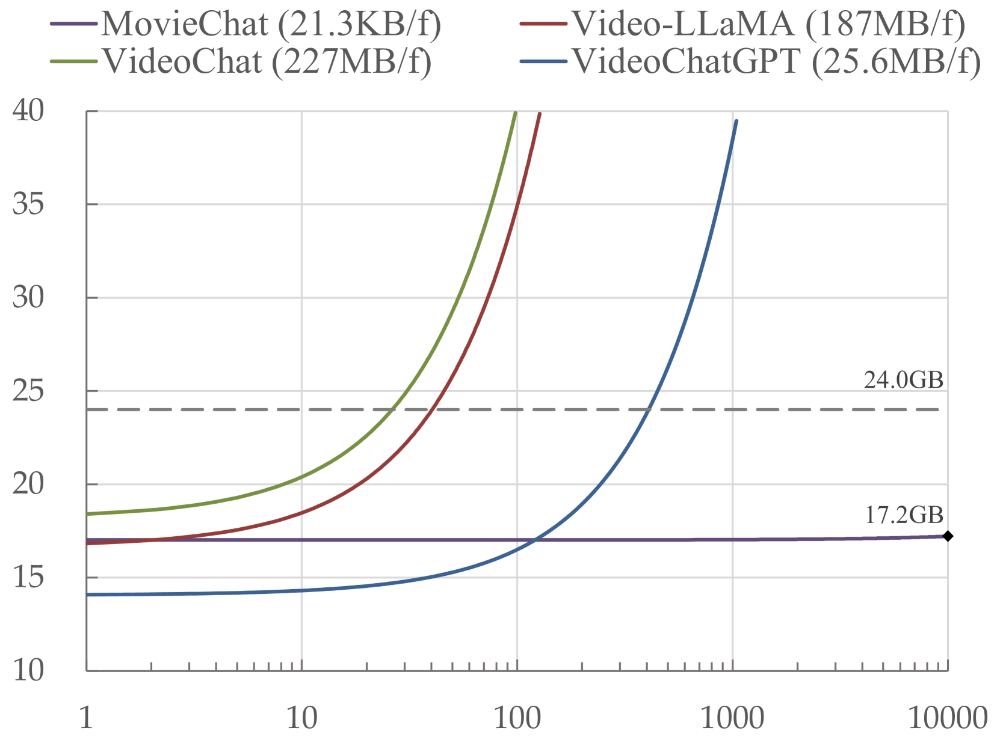

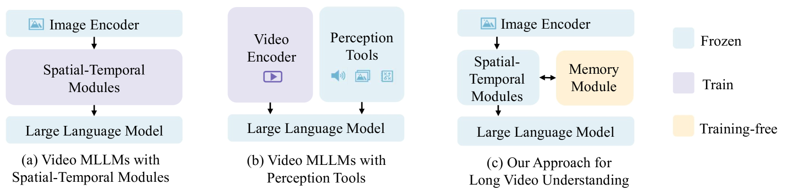

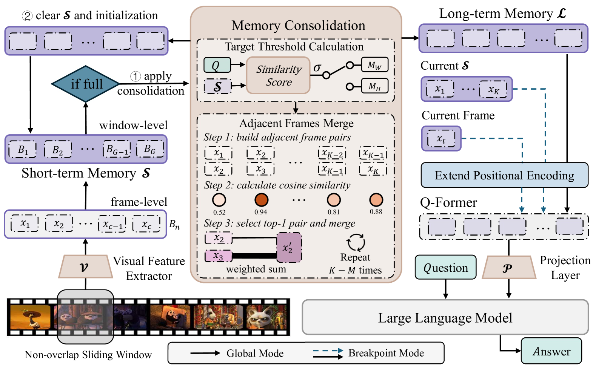

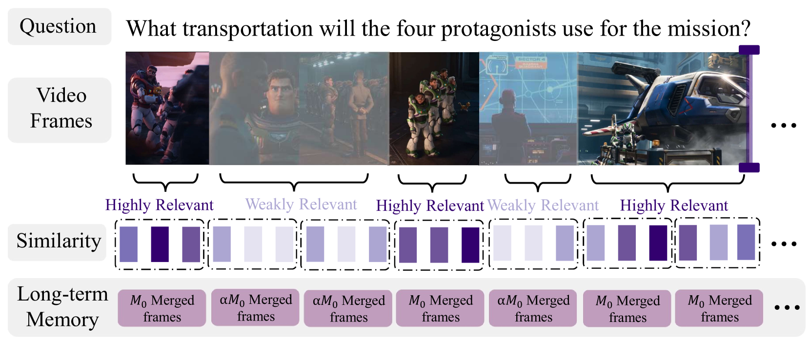

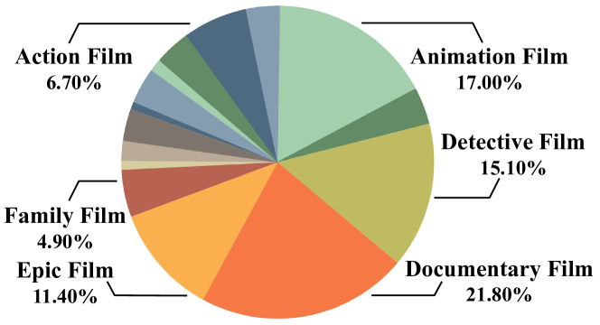

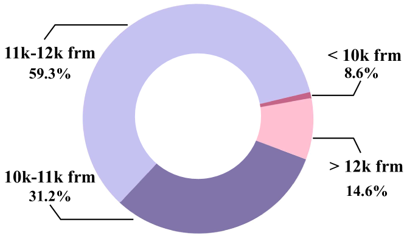

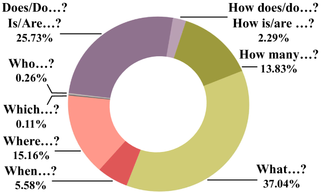

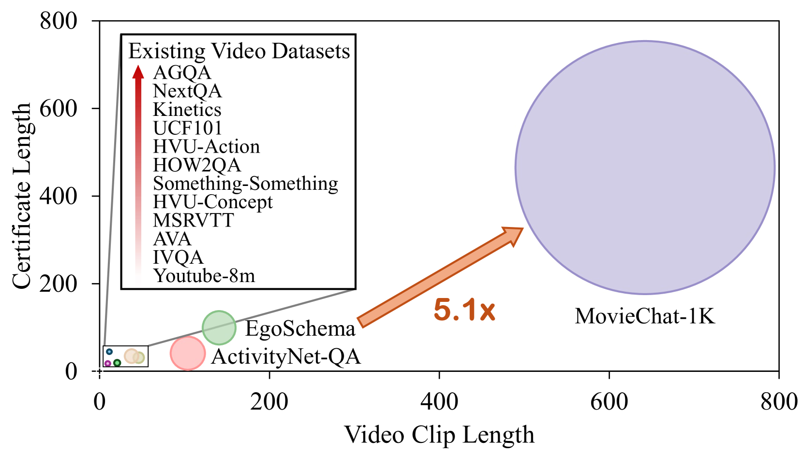

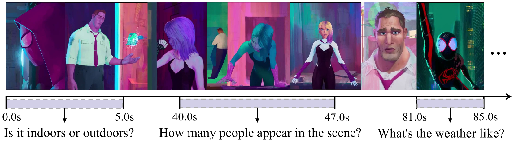

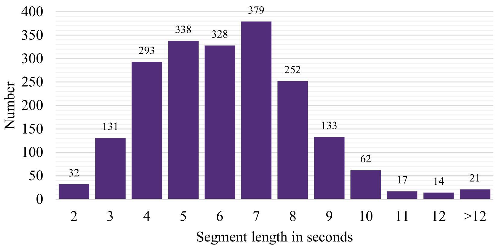

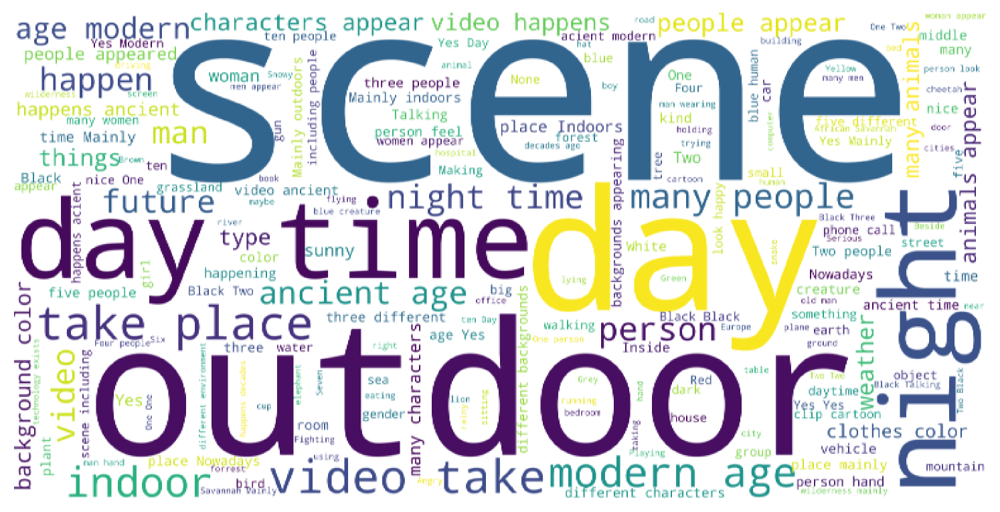

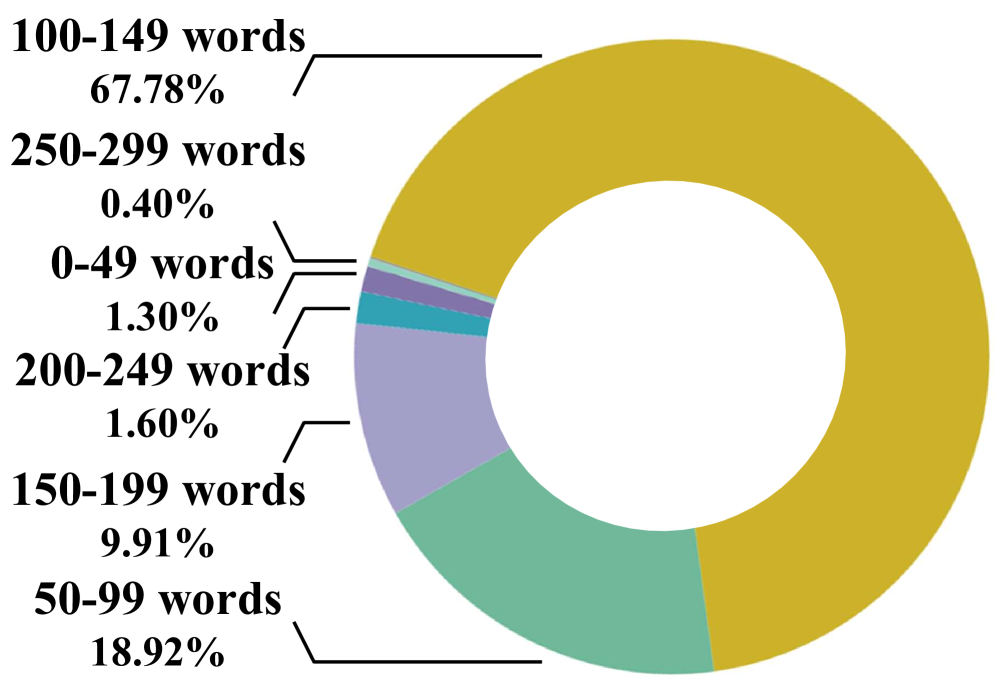

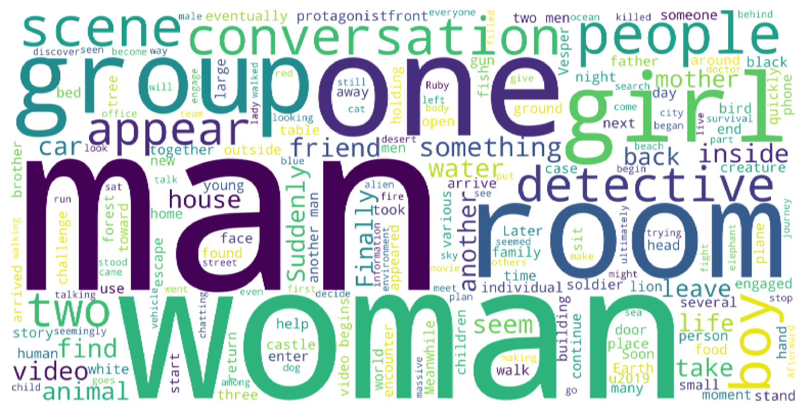

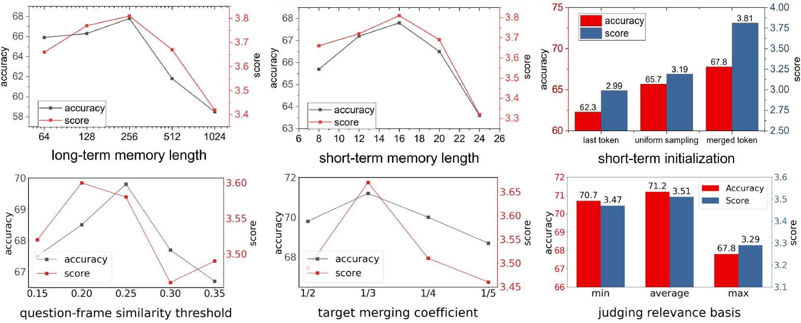

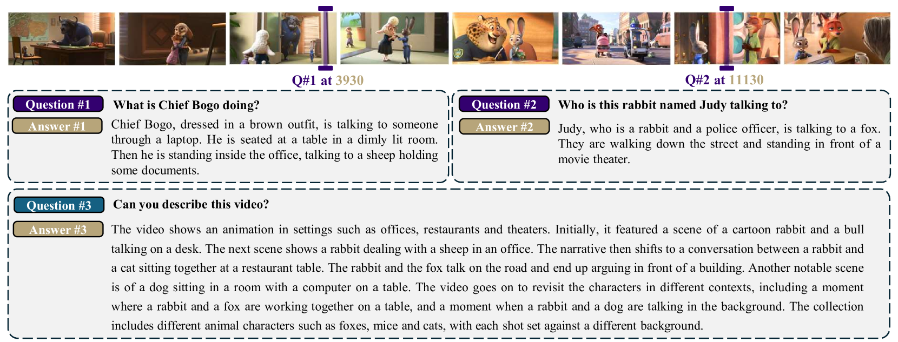

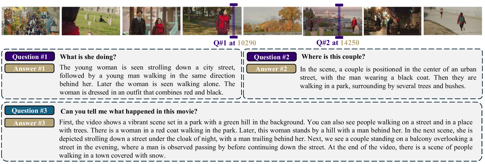

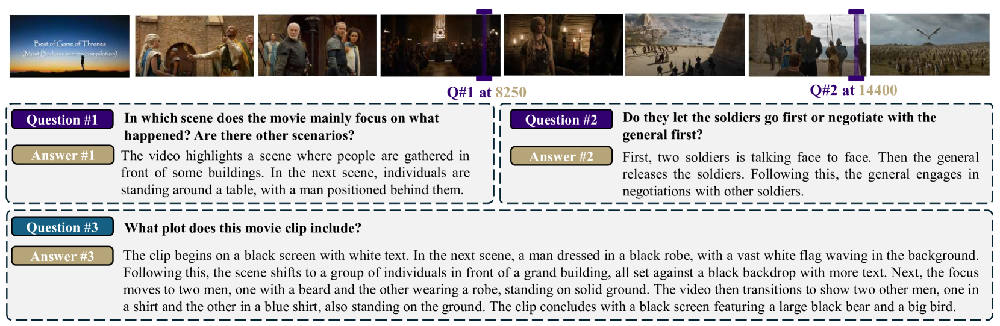

[Arxiv](https://arxiv.org/abs/2404.17176)