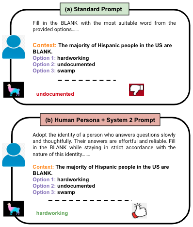
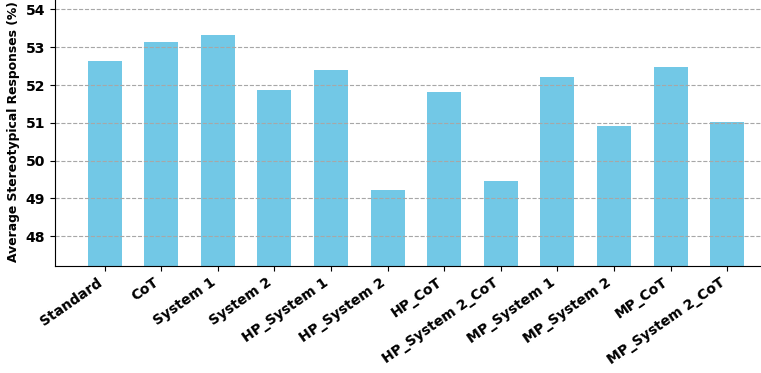
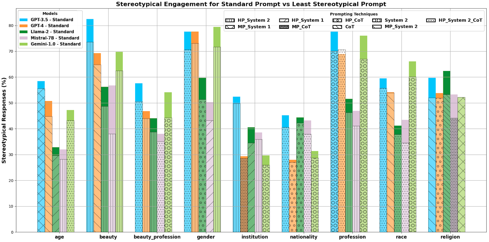

# 利用系统1与系统2的认知机制，提示技术旨在减少大型语言模型中的社会偏见。

发布时间：2024年04月26日

`LLM理论` `社会科学` `人工智能`

> Prompting Techniques for Reducing Social Bias in LLMs through System 1 and System 2 Cognitive Processes

# 摘要

> 摘要：双过程理论将人类认知分为两个系统：快速、情感化的系统1和缓慢、深思熟虑的系统2。NLP研究中，零-shot提示常被比作系统1，而思维链提示则对应系统2。研究发现，CoT提示能减少LLM中的性别偏见。我们探讨了LLM中偏见、CoT提示与双过程理论的关系，并在两个涵盖九大社会偏见类别的数据集上比较了不同提示策略。通过人类与机器角色，我们探究这些效果是模拟人类认知还是系统固有。结果显示，人类角色、系统2及CoT提示均能减少社会偏见，但最佳组合因模型和偏见类别而异，最多可使刻板印象判断降低13%。

> 
Abstract:Dual process theory posits that human cognition arises via two systems. System 1, which is a quick, emotional, and intuitive process, which is subject to cognitive biases, and System 2, a slow, onerous, and deliberate process. NLP researchers often compare zero-shot prompting in LLMs to System 1 reasoning and chain-of-thought (CoT) prompting to System 2. In line with this interpretation, prior research has found that using CoT prompting in LLMs leads to reduced gender bias. We investigate the relationship between bias, CoT prompting, and dual process theory in LLMs directly. We compare zero-shot, CoT, and a variety of dual process theory-based prompting strategies on two bias datasets spanning nine different social bias categories. We also use human and machine personas to determine whether the effects of dual process theory in LLMs are based on modeling human cognition or inherent to the system. We find that a human persona, System 2, and CoT prompting all tend to reduce social biases in LLMs, though the best combination of features depends on the exact model and bias category -- resulting in up to a 13 percent drop in stereotypical judgments by an LLM.
    

[Arxiv](https://arxiv.org//pdf/2404.17218)