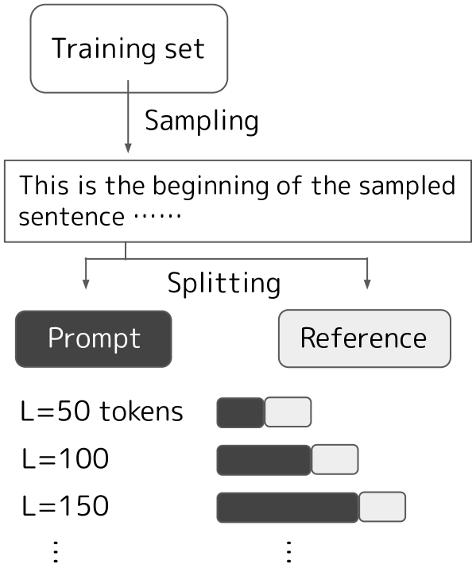
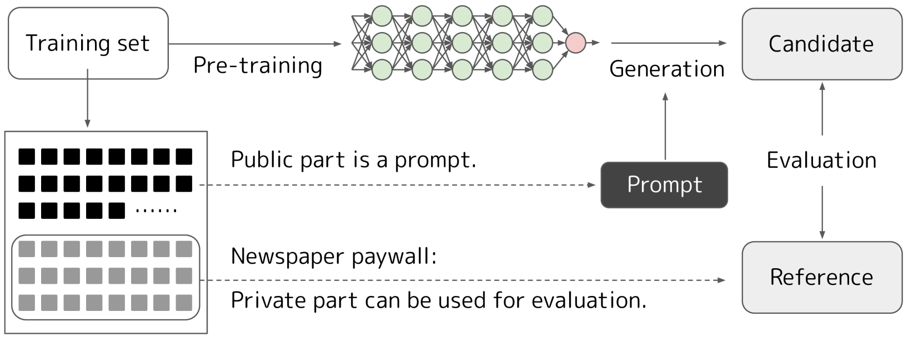
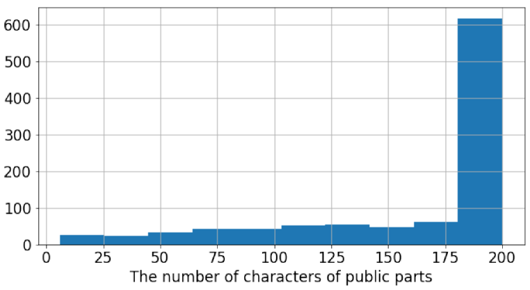
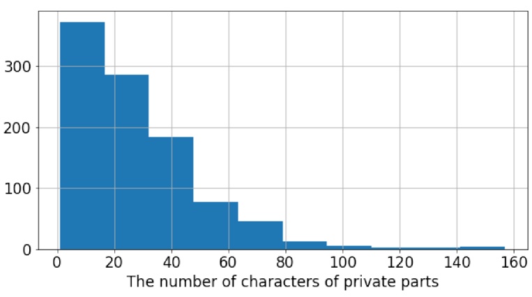
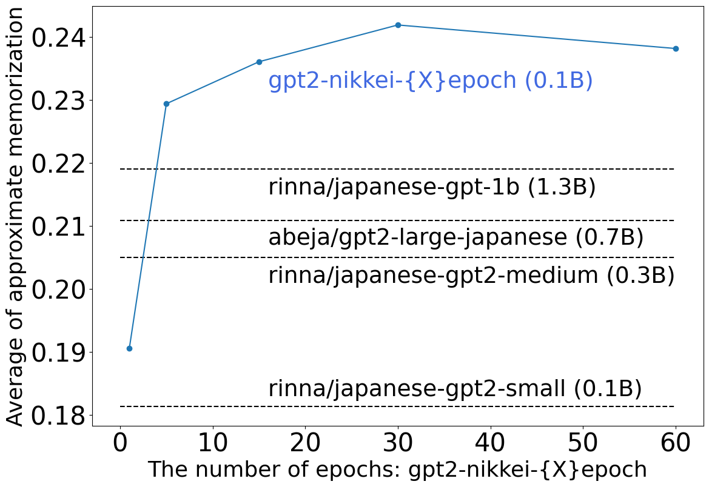

# 本文旨在通过日本报纸和付费墙的方式，探究特定领域预训练语言模型的记忆量化问题。

发布时间：2024年04月26日

`LLM理论`

> Quantifying Memorization of Domain-Specific Pre-trained Language Models using Japanese Newspaper and Paywalls

# 摘要

> 主流的预训练语言模型（PLMs）在自然语言生成的高品质输出上取得了显著成就。但对于它们的生成机制，我们的理解尚不成熟：这些模型究竟是掌握了通用的语言抽象能力，还是仅仅记住并复现了训练数据中的片段？特别是，针对特定领域的PLMs的研究更是寥寥无几。本研究中，我们利用有限的日本报纸文章集合，预训练了特定领域的GPT-2模型，并通过与通用的日本GPT-2模型的比较，量化了对训练数据的记忆力。实验结果显示，特定领域的PLMs有时会大规模地进行“复制粘贴”操作。此外，我们还复现了之前在英语研究中发现的现象：记忆力与复制行为、模型大小和提示长度有关，这一现象在日本语中同样存在。我们的评估通过专注于报纸的付费内容，避免了数据污染的问题，因为这些内容不会被用作训练材料。我们期望本文能够促进关于PLMs安全性和版权等问题的深入讨论。

> Dominant pre-trained language models (PLMs) have been successful in high-quality natural language generation. However, the analysis of their generation is not mature: do they acquire generalizable linguistic abstractions, or do they simply memorize and recover substrings of the training data? Especially, few studies focus on domain-specific PLM. In this study, we pre-trained domain-specific GPT-2 models using a limited corpus of Japanese newspaper articles and quantified memorization of training data by comparing them with general Japanese GPT-2 models. Our experiments revealed that domain-specific PLMs sometimes "copy and paste" on a large scale. Furthermore, we replicated the empirical finding that memorization is related to duplication, model size, and prompt length, in Japanese the same as in previous English studies. Our evaluations are relieved from data contamination concerns by focusing on newspaper paywalls, which prevent their use as training data. We hope that our paper encourages a sound discussion such as the security and copyright of PLMs.

[Arxiv](https://arxiv.org/abs/2404.17143)