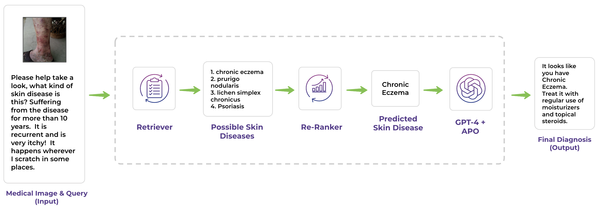

# UMass-BioNLP 团队在 2024 年 MEDIQA-M3G 竞赛中推出的 DermPrompt，是一项对 GPT-4V 进行提示工程系统性探索的成果，旨在提升皮肤科疾病的诊断能力。

发布时间：2024年04月26日

`分类：LLM应用

这篇论文展示了一个具体的应用案例，即利用大型多模态模型（特别是GPT-4V）进行临床皮肤科病例的诊断。它涉及到使用大型语言模型（LLM）进行实际问题的解决，因此可以归类为LLM应用。论文中提到了使用朴素链式思维（CoT）和多代理对话（MAC）框架来提高诊断的准确性，这些都是LLM在实际应用中的创新用法。` `人工智能`

> UMass-BioNLP at MEDIQA-M3G 2024: DermPrompt -- A Systematic Exploration of Prompt Engineering with GPT-4V for Dermatological Diagnosis

# 摘要

> 本论文展示了我们团队参与 MEDIQA-ClinicalNLP2024 共享任务 B 的成果。我们采用了一种创新的临床皮肤科病例诊断方法，通过融合大型多模态模型，尤其是利用 GPT-4V 在检索器和重排器框架下的功能。研究发现，GPT-4V 作为检索工具，能够基于皮肤图像和患者简史，85% 的时间准确识别出正确的皮肤状况。实验还证明，朴素链式思维（Naive Chain-of-Thought, CoT）在检索方面表现优异，而精确的皮肤科诊断则需依赖于医学指南引导的 CoT。此外，我们引入了多代理对话（Multi-Agent Conversation, MAC）框架，并证实了其相较于最佳 CoT 策略的卓越性能和潜力。实验结果表明，结合朴素 CoT 进行检索和 MAC 框架进行基于批评的诊断，GPT-4V 有助于实现皮肤科疾病的早期和准确诊断。这项研究不仅推动了诊断流程的优化，还有助于皮肤科教育的发展，并为患者提供了一种可扩展、易于获取且准确的诊断工具，从而提升了患者护理水平。

> This paper presents our team's participation in the MEDIQA-ClinicalNLP2024 shared task B. We present a novel approach to diagnosing clinical dermatology cases by integrating large multimodal models, specifically leveraging the capabilities of GPT-4V under a retriever and a re-ranker framework. Our investigation reveals that GPT-4V, when used as a retrieval agent, can accurately retrieve the correct skin condition 85% of the time using dermatological images and brief patient histories. Additionally, we empirically show that Naive Chain-of-Thought (CoT) works well for retrieval while Medical Guidelines Grounded CoT is required for accurate dermatological diagnosis. Further, we introduce a Multi-Agent Conversation (MAC) framework and show its superior performance and potential over the best CoT strategy. The experiments suggest that using naive CoT for retrieval and multi-agent conversation for critique-based diagnosis, GPT-4V can lead to an early and accurate diagnosis of dermatological conditions. The implications of this work extend to improving diagnostic workflows, supporting dermatological education, and enhancing patient care by providing a scalable, accessible, and accurate diagnostic tool.

[Arxiv](https://arxiv.org/abs/2404.17749)