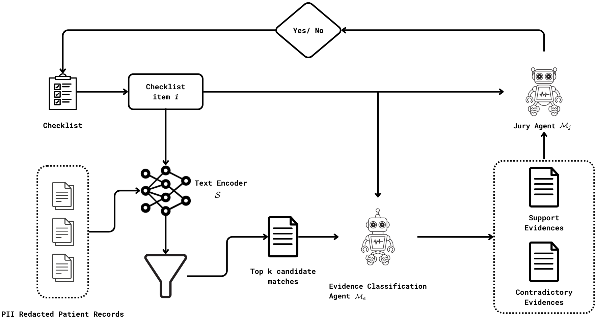
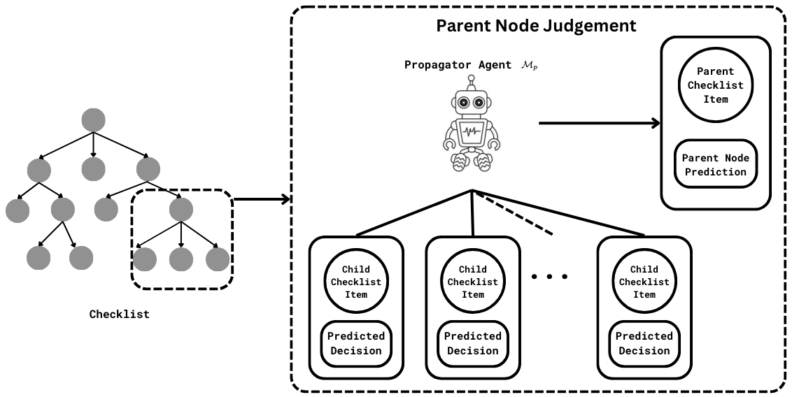
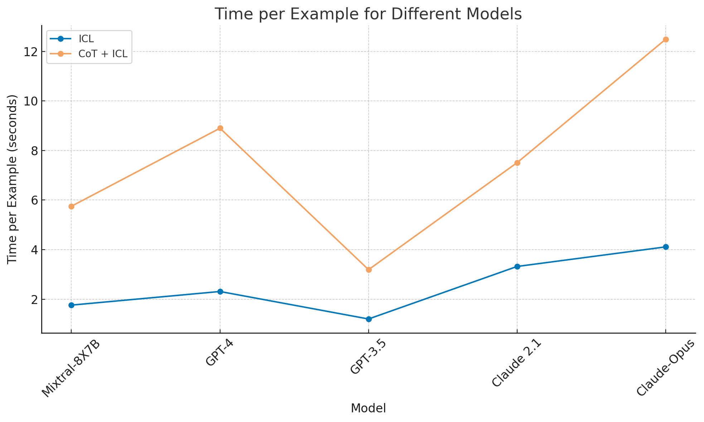

# 提升医疗自动化水平：多智能体系统在医疗需求论证中的应用。

发布时间：2024年04月27日

`分类：Agent` `人工智能`

> Advancing Healthcare Automation: Multi-Agent Systems for Medical Necessity Justification

# 摘要

> 本研究着眼于应用群体结构化多智能体系统（MAS）来评估医疗必要性，这一过程需要系统性地对照临床指南，审查患者的医疗结构化与非结构化数据。为应对这一挑战，我们将任务细化为易于操作的子任务，每个子任务由专责的AI智能体执行。我们对不同的提示策略对智能体的影响进行了系统性研究，并对比了多种大型语言模型（LLMs）的准确性。同时，我们也探讨了这些智能体如何增强系统的可解释性，以提升信任度和透明度。

> This paper explores the application of Swarm-Structured Multi-Agent Systems (MAS) to establish medical necessity, a process that involves a systematic review of patient-specific medical structured and unstructured data against clinical guidelines. We addressed this complex task by decomposing it into smaller, more manageable sub-tasks. Each sub-task is handled by a specialized AI agent. We conduct a systematic study of the impact of various prompting strategies on these agents and benchmark different Large Language Models (LLMs) to determine their accuracy in completing these tasks. Additionally, we investigate how these agents can provide explainability, thereby enhancing trust and transparency within the system.

[Arxiv](https://arxiv.org/abs/2404.17977)