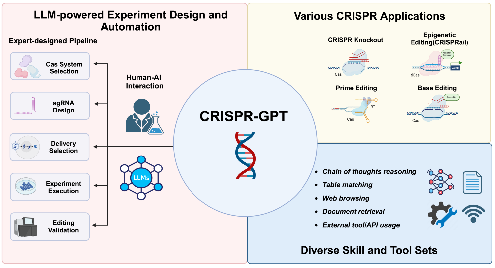
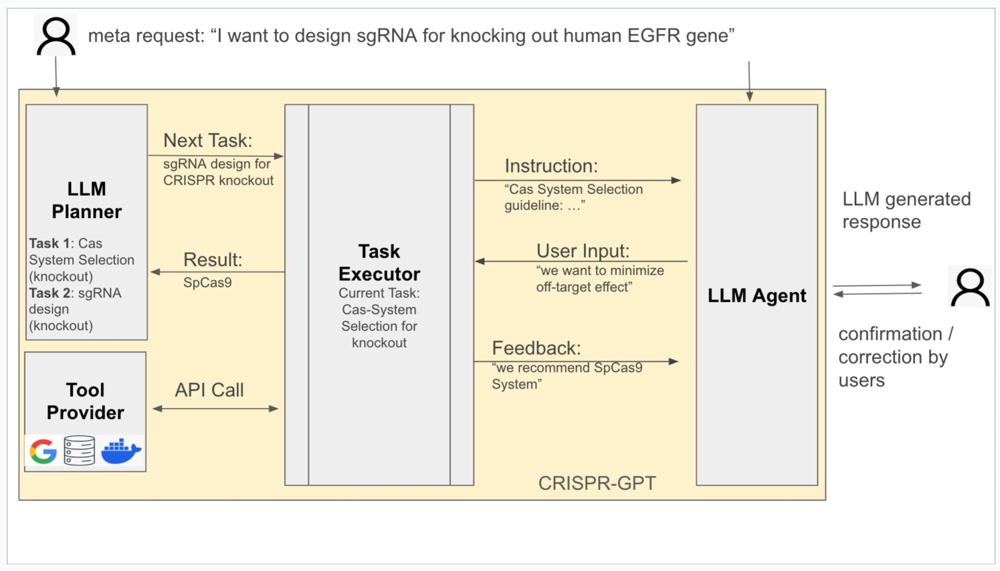
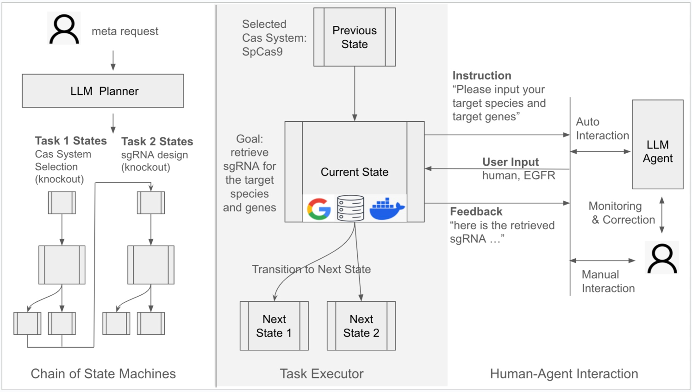
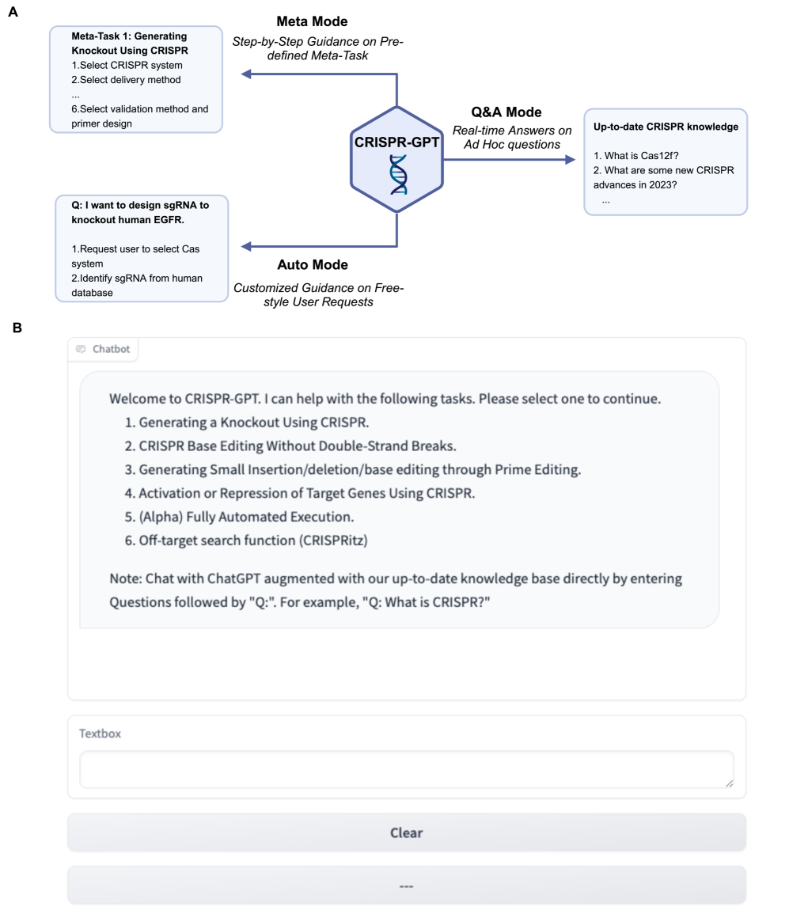
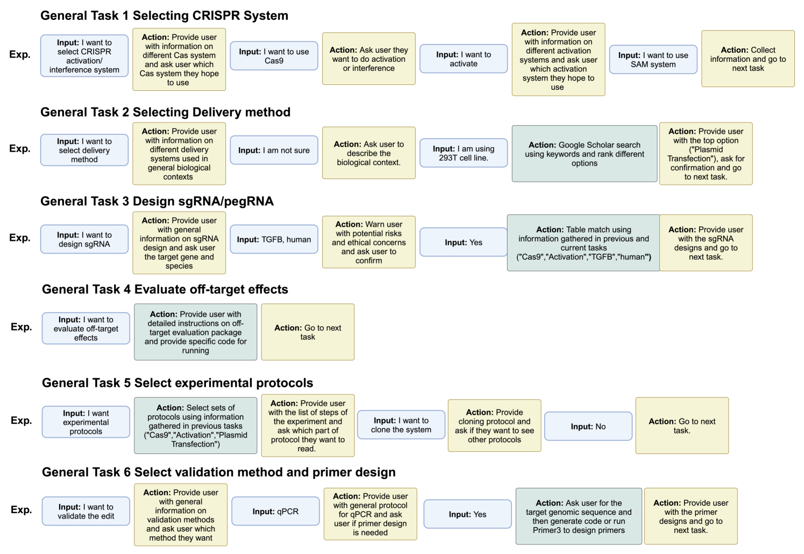
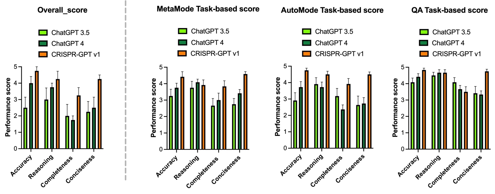
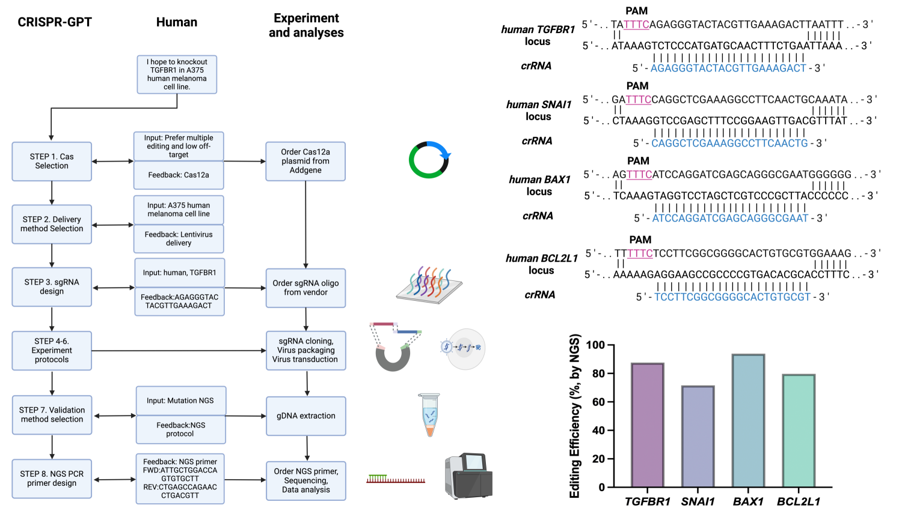

# CRISPR-GPT：自动化基因编辑实验设计的智能大型语言模型代理。

发布时间：2024年04月27日

`Agent` `生物医学` `基因编辑`

> CRISPR-GPT: An LLM Agent for Automated Design of Gene-Editing Experiments

# 摘要

> 基因组工程的革新为生物医学领域带来了翻天覆地的变化，使得对DNA进行精准编辑变得触手可及。但是，开发高效的基因编辑平台离不开对CRISPR技术的深刻洞察以及对实验体系的全面掌握。尽管大型语言模型（LLMs）在多领域展现出巨大潜力，它们在解决生物学设计问题时往往因缺乏专业知识而力不从心。本研究提出了CRISPR-GPT，这是一个融合了专业知识和外部工具的LLM智能体，旨在自动化并优化基于CRISPR的基因编辑实验设计流程。CRISPR-GPT发挥了LLMs的推理优势，简化了挑选CRISPR系统、构建导向RNA、选择细胞传递策略、制定实验方案以及规划验证实验等步骤。我们证明了CRISPR-GPT在辅助科研新手开展基因编辑实验方面的潜力，并在一个实际应用案例中检验了其效能。同时，我们也深入探讨了自动化基因编辑设计所引发的伦理和法规问题，强调了审慎和透明使用这些技术的重要性。我们的目标是连接生物学研究新手与CRISPR基因组工程技术的桥梁，并展现LLM智能体在推动复杂生物探索任务中的巨大潜力。

> The introduction of genome engineering technology has transformed biomedical research, making it possible to make precise changes to genetic information. However, creating an efficient gene-editing system requires a deep understanding of CRISPR technology, and the complex experimental systems under investigation. While Large Language Models (LLMs) have shown promise in various tasks, they often lack specific knowledge and struggle to accurately solve biological design problems. In this work, we introduce CRISPR-GPT, an LLM agent augmented with domain knowledge and external tools to automate and enhance the design process of CRISPR-based gene-editing experiments. CRISPR-GPT leverages the reasoning ability of LLMs to facilitate the process of selecting CRISPR systems, designing guide RNAs, recommending cellular delivery methods, drafting protocols, and designing validation experiments to confirm editing outcomes. We showcase the potential of CRISPR-GPT for assisting non-expert researchers with gene-editing experiments from scratch and validate the agent's effectiveness in a real-world use case. Furthermore, we explore the ethical and regulatory considerations associated with automated gene-editing design, highlighting the need for responsible and transparent use of these tools. Our work aims to bridge the gap between beginner biological researchers and CRISPR genome engineering techniques, and demonstrate the potential of LLM agents in facilitating complex biological discovery tasks.

[Arxiv](https://arxiv.org/abs/2404.18021)