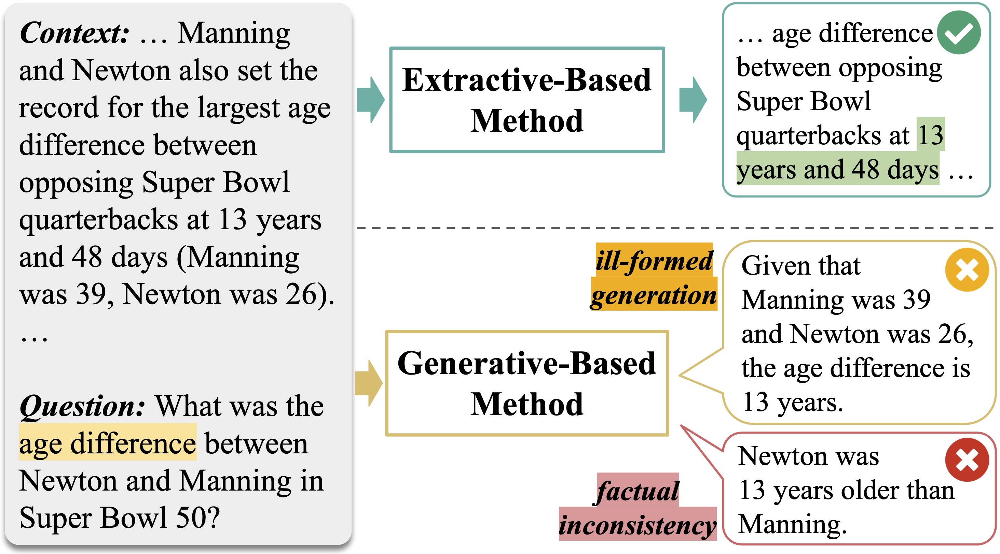
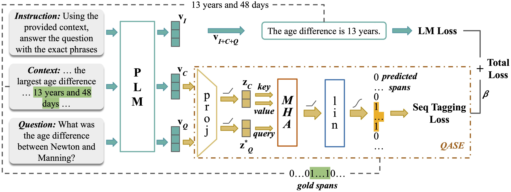
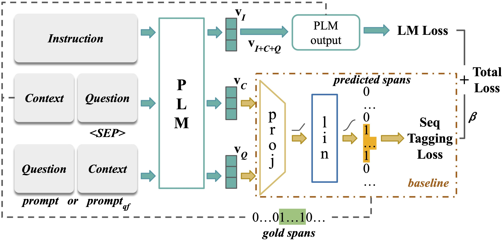

# 通过引入问题导向的段落抽取技术，提升机器阅读理解任务中预训练生成语言模型的性能。

发布时间：2024年04月27日

`分类：LLM应用

这篇论文主要讨论了机器阅读理解（MRC）领域的问题，并提出了一种新的模块——问题关注跨度提取（QASE）模块，以提高生成语言模型（PLMs）在MRC任务中的表现。这篇论文关注的是大型语言模型（LLMs）的应用，特别是在自然语言处理（NLP）领域，因此可以归类为LLM应用。` `机器阅读理解`

> Enhancing Pre-Trained Generative Language Models with Question Attended Span Extraction on Machine Reading Comprehension

# 摘要

> 机器阅读理解（MRC）是自然语言处理（NLP）领域的一大难题。主流的 MRC 方法多采用如 BERT 这类仅编码器模型的提取式策略，而生成式方法则常遭遇生成失控的窘境——即生成的答案往往错误、无关或与原文不符。为克服 MRC 生成模型的局限，我们提出了问题关注跨度提取（QASE）模块。该模块在预训练的生成语言模型（PLMs）微调阶段整合，显著提升了模型性能，使其超越了如 GPT-4 等高级大型语言模型（LLMs）的提取性能。关键的是，性能的提升并未导致计算成本的增加。QASE 模块的效力已在多个数据集上经过严格验证，持续达到了或超越了当前最佳（SOTA）的成绩。

> Machine Reading Comprehension (MRC) poses a significant challenge in the field of Natural Language Processing (NLP). While mainstream MRC methods predominantly leverage extractive strategies using encoder-only models such as BERT, generative approaches face the issue of out-of-control generation -- a critical problem where answers generated are often incorrect, irrelevant, or unfaithful to the source text. To address these limitations in generative models for MRC, we introduce the Question-Attended Span Extraction (QASE) module. Integrated during the fine-tuning phase of pre-trained generative language models (PLMs), QASE significantly enhances their performance, allowing them to surpass the extractive capabilities of advanced Large Language Models (LLMs) such as GPT-4. Notably, these gains in performance do not come with an increase in computational demands. The efficacy of the QASE module has been rigorously tested across various datasets, consistently achieving or even surpassing state-of-the-art (SOTA) results.

[Arxiv](https://arxiv.org/abs/2404.17991)