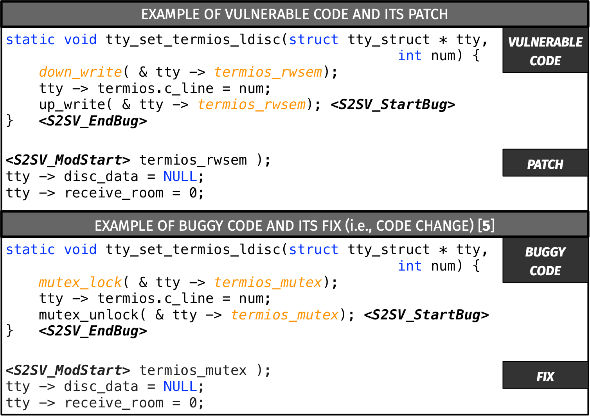

# 深度学习驱动的漏洞修复性能受训练流程的显著影响。

发布时间：2024年04月27日

`分类：LLM应用

这篇论文主要研究了深度学习（DL）模型在漏洞修复领域的应用，特别是探讨了不同训练方法对DL模型性能的影响。虽然它涉及到了预训练模型和编程语言，但主要关注的是漏洞修复任务，这属于大型语言模型（LLM）的应用范畴。论文中提到的自我监督和监督预训练方法，以及提示调整策略，都是为了提高DL模型在漏洞修复任务中的性能。因此，这篇论文应该归类为LLM应用。` `软件工程` `漏洞修复`

> How the Training Procedure Impacts the Performance of Deep Learning-based Vulnerability Patching

# 摘要

> 生成深度学习（DL）模型在漏洞修复领域取得了成功应用。但这些模型依赖于大量补丁数据集。为克服这一难题，研究者建议利用预训练模型，这些模型已通过编程语言或类似任务（如缺陷修复）的通用知识进行了训练。尽管在自动化漏洞修复方面取得了进展，但对于不同训练方法如何影响DL模型性能的系统性研究仍然不足。本文旨在填补这一空白，通过（i）对比自我监督与监督预训练方法在漏洞修复中的应用；（ii）首次探索为该任务设计的不同提示调整策略。研究共涉及23个DL模型的训练与测试。研究发现，专注于缺陷修复的监督预训练虽然在数据收集上成本较高，但能显著提升基于DL的漏洞修复效果。而在监督预训练模型上实施提示调整并未带来性能上的显著提升。相较之下，提示调整是一种高效且经济的方法，能够显著增强不依赖于缺陷修复预训练的自我监督预训练模型的性能。

> Generative deep learning (DL) models have been successfully adopted for vulnerability patching. However, such models require the availability of a large dataset of patches to learn from. To overcome this issue, researchers have proposed to start from models pre-trained with general knowledge, either on the programming language or on similar tasks such as bug fixing. Despite the efforts in the area of automated vulnerability patching, there is a lack of systematic studies on how these different training procedures impact the performance of DL models for such a task. This paper provides a manyfold contribution to bridge this gap, by (i) comparing existing solutions of self-supervised and supervised pre-training for vulnerability patching; and (ii) for the first time, experimenting with different kinds of prompt-tuning for this task. The study required to train/test 23 DL models. We found that a supervised pre-training focused on bug-fixing, while expensive in terms of data collection, substantially improves DL-based vulnerability patching. When applying prompt-tuning on top of this supervised pre-trained model, there is no significant gain in performance. Instead, prompt-tuning is an effective and cheap solution to substantially boost the performance of self-supervised pre-trained models, i.e., those not relying on the bug-fixing pre-training.

[Arxiv](https://arxiv.org/abs/2404.17896)