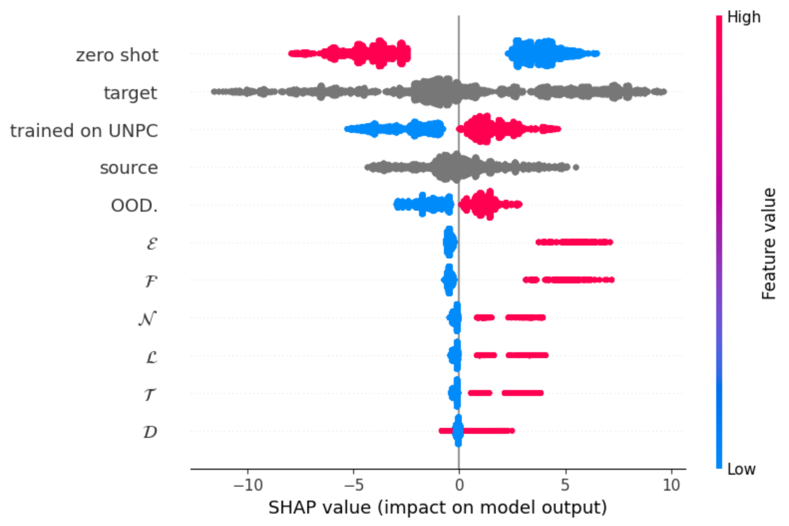

# 我向您推荐一座注意力之桥：探讨模块化翻译架构的泛化性能

发布时间：2024年04月27日

`分类：RAG

这篇论文讨论了模块化在机器翻译中的应用，以及它是否能够提高翻译质量和模型的泛化能力。这属于机器翻译的范畴，而机器翻译是RAG（Retrieval-Augmented Generation）的一个应用领域。RAG是一种结合了检索（Retrieval）和生成（Generation）的模型，用于处理需要大量上下文信息的任务，如机器翻译。因此，这篇论文应该归类为RAG。` `机器翻译`

> I Have an Attention Bridge to Sell You: Generalization Capabilities of Modular Translation Architectures

# 摘要

> 模块化作为机器翻译的新范式，能够在训练阶段构建大型模型，而在推理阶段则形成更为紧凑的模型。研究者们普遍认为，通过采用模块化方法，尤其是注意力桥接技术，可以增强模型的泛化能力，从而提升其对不同语言的适应性。本文旨在探讨模块化是否能够提升翻译的品质，并评估这类架构在多样化评估环境下的泛化表现。研究发现，在既定的计算资源下，非模块化架构在性能上总是可以与我们所研究的所有模块化设计相媲美，甚至更胜一筹。

> Modularity is a paradigm of machine translation with the potential of bringing forth models that are large at training time and small during inference. Within this field of study, modular approaches, and in particular attention bridges, have been argued to improve the generalization capabilities of models by fostering language-independent representations. In the present paper, we study whether modularity affects translation quality; as well as how well modular architectures generalize across different evaluation scenarios. For a given computational budget, we find non-modular architectures to be always comparable or preferable to all modular designs we study.

[Arxiv](https://arxiv.org/abs/2404.17918)