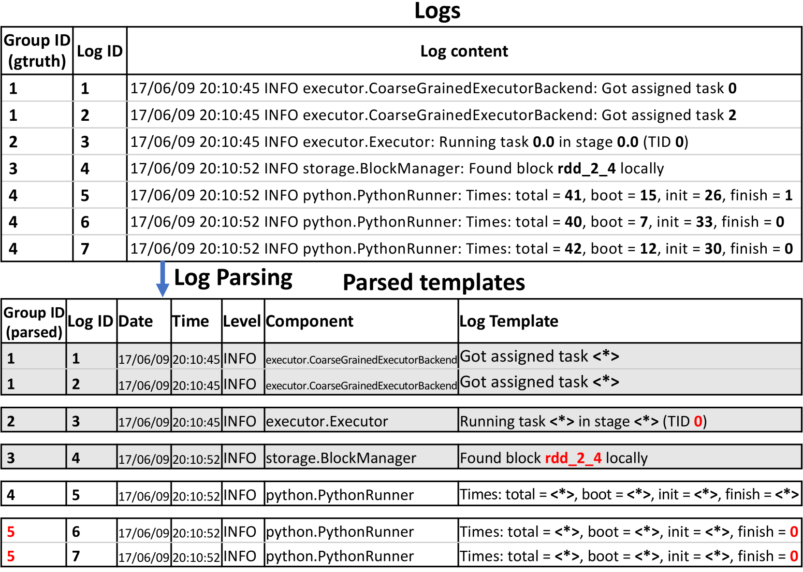
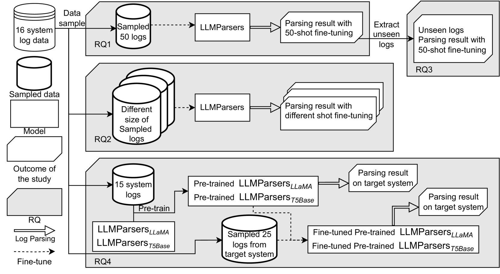

# LLMParser：探索性研究——利用大型语言模型进行日志解析。

发布时间：2024年04月27日

`LLM应用` `软件开发` `日志分析`

> LLMParser: An Exploratory Study on Using Large Language Models for Log Parsing

# 摘要

> 在现代软件开发中，日志作为运行时信息的载体扮演着关键角色。日志解析，即从非结构化日志数据中提取结构化信息，是许多基于日志分析的首要步骤。传统解析工具在处理多样化的日志格式时面临挑战，这直接关系到下游日志分析任务的效率。本文探讨了利用大型语言模型（LLMs）进行日志解析的可能性，并提出了LLMParser，这是一款基于生成性LLMs和少量样本微调的日志解析工具。我们采用了四种LLMs——Flan-T5-small、Flan-T5-base、LLaMA-7B和ChatGLM-6B——来构建LLMParser。通过对16个开源系统的评估，我们发现LLMParser在解析精度上显著超越了现有技术（平均解析精度达到96%）。此外，我们还深入分析了训练规模、模型大小和预训练LLM对日志解析精度的影响。研究发现，较小型的LLMs在某些情况下可能比更复杂的模型更为高效，如Flan-T5-base在较短的推理时间内就能达到与LLaMA-7B相似的结果。我们还观察到，使用其他系统日志预训练的LLMs并不总能提升解析精度。例如，尽管预训练的Flan-T5-base能够提高精度，但预训练的LLaMA却可能导致精度下降（组精度下降近55%）。总结来说，本研究为利用LLMs进行日志解析提供了实证基础，并指出了基于LLM的日志解析工具的局限性及未来研究的方向。

> Logs are important in modern software development with runtime information. Log parsing is the first step in many log-based analyses, that involve extracting structured information from unstructured log data. Traditional log parsers face challenges in accurately parsing logs due to the diversity of log formats, which directly impacts the performance of downstream log-analysis tasks. In this paper, we explore the potential of using Large Language Models (LLMs) for log parsing and propose LLMParser, an LLM-based log parser based on generative LLMs and few-shot tuning. We leverage four LLMs, Flan-T5-small, Flan-T5-base, LLaMA-7B, and ChatGLM-6B in LLMParsers. Our evaluation of 16 open-source systems shows that LLMParser achieves statistically significantly higher parsing accuracy than state-of-the-art parsers (a 96% average parsing accuracy). We further conduct a comprehensive empirical analysis on the effect of training size, model size, and pre-training LLM on log parsing accuracy. We find that smaller LLMs may be more effective than more complex LLMs; for instance where Flan-T5-base achieves comparable results as LLaMA-7B with a shorter inference time. We also find that using LLMs pre-trained using logs from other systems does not always improve parsing accuracy. While using pre-trained Flan-T5-base shows an improvement in accuracy, pre-trained LLaMA results in a decrease (decrease by almost 55% in group accuracy). In short, our study provides empirical evidence for using LLMs for log parsing and highlights the limitations and future research direction of LLM-based log parsers.

[Arxiv](https://arxiv.org/abs/2404.18001)