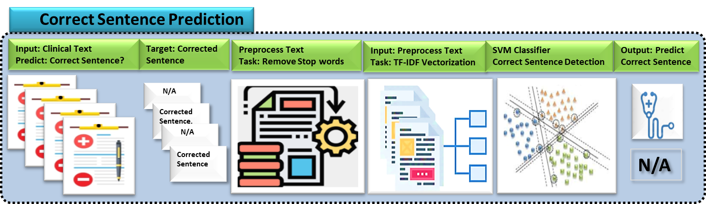
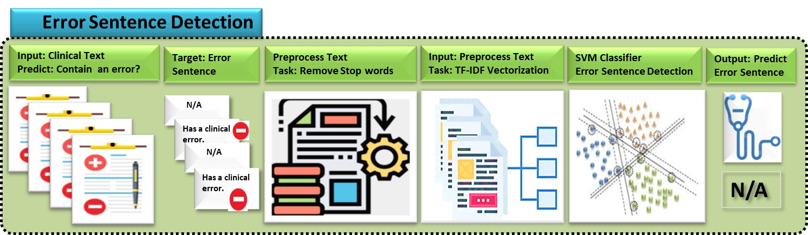
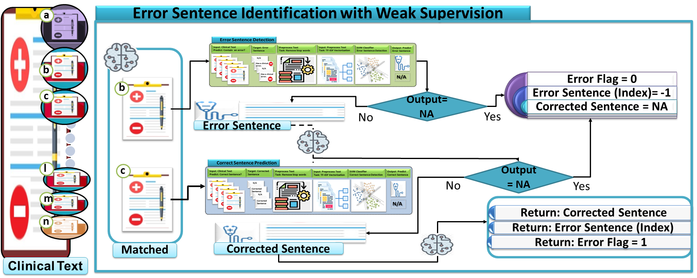
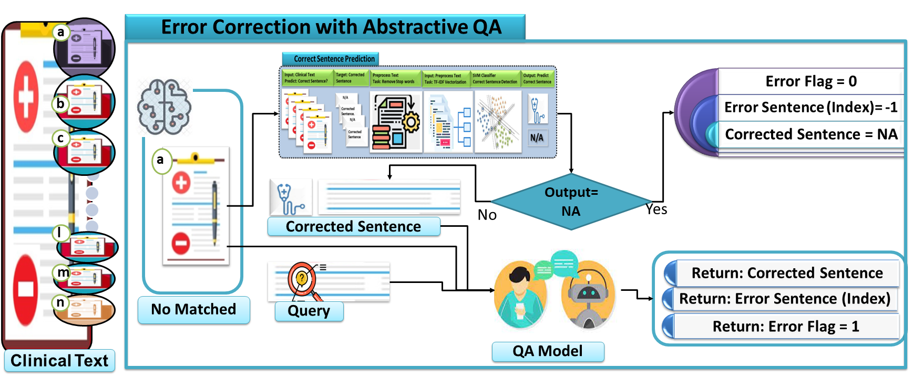

# MediFact 在 2024 年 MEDIQA-CORR 竞赛中的表现：论人工智能为何离不开人类的温情触摸

发布时间：2024年04月27日

`LLM应用` `人工智能`

> MediFact at MEDIQA-CORR 2024: Why AI Needs a Human Touch

# 摘要

> 确保医学信息的精确表达对保障患者安全极为关键。但是，人工智能（AI）系统，例如大型语言模型（LLMs），在准确解读临床文本时面临难题。本文介绍的是一种提交至2024年MEDIQA-CORR共同任务的创新方法（Ben Abacha等，2024a），该方法专注于自动修正临床记录中的单字错误。与依赖海量通用数据的LLMs不同，我们的方法侧重于从现有临床文本数据中抽取与上下文相关的信息。我们通过结合抽取式和生成式问答技术，构建了一个具有特定领域特征工程的监督学习框架。此外，我们的研究方法融合了领域专家知识，以提升错误修正的精确度。通过融合专家智慧并优先提取有价值的信息，我们的方法突出了在医疗保健领域应用AI时，采取以人为本策略的重要性。

> Accurate representation of medical information is crucial for patient safety, yet artificial intelligence (AI) systems, such as Large Language Models (LLMs), encounter challenges in error-free clinical text interpretation. This paper presents a novel approach submitted to the MEDIQA-CORR 2024 shared task (Ben Abacha et al., 2024a), focusing on the automatic correction of single-word errors in clinical notes. Unlike LLMs that rely on extensive generic data, our method emphasizes extracting contextually relevant information from available clinical text data. Leveraging an ensemble of extractive and abstractive question-answering approaches, we construct a supervised learning framework with domain-specific feature engineering. Our methodology incorporates domain expertise to enhance error correction accuracy. By integrating domain expertise and prioritizing meaningful information extraction, our approach underscores the significance of a human-centric strategy in adapting AI for healthcare.

[Arxiv](https://arxiv.org/abs/2404.17999)