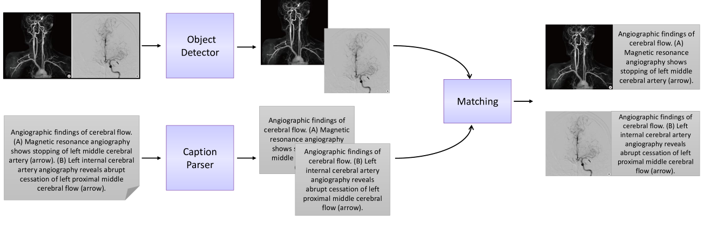
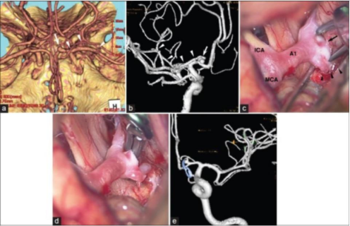
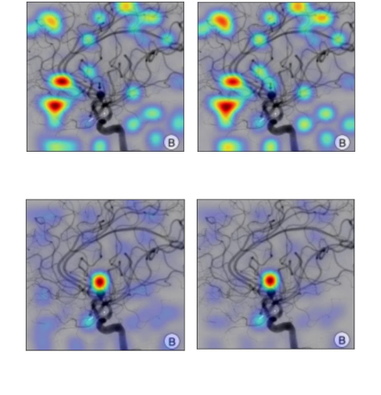

# 医学视觉与语言预训练：探索脑部异常识别

发布时间：2024年04月27日

`分类：LLM应用

这篇论文摘要描述了视觉-语言模型在多模态临床人工智能领域的应用，特别是在处理脑部异常的医疗任务中。论文介绍了如何从公共资源中收集医学图像与文本对齐数据，用于模型的预训练，并构建了一个专为特定医疗任务优化的高性能视觉-语言模型。这篇论文主要关注于实际应用，因此可以归类为LLM应用。` `人工智能`

> Medical Vision-Language Pre-Training for Brain Abnormalities

# 摘要

> 视觉-语言模型在处理视觉与语言元素并重的任务上愈发展现出其强大能力，有效地连接了视觉与语言两大领域。在多模态临床人工智能领域，对于具备特定领域知识的模型的需求不断上升，因为现有的模型往往缺少医疗应用所需的专业技能。本文以脑部异常为例，介绍了如何自动从PubMed等公共资源中收集医学图像与文本对齐数据，用于模型的预训练。我们设计了一个高效的流程，首先从病例报告和学术期刊中搜集大量脑部图像与文本数据，进而构建一个专为特定医疗任务优化的高性能视觉-语言模型。此外，我们还探讨了在医学领域内将子图与子标题对应起来的独特挑战。通过定量和定性的内在评估方法，我们对所构建的模型进行了评估。相关数据集和代码已在以下链接公开：https://github.com/masoud-monajati/MedVL_pretraining_pipeline

> Vision-language models have become increasingly powerful for tasks that require an understanding of both visual and linguistic elements, bridging the gap between these modalities. In the context of multimodal clinical AI, there is a growing need for models that possess domain-specific knowledge, as existing models often lack the expertise required for medical applications. In this paper, we take brain abnormalities as an example to demonstrate how to automatically collect medical image-text aligned data for pretraining from public resources such as PubMed. In particular, we present a pipeline that streamlines the pre-training process by initially collecting a large brain image-text dataset from case reports and published journals and subsequently constructing a high-performance vision-language model tailored to specific medical tasks. We also investigate the unique challenge of mapping subfigures to subcaptions in the medical domain. We evaluated the resulting model with quantitative and qualitative intrinsic evaluations. The resulting dataset and our code can be found here https://github.com/masoud-monajati/MedVL_pretraining_pipeline

[Arxiv](https://arxiv.org/abs/2404.17779)