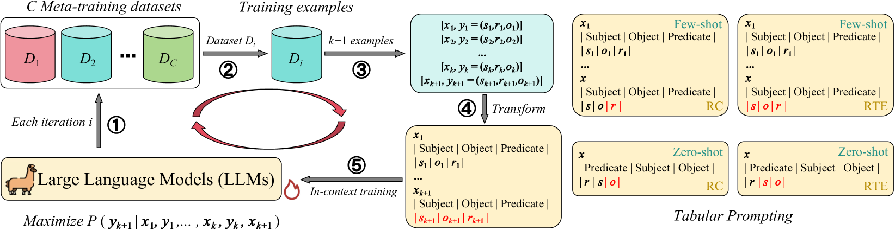
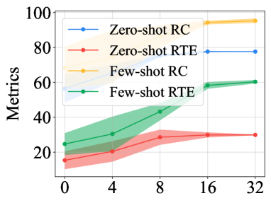
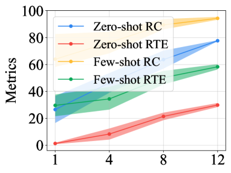
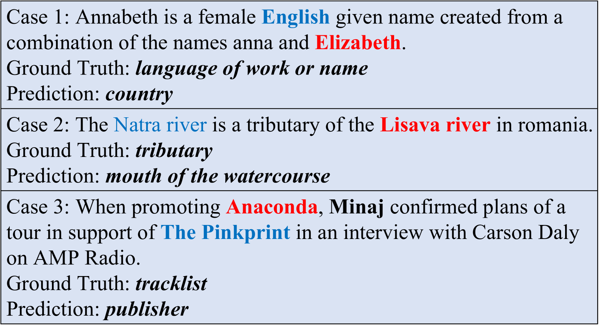

# 引入元上下文学习技术，大型语言模型在零样本和少样本关系抽取任务上的表现得到了显著提升。

发布时间：2024年04月27日

`LLM应用` `关系抽取`

> Meta In-Context Learning Makes Large Language Models Better Zero and Few-Shot Relation Extractors

# 摘要

> 关系抽取（RE）是一项核心任务，目的在于识别文本实体间的关系。尽管大型语言模型（LLMs）在常规的零样本和少样本学习中展现了卓越的上下文学习能力（ICL），但最新研究指出，现有LLMs在处理零样本和少样本的关系抽取上仍有挑战。过往研究多集中于设计提示格式和挑选恰当的例子以提升基于ICL的RE性能。虽然这两点对ICL至关重要，但如果能够从根本上增强LLMs在RE任务上的ICL能力，那么通过ICL实现的零样本和少样本RE性能有望显著提升。基于此，我们提出了\textsc{Micre}（元上下文学习框架，用于LLMs的关系抽取），这是一个针对零样本和少样本RE的新型元训练框架，通过在多样化的RE数据集上进行ICL，调整LLM以适应RE任务（即在RE的上下文中学会学习）。通过元训练，模型能够在推理阶段，仅依赖少数训练样本，无需参数更新或特定任务模板，更高效地学习新的RE任务上下文，从而提升零样本和少样本任务的泛化能力。我们在不同规模的多种LLMs上对\textsc{Micre}进行了实验，并在12个公共RE数据集上进行了评估，随后在未见过的RE基准上进行了零样本和少样本设置下的测试。\textsc{Micre}与包括监督微调和典型上下文学习方法在内的多种基线相比，展现出了相当或更优的性能。我们发现，对于更大规模的模型，提升尤为明显，且使用多样化的元训练RE数据集是提升性能的关键。实际上，我们证明了\textsc{Micre}能够在目标RE数据集的推理过程中，通过关系标签名称传递关系语义知识。

> Relation extraction (RE) is an important task that aims to identify the relationships between entities in texts. While large language models (LLMs) have revealed remarkable in-context learning (ICL) capability for general zero and few-shot learning, recent studies indicate that current LLMs still struggle with zero and few-shot RE. Previous studies are mainly dedicated to design prompt formats and select good examples for improving ICL-based RE. Although both factors are vital for ICL, if one can fundamentally boost the ICL capability of LLMs in RE, the zero and few-shot RE performance via ICL would be significantly improved. To this end, we introduce \textsc{Micre} (\textbf{M}eta \textbf{I}n-\textbf{C}ontext learning of LLMs for \textbf{R}elation \textbf{E}xtraction), a new meta-training framework for zero and few-shot RE where an LLM is tuned to do ICL on a diverse collection of RE datasets (i.e., learning to learn in context for RE). Through meta-training, the model becomes more effectively to learn a new RE task in context by conditioning on a few training examples with no parameter updates or task-specific templates at inference time, enabling better zero and few-shot task generalization. We experiment \textsc{Micre} on various LLMs with different model scales and 12 public RE datasets, and then evaluate it on unseen RE benchmarks under zero and few-shot settings. \textsc{Micre} delivers comparable or superior performance compared to a range of baselines including supervised fine-tuning and typical in-context learning methods. We find that the gains are particular significant for larger model scales, and using a diverse set of the meta-training RE datasets is key to improvements. Empirically, we show that \textsc{Micre} can transfer the relation semantic knowledge via relation label name during inference on target RE datasets.

[Arxiv](https://arxiv.org/abs/2404.17807)