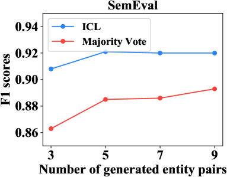
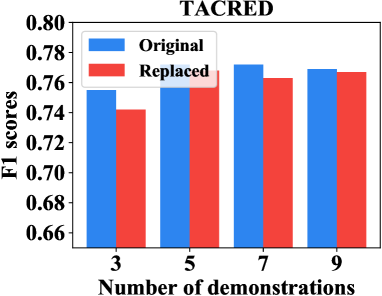

# 记忆、检索、推理——探索更佳的语境内关系抽取之道。

发布时间：2024年04月27日

`LLM应用` `关系抽取`

> Recall, Retrieve and Reason: Towards Better In-Context Relation Extraction

# 摘要

> 关系抽取（RE）的目的是识别文本中实体间的关系。大型语言模型（LLMs）在多项任务中表现出卓越的上下文学习能力（ICL），但在与大多数经过监督的微调RE方法相比时，其性能仍有待提高。利用LLMs进行RE的ICL面临双重挑战：首先，从训练样本中筛选出有价值的示例并非易事，这可能导致实体和关系的相关性降低；其次，LLMs在RE任务上的ICL表现不佳，这可能是因为RE任务与语言建模在本质上有所区别，或者所用的LLM规模不足。本研究提出了一种创新的“回忆-检索-推理”RE框架，该框架结合LLMs和检索语料库（即训练样本），以促进有效的信息检索和可靠的上下文推理。具体而言，我们从训练数据中提炼出稳定的本体知识，引导LLMs生成与检索语料库紧密相关的实体对，作为有效的查询条件。这些实体对随后用于从检索语料库中检索出相关训练样本，为LLMs提供更好的ICL示例，通过指令调整来优化学习效果。通过在多种LLMs和RE数据集上的广泛测试，我们的方法成功地生成了相关且有效的实体对，并显著提升了LLMs的ICL能力，与以往的监督微调方法和基于ICL的方法相比，在句子级别的RE任务上取得了竞争性或创新性的优异成绩。

> Relation extraction (RE) aims to identify relations between entities mentioned in texts. Although large language models (LLMs) have demonstrated impressive in-context learning (ICL) abilities in various tasks, they still suffer from poor performances compared to most supervised fine-tuned RE methods. Utilizing ICL for RE with LLMs encounters two challenges: (1) retrieving good demonstrations from training examples, and (2) enabling LLMs exhibit strong ICL abilities in RE. On the one hand, retrieving good demonstrations is a non-trivial process in RE, which easily results in low relevance regarding entities and relations. On the other hand, ICL with an LLM achieves poor performance in RE while RE is different from language modeling in nature or the LLM is not large enough. In this work, we propose a novel recall-retrieve-reason RE framework that synergizes LLMs with retrieval corpora (training examples) to enable relevant retrieving and reliable in-context reasoning. Specifically, we distill the consistently ontological knowledge from training datasets to let LLMs generate relevant entity pairs grounded by retrieval corpora as valid queries. These entity pairs are then used to retrieve relevant training examples from the retrieval corpora as demonstrations for LLMs to conduct better ICL via instruction tuning. Extensive experiments on different LLMs and RE datasets demonstrate that our method generates relevant and valid entity pairs and boosts ICL abilities of LLMs, achieving competitive or new state-of-the-art performance on sentence-level RE compared to previous supervised fine-tuning methods and ICL-based methods.

[Arxiv](https://arxiv.org/abs/2404.17809)