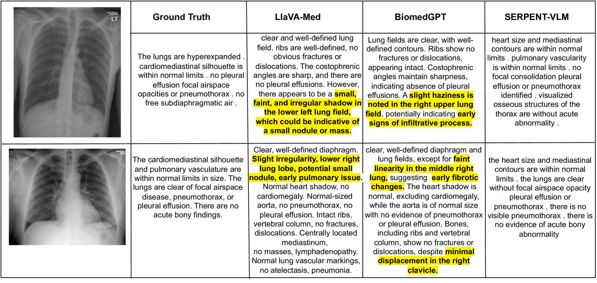
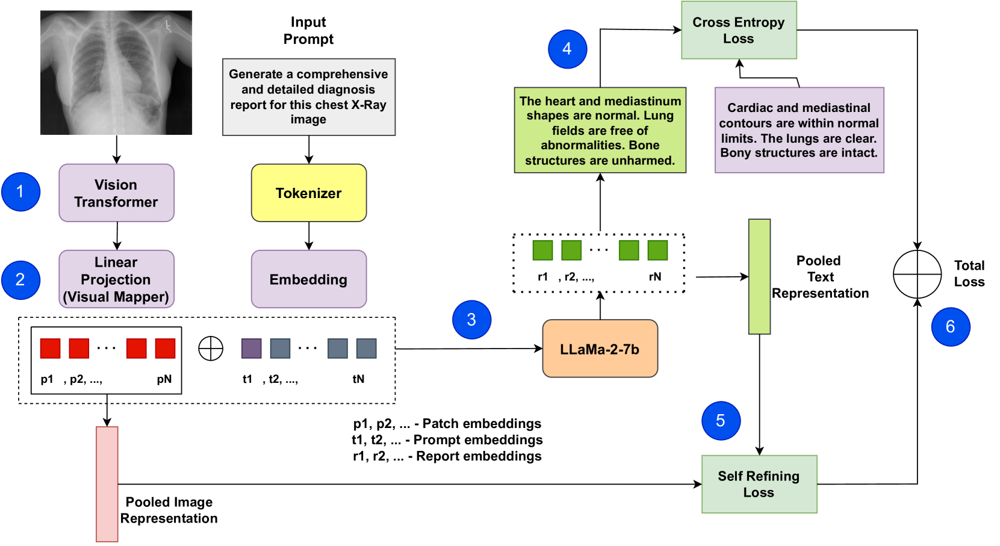
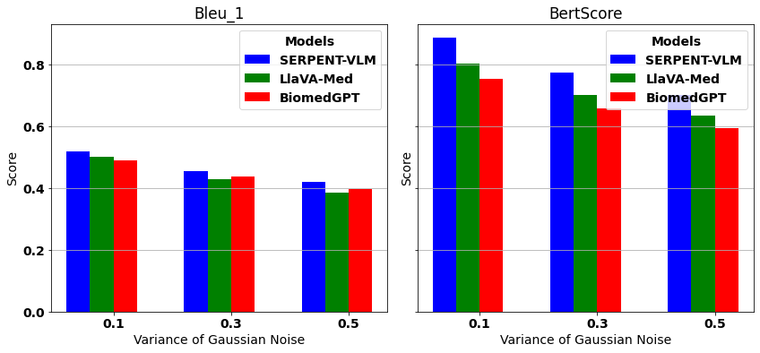

# SERPENT-VLM：一种利用视觉语言模型实现自我精炼的放射学报告生成技术

发布时间：2024年04月27日

`LLM应用` `放射学`

> SERPENT-VLM : Self-Refining Radiology Report Generation Using Vision Language Models

# 摘要

> 放射学报告自动生成技术（R2Gen）通过多模态大型语言模型（MLLMs），实现了放射学报告的精确、连贯生成。传统方法在文本报告中常常凭空捏造细节，与图像内容不符。为此，我们提出了一种创新策略——SERPENT-VLM，即利用视觉语言模型自我完善的放射学报告生成，通过在MLLM框架中整合自我完善机制来提升R2Gen任务的表现。该策略采用了一种新颖的自监督损失函数，它通过比较池化后的图像表示与生成放射学文本的上下文表示的相似度，结合标准的因果语言建模目标，来优化图像与文本的表示。这样的设计使得模型能够在给定图像和生成文本之间进行动态交互，以审查和校准文本，减少虚假信息的产生，并不断提升报告生成的细节处理能力。SERPENT-VLM在IU X射线和放射学对象上下文（ROCO）数据集上超越了如LLaVA-Med、BiomedGPT等现有基准，展现了卓越的性能，并对噪声图像显示出良好的鲁棒性。一项定性案例研究突出了在构建更高级的R2Gen MLLM框架方面取得的显著进步，为医学影像领域的自监督精细化研究开辟了新路径。

> Radiology Report Generation (R2Gen) demonstrates how Multi-modal Large Language Models (MLLMs) can automate the creation of accurate and coherent radiological reports. Existing methods often hallucinate details in text-based reports that don't accurately reflect the image content. To mitigate this, we introduce a novel strategy, SERPENT-VLM (SElf Refining Radiology RePort GENeraTion using Vision Language Models), which improves the R2Gen task by integrating a self-refining mechanism into the MLLM framework. We employ a unique self-supervised loss that leverages similarity between pooled image representations and the contextual representations of the generated radiological text, alongside the standard Causal Language Modeling objective, to refine image-text representations. This allows the model to scrutinize and align the generated text through dynamic interaction between a given image and the generated text, therefore reducing hallucination and continuously enhancing nuanced report generation. SERPENT-VLM outperforms existing baselines such as LLaVA-Med, BiomedGPT, etc., achieving SoTA performance on the IU X-ray and Radiology Objects in COntext (ROCO) datasets, and also proves to be robust against noisy images. A qualitative case study emphasizes the significant advancements towards more sophisticated MLLM frameworks for R2Gen, opening paths for further research into self-supervised refinement in the medical imaging domain.

[Arxiv](https://arxiv.org/abs/2404.17912)